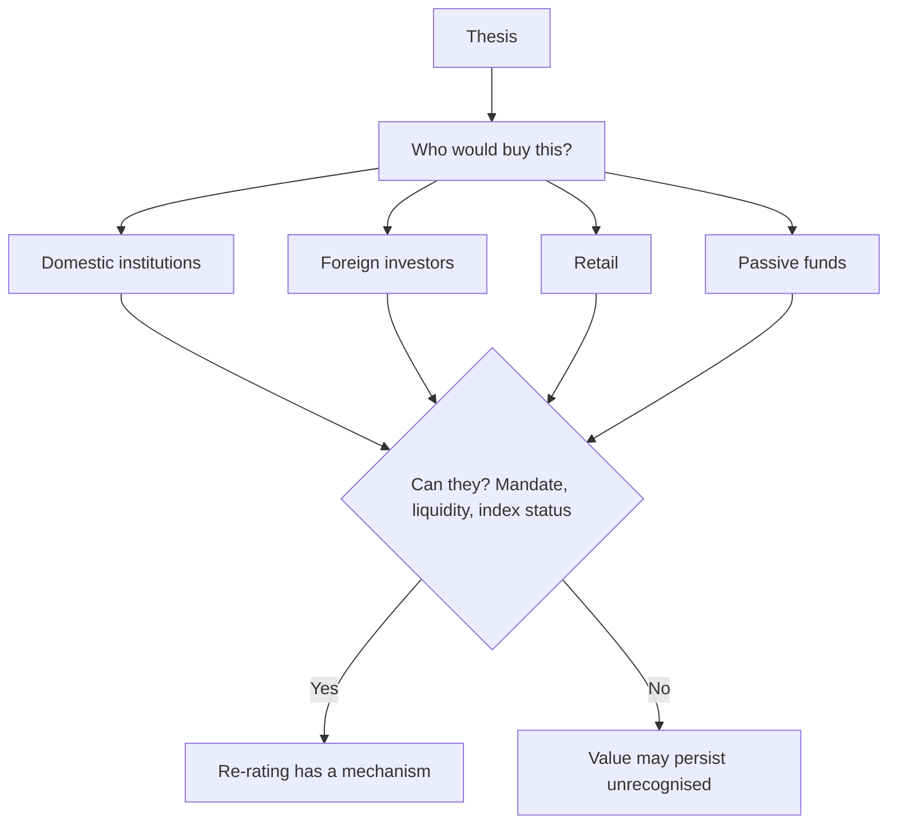

# Understanding the Shareholder Base You Are Writing For

## The Problem / Why this matters
The same analysis is useful to different investors in different ways, and a research product that ignores who holds the stock and who might buy it is less useful than it could be. A long-only fund with a three-year horizon, a hedge fund looking for a catalyst, and a retail-facing distributor need different emphases from the identical underlying work — and knowing who the marginal buyer is also bears directly on whether a re-rating can happen at all.

## Core Idea
Know **who owns the stock and who the marginal buyer would be**, because a thesis requiring a buyer who cannot or will not participate has no mechanism to be realised.

## Why it works this way
A re-rating requires someone to buy at a higher price. If the natural buyer is excluded — by mandate, by liquidity, by index membership, by foreign ownership limits — then even a correct thesis may not be rewarded within a useful horizon. This is the same mechanism-versus-value distinction the holding-company and asset-value chapters make, applied to the shareholder register.

## Full technical content

### Reading the register

From the shareholding pattern, per that chapter:
- **Who holds it now** — promoters, domestic institutions, foreign investors, retail.
- **How concentrated** the institutional holding is.
- **The trend** over recent quarters.
- **Foreign headroom** against any applicable limit.

### Identifying the marginal buyer

The forward-looking question, and the one that matters for a re-rating:

| Potential buyer | What enables or blocks them |
|---|---|
| **Domestic mutual funds** | Liquidity for their size; market-cap category mandates |
| **Insurance and pension** | Long horizon, valuation discipline, size requirements |
| **Foreign investors** | Foreign ownership headroom; index membership; governance standards |
| **Passive funds** | Index inclusion, per that chapter |
| **Retail** | Accessibility, brand familiarity, price level |
| **Strategic or promoter** | Control considerations |

**Common blockers worth checking explicitly:**
- **Liquidity below deployable size** for institutions, which is the binding constraint in small caps.
- **Free float too small** for meaningful institutional positions.
- **Not in an index**, so passive flows are unavailable.
- **Foreign limit exhausted**, capping foreign buying.
- **Governance concerns** that exclude institutions with screening policies.
- **Loss-making or non-dividend-paying**, which some mandates exclude.

**Where every natural buyer is blocked, a cheap stock can stay cheap indefinitely** — and saying so in the note is more useful than repeating the valuation argument.

### Writing for different audiences

The underlying view must be identical, per the morning-meeting chapter; what varies is emphasis:

| Audience | Emphasise |
|---|---|
| **Long-only institutional** | Multi-year thesis, durability, capital allocation, position size feasibility |
| **Hedge fund** | Catalyst and timing, both sides of the trade, borrow availability, crowding |
| **Foreign investor** | Country and sector context, currency, governance, liquidity, index status |
| **Insurance/pension** | Dividend sustainability, downside protection, long-horizon durability |
| **Retail-facing** | Clarity, explicit risk statements, no assumed jargon |

**Adjusting emphasis is legitimate; adjusting the view is not.** A substantive view that changes with the listener is a serious problem, and one that becomes visible quickly.

### The re-rating mechanism question

Tie it back to the recommendation:
- **Who is the buyer** who makes this work, and can they act?
- **What would bring them in** — index inclusion, a liquidity improvement from a promoter selldown, governance improvement, a demerger creating a cleaner entity, or simply results proving the thesis?
- **Is that dated?** If so, it is a catalyst; if not, the thesis has a timing problem regardless of the valuation.

**A stock can be cheap because the natural buyer is structurally absent**, which is a permanent condition rather than an opportunity. Distinguishing the two is the analytical task, and it requires the register rather than the model.

## Common mistakes
- Ignoring **who could buy** the stock when arguing for a re-rating.
- Missing **liquidity or free float** as a structural blocker for institutions.
- Overlooking **foreign headroom** exhaustion.
- Assuming index inclusion when the criteria are not met.
- Writing identical emphasis for **all audiences**.
- Adjusting the **substantive view** for the audience.
- Presenting a structurally excluded stock's cheapness as an opportunity.

## Interview angle
"The stock is clearly cheap but has been cheap for three years. Why?" Go to the shareholder register rather than the model: ask who the marginal buyer would be and whether they can actually act — whether liquidity supports a deployable institutional position, whether the free float is large enough, whether it is in an index so passive flows are available, whether foreign headroom is exhausted, and whether governance concerns exclude institutions with screening policies. Where every natural buyer is structurally blocked, cheapness is a permanent condition rather than an opportunity, and saying so is more useful than repeating the valuation argument. Then give the constructive version: identify what would bring a buyer in — index inclusion, a promoter selldown improving float, a demerger creating a cleaner entity, or results simply proving the thesis — and whether that is dated, because if it is, it is a catalyst, and if not, the thesis has a timing problem no amount of undervaluation fixes.
