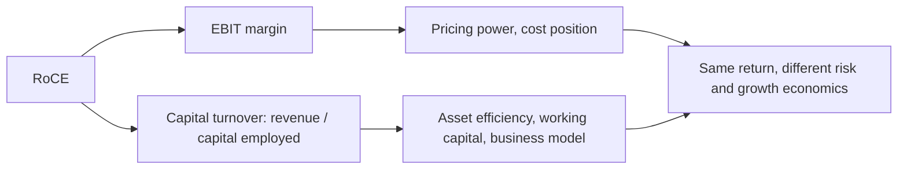

# Asset Turnover and Capital Intensity

## The Problem / Why this matters
Return on capital decomposes into margin and asset turnover, and analysts concentrate almost entirely on the first. Yet turnover — revenue generated per rupee of capital employed — is frequently the larger source of difference between companies in the same industry, is more stable, and is harder to improve. A company that generates twice the revenue from the same asset base has a structural advantage that no margin improvement by its competitor can offset.

## Core Idea
Decompose returns into **margin and turnover**, because they have different drivers, different persistence and different improvement paths — and a high-turnover, low-margin business can be far better than the reverse.

## Why it works this way
RoCE is EBIT margin times capital turnover. Two businesses can reach the same return by opposite routes: high margin on slow-turning capital, or thin margin on fast-turning capital. The routes have different risk profiles — the high-margin business is exposed to price competition, the high-turnover one to volume — and different capital requirements for growth.

## Full technical content

### The decomposition

**RoCE = (EBIT ÷ Revenue) × (Revenue ÷ Capital employed)**

Compute both components across peers and across time. **The comparison is frequently more revealing than the RoCE itself**, because it shows *how* a company earns its return and therefore what threatens it.

**Extending it:**
- **Capital employed** = fixed assets + working capital (+ goodwill, depending on the question, per that chapter).
- **Fixed asset turnover** and **working capital turnover** separately, since they have different drivers and different fixes.

### What drives turnover

| Driver | Effect |
|---|---|
| **Business model** | Asset-light versus asset-heavy — franchising, outsourced manufacturing, leasing |
| **Capacity utilisation** | Higher utilisation raises turnover mechanically, per that chapter |
| **Working capital efficiency** | Inventory and receivable days directly affect capital employed |
| **Asset age** | An old, depreciated asset base flatters turnover, per the depreciation chapter |
| **Product mix** | Different products carry different asset requirements |
| **Outsourcing** | Moves capital off the balance sheet, raising turnover and usually lowering margin |
| **Negative working capital** | Advance payments from customers — genuine and powerful where it exists |

**Negative working capital is the strongest turnover advantage available.** Where customers pay before the company pays its suppliers — retail with fast inventory turns, capital goods with advances, subscription models — growth generates cash rather than consuming it, which changes the entire funding requirement of the business.

### The margin-turnover trade-off

Frequently a deliberate strategic choice:
- **Outsourcing manufacturing** lowers margin (the contract manufacturer takes a cut) and raises turnover (no plant on the balance sheet). RoCE can rise, and the business becomes more flexible.
- **Franchising versus company-owned** does the same, per the royalty chapter — which is why a shift toward franchising lowers margin while raising returns.
- **Premiumisation** raises margin and may lower turnover if it requires more inventory or slower-moving stock.

**This is why comparing margins across companies with different models is meaningless without the turnover comparison** — and it is the specific error the margin-bridge chapter warns about when a mix shift lowers margin while raising returns.

### Using turnover in analysis

- **Compare turnover across peers** to identify structural efficiency differences.
- **Track it over time** — declining turnover with stable margin means capital is being added faster than revenue, which is the early signal of poor incremental returns that the ROIIC chapter measures directly.
- **Check whether an improving RoCE came from margin or turnover**, since the sources have very different durability.
- **Watch for turnover flattered by an old asset base**, per the depreciation chapter — accumulated depreciation over gross block is the check.
- **Use gross-block-based turnover** as a cross-check that neutralises asset age.

### Growth economics

The most practically important implication:
- **A high-turnover business needs less capital to grow.** Growing revenue 20% requires 20% more capital at constant turnover — so a business turning capital twice needs half the incremental capital of one turning it once.
- **This determines self-funding capacity.** The sustainable growth relationship from the ROIIC chapter — reinvestment rate times return — means a high-turnover business can fund faster growth from the same profit.
- **It also determines vulnerability**: a low-turnover business growing fast must raise external capital, which is the model inconsistency the capital-structure chapter flags.

## Common mistakes
- Analysing **margin** without turnover.
- Comparing margins across **different business models** without adjusting.
- Missing declining turnover as an early signal of **poor incremental returns**.
- Ignoring an **old asset base** flattering turnover.
- Treating a margin decline from **outsourcing or franchising** as deterioration.
- Overlooking **negative working capital** as a structural advantage.
- Forecasting growth without checking the **capital** it requires at the company's turnover.

## Interview angle
"Company A has a 9% EBIT margin and Company B has 22%. Which is the better business?" Say the margin alone does not answer it, and decompose: RoCE is margin times capital turnover, so if A turns its capital three times and B turns it once, A earns 27% and B earns 22%, and A is the better business despite the thinner margin. Then explain what that difference means beyond the return — a high-turnover business needs less capital to grow, so it can self-fund faster growth from the same profit, while a low-turnover business growing quickly must raise external capital. Add what drives turnover: business model choices like outsourcing and franchising, which deliberately trade margin for turnover; capacity utilisation; working capital efficiency; and above all negative working capital, where customers pay before suppliers do, which means growth generates cash rather than consuming it. And flag the check that keeps it honest — an old, largely depreciated asset base flatters turnover, so compare accumulated depreciation to gross block before crediting the efficiency.
