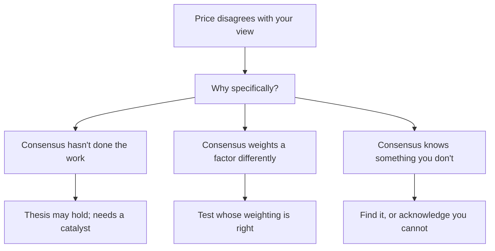

# When the Market Disagrees With You

## The Problem / Why this matters
An analyst with a differentiated view is, by construction, disagreeing with the price. The uncomfortable question is what to do when the price keeps moving against that view — because two very different situations look identical from the inside: the market has not yet seen what you see, or the market knows something you do not. Distinguishing them is among the hardest and most consequential judgements in the job.

## Core Idea
Treat persistent disagreement as **evidence to be explained**, not as noise to be dismissed — the market is a weighted opinion of many informed participants, and the reason it disagrees is worth identifying specifically.

## Why it works this way
Prices reflect the aggregate view of participants who also have models, access and incentives. A price far from your estimate means either they have not done the work, or they have information or a framing you lack. Assuming the first without testing the second is the most expensive form of confidence.

## Full technical content

### Establishing what the market believes

Before deciding who is right, establish the disagreement precisely:
- **Reverse-DCF** — what growth, margin and return does the current price imply? This converts a vague disagreement into a specific one.
- **Read the other side.** Find the most credible bearish (or bullish) note and understand its argument properly rather than in caricature.
- **Look at positioning** — is the stock crowded on your side, per the derivatives chapter? If everyone informed already agrees with you, the differentiated view is not differentiated.
- **Check consensus estimates** and their dispersion, and whether they are moving toward or away from you.

### The three explanations

**1. The market has not done the work.** Genuinely common in under-covered names, complex situations and businesses whose historical record no longer describes them — the situations the breadth-and-dispersion chapter identifies as where research pays. **This is the most favourable explanation and requires a catalyst** to convert the view into a return.

**2. The market weights a factor differently.** Both sides see the same facts and disagree on their importance — a governance discount, a terminal growth assumption, the durability of a moat. **This is a legitimate difference of judgement**, and the honest position is to state your weighting and its basis rather than to claim the other side is ignoring something.

**3. The market knows something you do not.** The most dangerous, and the possibility most often dismissed. Sources: primary knowledge you lack, an interpretation of a disclosure you read differently, or simply more experience of how this kind of situation resolves.

### Testing for the third case

Specific, checkable steps rather than introspection:
- **Ask who is selling** — if long-horizon institutional holders are exiting steadily, that is informed selling and warrants explanation.
- **Check credit markets**, per that chapter — widening spreads or a rating outlook change means credit investors see something.
- **Check the derivatives and borrow data** for informed positioning.
- **Re-read the disclosures** looking specifically for what a bear would emphasise.
- **Talk to someone who disagrees** and take their strongest argument seriously rather than their weakest.
- **Check whether a falsification condition** has quietly been approached without being met.

### The decision

- **If a falsification condition is met**, the thesis is broken. Change the view, per the conviction chapter.
- **If the thesis is intact and the disagreement is explicable**, reaffirm — and risk-reward has improved if the price fell.
- **If you cannot explain the disagreement at all**, that is itself information. **An unexplained persistent disagreement with an informed market is a reason to reduce conviction**, even where no specific evidence has changed.
- **Apply the initiation test:** would you start this position today at this price knowing what you now know? It strips out anchoring on the prior view.

### Communicating it

- **Proactively**, per the conviction chapter — clients need the view most when it is uncomfortable to give.
- **Acknowledge the disagreement explicitly** rather than restating the original argument louder.
- **State what would change your mind**, again.
- **Distinguish "early" from "wrong" honestly**, using the pre-committed conditions rather than the price.
- **Do not become more strident as evidence weakens**, which is the behaviour that destroys credibility beyond the specific call.

### The honest asymmetry

Being wrong alone is more damaging to a career than being wrong with everyone, which the ratings chapter identifies as a structural pressure. **Recognising that this pressure exists is what allows a differentiated view to be held for the right reasons rather than abandoned for the wrong ones** — and equally, it is what allows a broken thesis to be abandoned without the sunk-cost defence that a public commitment invites.

## Common mistakes
- Dismissing persistent disagreement as **market inefficiency** without testing alternatives.
- Not establishing **what the price implies** before arguing with it.
- Reading the opposing case in **caricature** rather than at its strongest.
- Ignoring **credit market** and **positioning** signals that other participants see something.
- Treating a differentiated view as vindicated by **conviction** rather than evidence.
- Becoming more **strident** as the position moves against you.
- Failing to reduce conviction when the disagreement is genuinely **unexplained**.

## Interview angle
"You're down 30% on a high-conviction call and nothing has changed fundamentally. What now?" Start by making the disagreement specific: run a reverse-DCF to establish exactly what the current price implies, and read the strongest opposing note rather than a caricature of it, so you know precisely which assumption is in dispute. Then work through the three explanations — the market has not done the work, which is plausible in under-covered or complex situations but requires a catalyst to be monetised; the market weights a factor differently, which is a legitimate judgement difference you should state rather than dismiss; or the market knows something you do not. Test the third specifically rather than by introspection: check whether long-horizon holders are exiting, whether credit spreads have widened or a rating outlook has changed, and re-read the disclosures for what a bear would emphasise. Finish with the decision rule — if a pre-committed falsification condition is met, the thesis is broken and you change the view; if you can explain the disagreement and the thesis is intact, risk-reward has improved; but if the disagreement is genuinely unexplained, that is itself a reason to reduce conviction even with no new adverse evidence.
