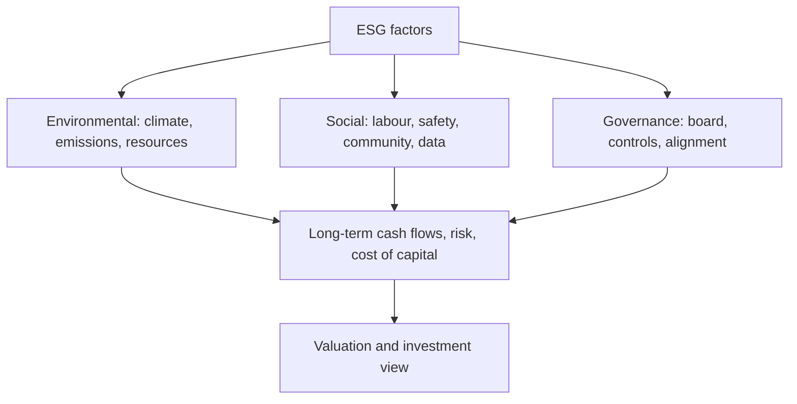

# ESG in Equity Analysis

## The Problem / Why this matters
Investors increasingly judge companies not just on financials but on **Environmental, Social and Governance (ESG)** factors — because these non-financial issues create real financial risks and opportunities (regulation, reputation, stranded assets, talent). ESG has moved from niche to mainstream, is increasingly mandated in disclosure (BRSR in India), and comes up in interviews as "why do investors care about ESG?" Understanding how to integrate it into equity analysis is now part of the job.

## Core Idea
ESG analysis assesses a company's exposure to and management of **environmental, social, and governance** risks and opportunities, integrating them into the investment view. The premise: material ESG factors affect long-term cash flows, risk, and therefore valuation — so ignoring them means missing risks that standard financials don't capture.

## Why it works this way
Many ESG issues are **financially material but slow-moving** — a carbon-intensive business faces future regulation and stranded-asset risk; poor governance invites fraud and value destruction; weak labour or safety practices bring litigation and reputational damage. These show up in cash flows and cost of capital eventually, so a forward-looking analyst prices them in before they hit the financials.

## Full technical content

**The three pillars:**
| Pillar | Example factors |
|---|---|
| **Environmental** | Carbon emissions, energy/water use, waste, climate transition risk, biodiversity |
| **Social** | Labour practices, health & safety, diversity, product safety, data privacy, community relations |
| **Governance** | Board independence/quality, executive pay alignment, shareholder rights, audit quality, related-party dealings, anti-corruption |

**Governance** is often seen as the most immediately financially material — weak governance (dominant promoters, poor controls) is a leading cause of fraud and value destruction, especially in emerging markets.

**How investors use ESG:**
- **Integration** — embed material ESG factors into fundamental analysis and valuation (adjust growth, margins, cost of capital, or apply a risk discount).
- **Screening** — exclude (negative screening: tobacco, weapons) or tilt toward leaders (positive/best-in-class).
- **Thematic / impact** — invest in a theme (clean energy) or for measurable impact.
- **Stewardship** — engage and vote to improve company behaviour.

**Materiality.** The key discipline: focus on ESG factors that are **financially material** to *that* industry (e.g., emissions for a utility, data privacy for a tech firm, safety for a miner) — not a generic checklist. Frameworks like SASB map materiality by sector.

**Instruments & disclosure:** **green bonds**, **sustainability-linked loans**, ESG funds/ETFs; disclosure via GRI, TCFD, and in India the **BRSR (Business Responsibility and Sustainability Report)** mandated for top listed firms by SEBI.

**Debates & challenges:**
- **Greenwashing** — overstating ESG credentials.
- **Inconsistent ratings** — ESG scores from different providers often disagree (different methodologies).
- **Performance debate** — whether ESG helps or hurts returns is contested; the strongest case is **risk management** (avoiding blow-ups) rather than guaranteed outperformance.

**Effect on cost of capital.** Strong ESG can lower cost of capital (broader investor base, lower risk perception); poor ESG can raise it (exclusion, higher risk), feeding directly into valuation.

## Worked examples

**Example 1 — governance red flag.** An analyst finds a company with a promoter-dominated board, frequent related-party transactions, and an auditor change after a qualification. Governance risk is high — historically a precursor to value destruction. The analyst applies a valuation discount (or avoids the stock), a call standard financials alone wouldn't trigger.

**Example 2 — environmental transition risk.** A thermal-coal power producer looks cheap on current earnings, but tightening emissions regulation and the energy transition threaten **stranded assets** and rising compliance costs over the next decade. Integrating this, the analyst lowers long-term cash flows and raises the discount rate — the stock is less cheap than it looks.

**Example 3 — materiality focus.** For a software company, carbon emissions are minor but **data privacy and talent retention** are highly material (a breach or attrition could hit revenue and margins). A good ESG analyst weights the *material* factors for that sector, not a generic environmental score.

**Example 4 — quantifying a governance discount in a valuation, not just flagging it qualitatively.** An analyst values a company at ₹450/share on a clean DCF, but the company has two governance red flags: 35% of revenue runs through related-party transactions with promoter-owned entities (raising round-tripping/value-leakage concerns), and the board has no independent directors on the audit committee. Rather than simply writing "governance risk — be cautious" in the note, a rigorous approach quantifies it: apply a discount rate premium (e.g. +150 basis points to the cost of equity, reflecting the additional risk premium investors should demand for weaker minority-shareholder protection) and re-run the DCF. If the +150bp premium takes WACC from 11.0% to 12.5%, the same cash flows might value the stock at ₹390/share instead of ₹450 — a concrete, defensible ₹60/share governance discount an investment committee can actually act on, rather than a vague qualitative caution that doesn't change the number anyone actually trades on.

**Example 5 — BRSR disclosure as a research input, not just a compliance checkbox.** India's SEBI-mandated Business Responsibility and Sustainability Report (BRSR, required for the top listed companies by market cap) discloses standardised metrics — GHG emissions (Scope 1 and 2), water/waste intensity, employee attrition and diversity data, and related-party transaction details. An equity analyst covering a manufacturing company can use the BRSR's disclosed emissions-per-unit-of-revenue trend across several years as a genuine research input: a rising emissions-intensity trend at a company operating in a sector facing tightening carbon-pricing regulation is a quantifiable, forward-looking risk signal — directly usable in the Example 2 stranded-asset-style analysis — rather than treating BRSR filing as a purely regulatory box-ticking exercise disconnected from the investment thesis.

## How it is tested in interviews
- **"Why do investors care about ESG?"** — "Because material ESG factors create real financial risks and opportunities — regulation, stranded assets, reputation, governance failures — that affect long-term cash flows and cost of capital but aren't captured in standard financials."
- **"What are the three pillars?"** — Environmental (climate, emissions, resources), Social (labour, safety, privacy, community), Governance (board, controls, alignment).
- **"Which is most financially material?"** — "Often governance — weak governance is a leading cause of fraud and value destruction, especially in emerging markets — but materiality is industry-specific."
- **"What are the criticisms of ESG?"** — Greenwashing, inconsistent ratings across providers, and a contested performance record (the strongest case is risk management).
- **"How would you integrate ESG into a valuation?"** — "Focus on material factors for the sector; adjust growth, margins, or the discount rate, or apply a governance/risk discount."

## Traps & common mistakes
- Treating ESG as a **generic checklist** rather than **industry-material** factors.
- Ignoring **governance** — the most immediately material pillar.
- Taking a single ESG **rating** at face value (providers disagree).
- Assuming ESG **guarantees** outperformance — the robust case is risk management.
- Missing the **cost-of-capital** channel through which ESG hits valuation.

## First-principles recap
- ESG assesses environmental, social and governance risks/opportunities that are financially material.
- **Materiality is industry-specific** — focus on what matters for that sector.
- Governance is often the most immediately material pillar.
- Integrate via adjusted cash flows/discount rate, screening, or stewardship.
- Watch greenwashing and rating inconsistency; the strongest case is risk management and cost of capital.

## Quick-reference
| Pillar | Material examples |
|---|---|
| Environmental | Emissions, transition risk, resources |
| Social | Labour, safety, data privacy |
| Governance | Board, controls, related-party, alignment |
| Uses | Integration, screening, thematic, stewardship |
| India disclosure | BRSR (SEBI) |
| Key discipline | Focus on financially material factors |
