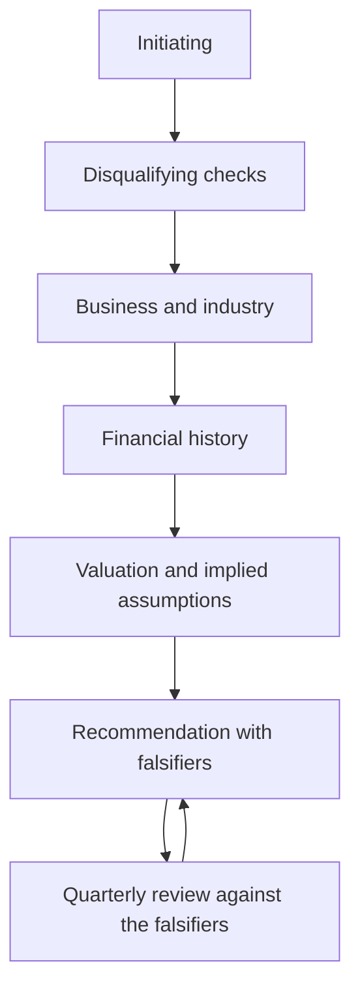

# The Working Checklist

## The Problem / Why this matters
The preceding chapters contain a large number of specific checks, each introduced where it belongs analytically. In practice they need to be available as a list — something an analyst can run through when initiating on a company, reviewing a quarter, or preparing for an interview. This chapter assembles them, ordered by when they are used rather than by topic.

## Core Idea
Most analytical failures are **omissions rather than errors** — a check not run rather than a calculation done wrongly — so a systematic list is worth more than additional technique.

## Why it works this way
Under time pressure, the checks that get skipped are the ones that are not on a list. Every check below appears in these chapters because omitting it has cost investors money, and each takes minutes.

## Full technical content

### A — The disqualifying checks (run first, always)

1. **Cumulative CFO versus cumulative PAT**, five years.
2. **Auditor's report** — opinion type, Emphasis of Matter, going-concern language, recent resignation.
3. **Key Audit Matters**, and the notes they point to.
4. **CARO items** — statutory dues delayed, internal control adverse opinion, fund diversion.
5. **Promoter pledge**, expressed as a percentage of total equity, and its trend.
6. **Related-party transactions** as a proportion of the relevant base, and net direction.
7. **Contingent liabilities** against net worth, especially group guarantees.
8. **Liquidity** against deployable position size.
9. **Share count** trend over five years.

### B — Business and industry

10. **How the company makes money**, and where in the value chain it sits.
11. **Where the margin pool sits** in the chain and whether it is shifting.
12. **The binding constraint** — capacity, input, permit, labour, working capital.
13. **Market share** and its direction, computed independently where possible.
14. **What protects the returns**, and whether it is strengthening or eroding.
15. **Industry capacity announcements**, globally where relevant.
16. **Customer and supplier concentration**, with switching costs assessed.

### C — Financial history

17. **RoCE over ten years**, including a downturn.
18. **ROIIC** over rolling multi-year periods.
19. **Margin decomposed** into price, cost, mix and operating leverage.
20. **Asset turnover** alongside margin.
21. **Working capital days**, by component, and their trend.
22. **Inventory split** — raw material, WIP, finished goods.
23. **Segment RoCE** and capex allocation where multi-business.
24. **Other income** decomposed; core operating profit isolated.
25. **Provision movement schedules**, including reversals.
26. **Depreciation policy and asset age** — accumulated depreciation over gross block.
27. **Debt maturity profile, fixed/floating split, covenant headroom.**
28. **Consolidated versus standalone** — the subtraction.
29. **Equity-accounted entities** — proportionate view where material.
30. **Employee benefit assumptions** against peers.
31. **Lease treatment** where comparing across ownership models.
32. **Restatements and definitional changes** breaking the series.

### D — Management and governance

33. **Capital allocation record** — past projects: announced versus actual cost, timeline and return.
34. **Past acquisitions** — RoCE with and without goodwill.
35. **Guidance credibility record** over five years.
36. **Board composition, tenure, attendance, audit committee capability.**
37. **Shareholder meeting voting outcomes**, split by category.
38. **Remuneration** against peers and against performance.
39. **Insider and promoter transactions**, weighting purchases above sales.
40. **Disclosure quality trend** — any metric discontinued or segment aggregated.

### E — Valuation

41. **Which method is appropriate** for this business type.
42. **Normalised earnings** for cyclicals; never P/E at peak.
43. **At least two independent methods**, with divergences diagnosed.
44. **Reverse-DCF** — what does the price imply, and is it plausible?
45. **Implied multiple at the target** against the stock's own history.
46. **Terminal value proportion** of DCF value.
47. **Growth-reinvestment consistency.**
48. **Fully diluted share count** at the target price, with exercise proceeds added.
49. **Bear case** with the multiple moving, not just earnings.
50. **Risk-reward ratio** stated numerically.

### F — The recommendation

51. **Rating, target, upside, horizon** in the first line.
52. **The differentiated insight**, quantified against consensus.
53. **Evidenced pillars**, each with a specific fact.
54. **A dated catalyst.**
55. **Who the marginal buyer is**, and whether they can act.
56. **Position size** and the liquidity constraint.
57. **Falsification conditions**, pre-committed.
58. **Monitorables** with their reporting dates.

### G — Ongoing

59. **Quarterly**: actuals across all three statements, compared line by line against your own estimate.
60. **Quarterly**: falsification conditions checked; disclosure changes noted.
61. **Annually**: full annual report in the sequence — auditor's report, CARO, KAM-flagged notes, related party, contingent liabilities, then the statements.
62. **Annually**: review last year's calls, classify errors, record what changed in the process.

### How to use it

- **Not every item applies** to every company; the point is to decide consciously rather than to omit by default.
- **Section A first**, always — it eliminates candidates in twenty minutes.
- **The ongoing section is what most analysts skip**, and it is where calibration comes from.
- **Adapt it** to the sector, adding the two or three metrics that actually drive earnings there.

## Common mistakes
- Treating the checklist as **the work** rather than as a check on it.
- Running the analysis before the **disqualifying checks**.
- Skipping the **ongoing** section, losing the calibration record.
- Applying every item mechanically rather than deciding what is relevant.

## Interview angle
"How do you make sure you haven't missed something?" A systematic list, run in a deliberate order, because most analytical failures are omissions rather than calculation errors. Say that you run the disqualifying checks first — cash against profit, the auditor's report, promoter pledging, related-party flows, contingent liabilities and liquidity — because they take twenty minutes and eliminate a large share of candidates before any model is built. Then business and industry structure, then the financial history with returns decomposed into margin and turnover, then governance and the capital allocation record, and only then valuation with at least two independent methods and a reverse-DCF to establish what the price implies. Add that the recommendation itself has required elements — a dated catalyst, the marginal buyer, position size against liquidity, and pre-committed falsification conditions — and that the part most analysts skip is the ongoing one: comparing actuals line by line against your own estimate every quarter, which is what builds calibration and is impossible to reconstruct later.
