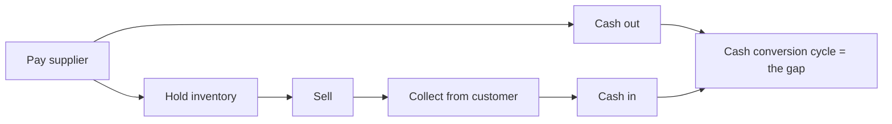

# The Working Capital Cycle by Business Model

## The Problem / Why this matters
Working capital intensity varies enormously across business models, and comparing days across companies with different models produces meaningless conclusions. More importantly, the cycle determines whether growth generates or consumes cash — which is the difference between a business that funds itself and one that requires continuous external capital.

## Core Idea
The cash conversion cycle — inventory days plus receivable days less payable days — determines whether **growth is self-funding**, and the sign of that number is a structural feature of the business model rather than a management achievement.

## Why it works this way
A company pays for inputs before it collects from customers, and the gap must be funded. Where the gap is positive, every rupee of growth requires additional funding. Where it is negative — customers pay before suppliers are paid — growth generates cash, and the business can expand without external capital.

## Full technical content

### The calculation

**Cash conversion cycle = Inventory days + Receivable days − Payable days**

- **Inventory days** = (Inventory ÷ COGS) × 365
- **Receivable days** = (Receivables ÷ Revenue) × 365
- **Payable days** = (Payables ÷ COGS or purchases) × 365

**Use consistent denominators** across the comparison set, and be aware that some companies compute payable days on purchases and others on COGS, producing non-comparable figures.

### By business model

| Model | Typical cycle | Why |
|---|---|---|
| **Organised retail** | Strongly negative | Cash sales, supplier credit — growth funds itself |
| **Quick service restaurants** | Strongly negative | Same mechanism, faster inventory turns |
| **FMCG** | Short positive | Fast-moving inventory, trade credit both ways |
| **Consumer durables** | Moderate positive | Channel inventory and dealer credit |
| **Pharma formulations** | Long positive | Regulatory stock, long export receivables |
| **Auto components** | Moderate positive | OEM payment terms |
| **EPC and construction** | Very long positive | Unbilled revenue, retention money, milestone billing |
| **Real estate** | Negative on advances, long on completion | Customer advances fund construction |
| **Capital goods** | Varies with advance structure | Advances against orders can turn it negative |
| **Commodity trading** | Short but large in absolute terms | Fast turns, thin margins, large balances |

**Negative-cycle businesses are structurally advantaged**, and it is worth stating why explicitly: they require no incremental capital to grow, so RoCE is high by construction and the reinvestment constraint that limits other businesses does not bind.

### The float dimension

A negative cycle is economically equivalent to an interest-free loan from suppliers and customers:
- **The float grows with the business**, so faster growth means more free funding.
- **It reverses if growth stops**, which is the risk — a shrinking negative-cycle business releases cash on the way down and then has none, and a sudden decline in a business funded by supplier credit can become a liquidity event.
- **Supplier dependence** is the vulnerability: the funding depends on suppliers continuing to extend credit, which they may reconsider if the company weakens, per the supply chain finance chapter.

### Reading changes

- **Track days, not rupees**, since rupees rise with both growth and inflation.
- **By component**, since the cause matters: rising inventory, rising receivables and falling payables have different explanations.
- **Against the model's norm** — a positive cycle in a retailer is a warning; the same figure in an EPC contractor is unremarkable.
- **Seasonally aware** — year-end figures may not represent the average, and are the most likely to be managed.
- **Check for financing arrangements** disguising the underlying position, per the supply chain finance chapter.

### The growth-funding implication

Connecting to the capital structure and ROIIC chapters:
- **Incremental working capital = incremental revenue × (cycle days ÷ 365) × (cost ratio).**
- **This is capital employed**, and it belongs in the incremental return calculation — omitting it is the standard error the ROIIC chapter identifies.
- **A long-cycle business growing quickly requires external funding**, and a model showing that growth without financing it is internally inconsistent.
- **A negative-cycle business growing quickly funds itself and generates cash**, which is why such businesses can compound without dilution.

## Common mistakes
- Comparing cycle days across **different business models**.
- Using **inconsistent denominators** for payable days.
- Tracking working capital in **rupees** rather than days.
- Ignoring the **component split** when the cycle changes.
- Missing that a **negative cycle reverses** when growth stops.
- Omitting **incremental working capital** from capital employed in return calculations.
- Forecasting growth in a long-cycle business without funding the working capital.
- Missing **financing arrangements** that disguise the true cycle.

## Interview angle
"Why do retailers earn such high returns on capital?" A large part is the cash conversion cycle: they sell for cash and pay suppliers on credit, so the cycle is strongly negative and they hold customers' money before paying for the goods — which means growth generates cash rather than consuming it, no incremental capital is required to expand, and RoCE is high by construction rather than by superior operations. Say what that implies and where the risk sits: the float grows with the business but reverses if growth stops, so a sharply decelerating negative-cycle business releases cash on the way down and then has none, and the funding depends on suppliers continuing to extend credit, which they may reconsider if the company weakens. Then generalise the point — incremental working capital is capital employed and belongs in any incremental return calculation, so a long-cycle business growing fast needs external funding, and a model that shows the growth without financing the working capital is internally inconsistent.
