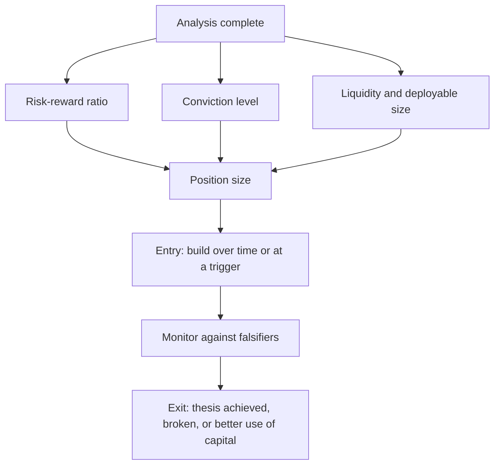

# Translating Analysis Into a Position

## The Problem / Why this matters
An analyst's output is a view; an investor's output is a position. The translation between them — how much to own, when to buy, how to build and exit — is where a correct analysis either becomes a return or does not. Sell-side analysts often stop at the rating, and buy-side interviews probe this gap specifically, because a view without an implementable position is incomplete work.

## Core Idea
Position size follows from **risk-reward, conviction and liquidity together** — not from conviction alone, which is the most common sizing error.

## Why it works this way
The expected contribution of a position is its expected return times its size. But the risk it contributes is its downside times its size, and the ability to establish or exit it is bounded by liquidity. Sizing on conviction alone ignores two of the three inputs, which is how correct analysis produces losses that exceed what the thesis justified.

## Full technical content

### Sizing

The three inputs, and how each constrains:
- **Risk-reward.** A 3:1 ratio supports a larger position than 1.2:1 at the same conviction. **This is the primary input**, and it requires a genuine bear case per the stress-testing chapter.
- **Conviction.** How confident are you in the evidence, honestly assessed? The differentiated insight's strength, the quality of the evidence, and whether the falsification conditions are tight.
- **Liquidity.** What can actually be built and exited within an acceptable period and impact cost? For smaller companies this frequently binds before the other two, per the small-cap and coverage chapters.

**Additional constraints:**
- **Correlation with existing positions** — several ideas resting on the same factor or the same macro driver are one position, per the factor chapter.
- **Downside asymmetry** — a short's unbounded downside argues for smaller size, per the short case chapter.
- **Total loss probability** — distressed and binary situations should be sized for zero, per that chapter.

### Entry

- **Building over time** reduces timing risk and impact cost, and is usually preferable to a single entry in a less liquid name.
- **Entry triggers** — a defined price or a specific event — convert an attractive business into an attractive position. The worked bank case's "Hold with a ₹520 entry trigger" is exactly this: conviction in the analysis without adequate risk-reward at the current price.
- **Do not chase.** If the price moves away before the position is built, recompute the risk-reward at the new price rather than completing the purchase from commitment.

### Monitoring

- **Falsification conditions**, checked on a schedule rather than on price moves.
- **Monitorables** with their reporting dates.
- **Scheduled reviews** quarterly and annually, per the conviction chapter.
- **Position-level risk** — has the position grown to a size that no longer reflects the current risk-reward?

### Exit

The three legitimate reasons, and the discipline of naming which applies:
1. **Thesis achieved** — the price reached the target and the risk-reward no longer justifies the position. This is success, and holding past it abandons the discipline that created the return.
2. **Thesis broken** — a falsification condition met. Exit promptly regardless of the loss, since the reason for owning it has gone.
3. **Better use of capital** — a superior risk-reward available elsewhere. Legitimate, and the reason a concentrated portfolio requires continuous comparison.

**Not legitimate reasons:** the price moved and nothing else, discomfort, or a general sense that it has "had a good run."

### The trim discipline

- **A position that has doubled** now represents a larger share of the portfolio at a worse risk-reward, since the upside to target has compressed.
- **Trimming to the original weight** is a mechanical application of the same discipline that sized it initially, and it is frequently resisted for behavioural reasons.
- **Conversely, adding on a decline** is correct only if the thesis is intact and the falsification conditions are unmet — otherwise it is averaging into an error, which the behavioural chapter identifies as one of the more expensive biases.

### For the sell-side analyst

Even without managing money, the discipline improves the work:
- **State the position size implication** — "we would own this at a moderate weight given the liquidity" is more useful than a rating.
- **Give an entry trigger** where the business is attractive and the price is not.
- **State the exit condition** alongside the target.
- **Acknowledge the liquidity constraint** explicitly, since a recommendation that cannot be implemented at client scale is incomplete.

## Common mistakes
- Sizing on **conviction alone**, ignoring risk-reward and liquidity.
- No **bear case**, so the risk-reward that should drive sizing does not exist.
- Ignoring **correlation** with existing positions.
- Sizing a **short** like a long.
- **Chasing** a price that has moved without recomputing risk-reward.
- Holding past the **target** with no revised view.
- Exiting because the **price moved** rather than for one of the three legitimate reasons.
- Never **trimming** a position that has outgrown its risk-reward.
- Recommending at a size the **liquidity** cannot support.

## Interview angle
"You love the stock. How much would you own?" Give the three inputs rather than a number: risk-reward first, since a 3:1 ratio supports a much larger position than 1.2:1 at identical conviction, and that ratio requires a genuine bear case rather than a haircut; then conviction, honestly assessed from the strength of the evidence and how tight the falsification conditions are; then liquidity, which for smaller companies frequently binds before either of the others. Add the constraints people forget — correlation with existing positions, since several ideas resting on the same factor are one position, and asymmetry, since a short's unbounded downside argues for smaller size than an equivalent-conviction long. Then cover entry and exit, because that is where views become returns: an entry trigger converts an attractive business at an unattractive price into an actionable position, and there are exactly three legitimate reasons to sell — thesis achieved, thesis broken, or a better use of capital — while "the price moved" is not one of them.
