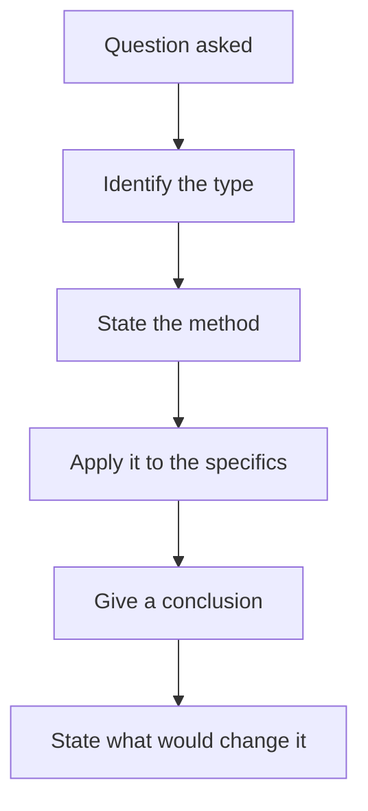

# Common Interview Questions and How to Answer Them

## The Problem / Why this matters
Equity research interviews test a specific and fairly predictable set of things: whether you can form a view, whether your reasoning is sound, whether you know what you do not know, and whether you have done the work. The questions vary in wording but cluster into a small number of types, and preparing by type rather than by memorised answer is what produces a good performance under an unexpected phrasing.

## Core Idea
Interview questions test **reasoning process, not recall** — so answer by showing the method, then applying it, rather than by producing a conclusion.

## Why it works this way
An interviewer cannot verify whether your conclusion about a company is right, and does not much care. What they can assess is whether the path to the conclusion was sound, whether you identified the right questions, and whether you were honest about uncertainty. Those are the transferable qualities.

## Full technical content

### The question types

**1. The pitch.** "Give me a stock idea." Structure: the call first, the quantified differentiated insight, two evidenced pillars, valuation with bear case and risk-reward, dated catalyst, position size, falsification conditions. Per the one-page chapter — and have at least one negative or avoid idea ready, since that is rarer and is noticed.

**2. The technical question.** "How do you value a bank?" Answer with the method and *why* the usual method fails: EV/EBITDA is meaningless for a lender because debt is raw material, so use price-to-book against sustainable RoE, and dividend discount or residual income. **Explaining why the standard approach does not apply is what distinguishes understanding from recall.**

**3. The market question.** "Where do you see the Nifty in a year?" Nobody knows, and pretending to is worse than declining. Give the framework — earnings growth, multiple, and what would move each — state the range and the key uncertainty, and avoid a confident point forecast.

**4. The situation question.** "Your Buy is down 30%. What do you do?" Per the conviction and disagreement chapters: check the pre-committed falsification conditions, distinguish wrong from early, apply the would-I-initiate-today test.

**5. The company question.** "Here's a company. What do you think?" Per the reading-an-unfamiliar-company chapter — state the order before starting, since the order is what is being assessed.

**6. The behavioural question.** "Tell me about a mistake." A real error, classified specifically, with the process change it produced. **A disguised strength is transparent and damaging.**

**7. The motivation question.** "Why research?" Specific and honest — an interest in businesses, in being measured against outcomes, in the writing and the argument. Generic enthusiasm is forgettable.

### The principles that apply across types

- **Answer the question asked**, not the one you prepared.
- **State the method before the conclusion**, so the reasoning is visible even if the conclusion is arguable.
- **Quantify wherever possible.** "Roughly 30% of revenue" beats "a significant portion."
- **Say "I don't know" when true**, and say what you would need to find out. This is a strength, per the no-view chapter, and interviewers test for it deliberately.
- **Never fabricate a number.** It is discovered, and it ends the interview in substance if not in form.
- **Take pushback seriously.** Distinguish a good objection that updates your view from a weak one you can answer — the buy-side chapter's point, and it applies everywhere.
- **Have questions ready** about the role, the coverage and how the team works.

### The preparation that shows

- **Know your own numbers cold**, including the assumptions behind your target.
- **Prepare the bear case harder than the bull case** for anything you pitch.
- **Know the firm's coverage** and, where public, its recent published views.
- **Have a genuine mistake** with a specific process change.
- **Read the sector's recent developments** — being unaware of a major event in a sector you claim to follow is disqualifying.
- **Be able to explain your own background's relevance** concretely rather than by assertion.

### What is actually being assessed

Beyond the answers:
- **Do you think in structures** or in anecdotes?
- **Are you honest about uncertainty?**
- **Do you have genuine curiosity** about businesses, which is hard to fake over an hour?
- **Would they want to argue with you** regularly for years?
- **Have you done the work**, or are you describing work you have read about?

**The last is the most detectable.** An analyst who has actually built a model, done a channel check or tracked a call against its outcome speaks about it differently from someone who has read the description, and interviewers hear the difference immediately.

## Common mistakes
- Producing a **conclusion** without the method.
- Answering the question you **prepared** rather than the one asked.
- **Fabricating** a number under pressure.
- A confident **point forecast** on something unforecastable.
- A "mistake" that is a **disguised strength**.
- Conceding immediately under pushback, or refusing a good point.
- Generic **motivation** answers.
- Describing work you have not done.

## Interview angle
"What's the most important thing in an interview?" Showing the method rather than the conclusion — because the interviewer cannot verify whether your view on a company is right and does not much care, but they can assess whether you asked the right questions and whether the reasoning holds. So structure every answer as method, application, conclusion, and what would change it. Add the two things that are tested deliberately and are easy to fail: saying "I don't know" where it is true, along with what you would need to find out, which is a strength rather than a weakness; and handling pushback by distinguishing an objection that should update your view from one you can answer with evidence, since neither immediate capitulation nor refusal to concede is the right response. And the thing that cannot be faked — having actually done the work. Someone who has built a model, made a channel check or tracked a call against its outcome talks about it differently from someone who has read the description.
