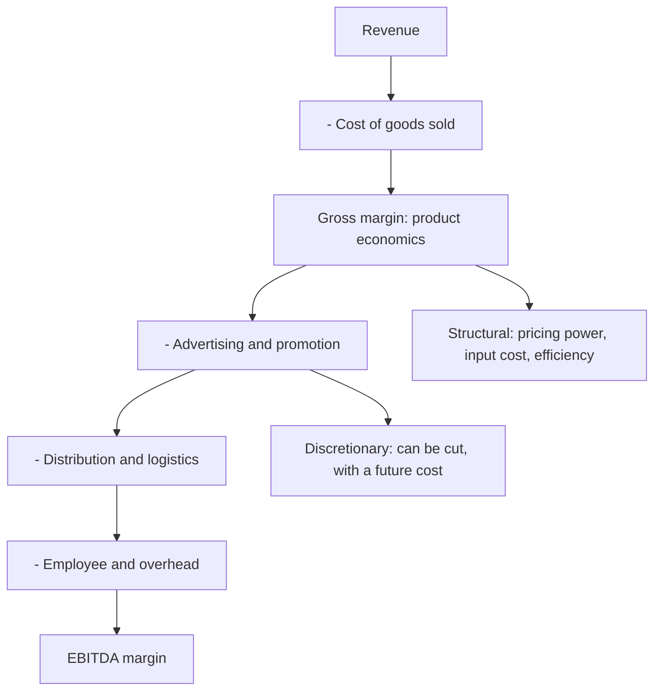

# Gross Margin Analysis and the Cost of Goods

## The Problem / Why this matters
Gross margin is the first line where a company's competitive position becomes visible, and it is frequently skipped in favour of EBITDA margin. But EBITDA blends together the manufacturing economics and the discretionary spend on advertising, distribution and overhead, which have entirely different meanings. Separating them tells you whether a margin change came from what the company makes or from what it chooses to spend.

## Core Idea
Gross margin measures the **product's economics**; the gap between gross and EBITDA margin measures the **cost of going to market** — and confusing the two produces the wrong conclusion about almost every margin change.

## Why it works this way
Gross margin reflects pricing, input costs and manufacturing efficiency — the structural economics of the product. Below it sit advertising, distribution, employee and overhead costs, most of which are discretionary in the short run. A company can hold EBITDA margin flat while gross margin collapses, by cutting advertising — which looks like stability and is borrowed from future revenue.

## Full technical content

### What sits in cost of goods

Definitions vary between companies, which is the first comparability problem:
- **Raw material and packaging** — always included.
- **Direct labour** — usually, but not always.
- **Manufacturing overhead and depreciation** — treatment varies materially.
- **Freight** — inward is usually in COGS; outward may be in COGS or in distribution costs.
- **Trade schemes and discounts** — may be netted from revenue or booked as expenses, which changes both revenue and gross margin.

**Check the accounting policy note before comparing gross margins across companies.** A difference of several percentage points can be entirely definitional, and this is one of the more common false conclusions in peer comparison.

### What gross margin actually reveals

| Movement | Likely cause |
|---|---|
| **Sustained expansion over years** | Genuine pricing power, premiumisation, or structural cost advantage |
| **Compression with rising input prices** | Pass-through lag, per that chapter — cyclical and likely to reverse |
| **Compression with stable inputs** | Price competition — the serious one |
| **Expansion with falling inputs** | Temporary; competition will compete it away |
| **Step change** | Mix shift, a definitional change, or a divestment |

**Sustained gross margin expansion alongside stable or growing volumes is the strongest available evidence of pricing power**, per the pass-through and franchise chapters. It is a higher bar than "raised prices in an inflationary period," which everyone did.

### The gap to EBITDA

The gap is the cost of reaching the customer, and its composition is informative:
- **A high-gross-margin, high-spend model** — branded consumer, pharma — where the product economics are excellent and building the brand is expensive.
- **A low-gross-margin, low-spend model** — distribution, commodity processing — where the value added is thin but so is the cost of doing business.
- **Both can produce the same EBITDA margin**, and they are completely different businesses with different risks: the first is exposed to advertising efficiency and brand erosion, the second to input price and volume.

**Watch the direction of the gap.** Rising advertising and promotion as a share of revenue to hold the same volume indicates weakening brand pull, per the pricing chapter, and it appears here before it appears anywhere else.

### The advertising question specifically

For consumer businesses this is the central discretionary line:
- **A&P as a percentage of revenue**, tracked over years and against peers.
- **A cut that raises reported margin** is borrowing from future revenue — the FMCG chapter's point, and it is visible only if gross margin is examined separately.
- **A step-up ahead of a launch** is investment and should be modelled as temporary.
- **Rising A&P with flat volumes** is the clearest sign that the brand is buying share it used to command.

### Modelling it

- **Forecast gross margin from its drivers** — realisation, input cost, mix — rather than as a percentage assumption, per the margin-bridge chapter.
- **Forecast below-the-line costs separately**, since they follow different logic: advertising as a policy decision, distribution as a function of volume and channel mix, employee costs as headcount times cost.
- **Sense-check the implied EBITDA margin** as an output.
- **Watch for a forecast that holds EBITDA margin by assuming A&P cuts**, which is a decision the company may not make and which has a revenue consequence the model should carry.

## Common mistakes
- Analysing **EBITDA margin** without separating gross margin.
- Comparing gross margins across peers without checking **COGS definitions**.
- Missing that **schemes and discounts** may be netted from revenue rather than expensed.
- Reading a margin hold achieved by **cutting advertising** as stability.
- Confusing **passing through inflation** with genuine pricing power.
- Ignoring the **direction of the gross-to-EBITDA gap** as a brand-strength signal.
- Modelling EBITDA margin directly rather than building it from components.

## Interview angle
"EBITDA margin was flat but you're concerned. Why?" Because a flat EBITDA margin can conceal opposite movements above and below the line: if gross margin fell 200bp and advertising was cut by the same amount, the product's economics have deteriorated while the reported margin held — and the advertising cut borrows from future revenue. So separate the two: gross margin measures the structural economics of what the company makes, and the gap to EBITDA measures the discretionary cost of reaching the customer. Then say what each movement means — gross margin compressing with rising input costs is a cyclical pass-through lag that reverses, but compressing with stable inputs is price competition and does not self-correct. Add the peer-comparison caution: COGS definitions vary, particularly on outward freight and whether trade schemes are netted from revenue or expensed, so a several-point gross margin gap between companies can be entirely definitional and the policy note settles it.
