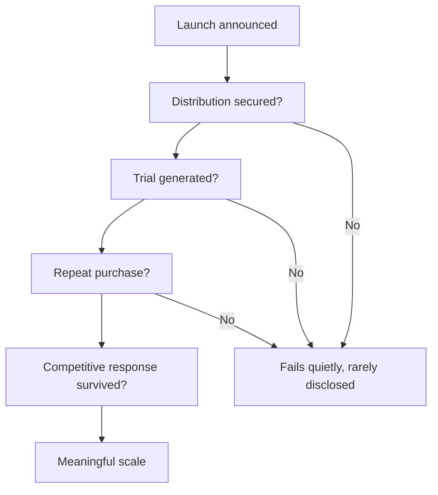

# New Product Launches and Innovation Pipelines

## The Problem / Why this matters
Companies announce new products constantly, and analysts either ignore them or credit them with revenue that never materialises. Most launches fail, the failures are rarely disclosed, and the successes take longer to scale than announced. Assessing a pipeline properly requires knowing the base rates and modelling the successes conservatively rather than modelling the announcements.

## Core Idea
Value a launch pipeline on **historical conversion rates**, not on announcements — because a company's own record of how many launches reached meaningful scale is the best available predictor of the next one.

## Why it works this way
Announcing a product costs nothing and generates favourable news flow. Scaling one requires distribution, consumer acceptance, repeat purchase and competitive survival. The gap between the two is large and is measurable from the company's own history, which most analysts never check.

## Full technical content

### Establishing the base rate

The work that makes the assessment defensible:
1. **List launches announced over the past five years**, from presentations, transcripts and press releases.
2. **Check which are still on the market**, from product listings and channel checks.
3. **Identify which reached disclosed materiality** — a segment line, a named contribution, or management commentary.
4. **Compute the conversion rate** and the typical time to scale.

**This is a few hours of work and transforms the assessment**, because it replaces an assumed success rate with the company's own. A company converting one launch in six into a material product should have its next announcement modelled accordingly.

**Note what is not disclosed.** Companies discuss launches enthusiastically and discontinuations silently, so the failures must be found rather than read.

### What determines success

| Factor | Why |
|---|---|
| **Distribution access** | The Indian consumer moat, per that chapter — a superior product without shelf space fails |
| **Category adjacency** | Extensions into adjacent categories succeed more often than unrelated entries |
| **Repeat rate** | Trial is bought with advertising; repeat is the product working |
| **Competitive response** | An incumbent with distribution and capital can copy quickly |
| **Price point** | Whether it fits an established consumer price architecture |
| **Regulatory pathway** | For pharma and regulated products, approval is the binding step |

**The trial-versus-repeat distinction is the most useful early indicator.** Strong initial offtake proves the advertising worked; sustained repeat purchase proves the product does. Companies sometimes disclose repeat rates, and channel checks can establish them where they do not.

### Sector variations

- **FMCG** — high launch volume, low success rate; distribution and repeat rate decide it.
- **Pharma** — regulated pipeline with disclosed stages and industry-published success probabilities by stage, per the R&D chapter; the analysis is more structured than in most sectors.
- **Autos** — few, large launches with long development cycles; each one is material and the success rate matters enormously.
- **Technology and software** — fast iteration, low launch cost, and the relevant metric is adoption within the existing customer base.
- **Industrial and B2B** — success depends on customer qualification, which is slow and observable, per the export chapter.

### Modelling a pipeline

1. **Do not add announced products to the revenue forecast** at face value.
2. **Apply the historical conversion rate** to the pipeline.
3. **Model the ramp realistically** — distribution build, trial, repeat — over two to four years rather than immediately.
4. **Model the cost**: launches consume advertising, distribution investment and working capital before generating profit, so a heavy launch year compresses margin, and that is investment rather than deterioration.
5. **Treat a genuinely transformative product separately** with a probability, rather than embedding it in the base case.
6. **Check cannibalisation** — a new product frequently takes share from the company's own existing range, so incremental revenue is less than gross revenue.

**Point 6 is routinely omitted** and can eliminate most of the apparent benefit, particularly for line extensions.

### The signals worth monitoring

- **Distribution reach achieved** for the new product, sometimes disclosed.
- **Repeat purchase rates**, where disclosed or establishable.
- **Advertising support** — a company that stops advertising a launch has decided it is not working.
- **Shelf presence** in store visits, per the scuttlebutt chapter — direct, cheap evidence.
- **Continued mention on calls.** A product discussed enthusiastically for two quarters and then never again has failed, and the omission is the disclosure.

That last signal is the clearest and costs nothing to track.

## Common mistakes
- Crediting **announced launches** with revenue.
- Not establishing the company's **historical conversion rate**.
- Ignoring **cannibalisation** of the existing range.
- Modelling an immediate ramp rather than a two-to-four-year build.
- Reading launch-year **margin compression** as deterioration rather than investment.
- Confusing **trial** with repeat purchase.
- Missing that a product's disappearance from commentary is the failure disclosure.

## Interview angle
"Management says new products will drive 30% of growth. How do you treat that?" Check their record before modelling anything: list the launches announced over the past five years, establish which are still on the market and which reached disclosed materiality, and compute the conversion rate — because a company that converts one launch in six should have its next announcement modelled at that rate rather than at face value. Note that the failures must be found rather than read, since companies discuss launches enthusiastically and discontinuations silently, and a product that stopped being mentioned on calls has failed. Then model conservatively: apply the historical conversion rate, ramp over two to four years for distribution build and repeat purchase rather than immediately, and deduct cannibalisation of the existing range, which for line extensions can eliminate most of the apparent incremental revenue. Add the distinction that predicts success — trial is bought with advertising, repeat purchase proves the product works, and the repeat rate is what separates a launch from a product.
