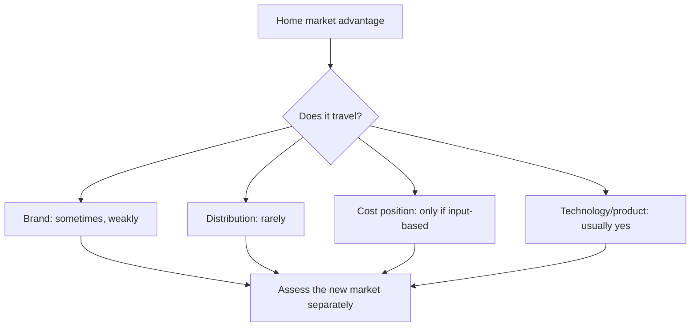

# Geographic Expansion and New Market Entry

## The Problem / Why this matters
Expansion into a new geography — a new state, a new country, a new city tier — is a common growth story and a common source of value destruction. The economics of the home market do not transfer automatically, and companies routinely underestimate the cost and time of building position where they have no distribution, no brand and no local knowledge. The analysis requires treating the new market as a separate business rather than as an extension.

## Core Idea
Assess new-market entry on **whether the company's actual advantage travels** — and most advantages are local, so the honest answer is frequently that it does not.

## Why it works this way
Competitive advantages are specific. Distribution reach, brand recognition, regulatory relationships and cost position based on plant location are all geographically bounded. A company entering a new market brings its capital and its operating capability but usually not the advantage that made it profitable at home — which is why entrants earn lower returns than incumbents for years, if ever.

## Full technical content

### What travels and what does not

| Advantage | Travels? |
|---|---|
| **Product or technology** | Usually — it is embodied in the offering |
| **Manufacturing scale** | Partly — if the new market is served from existing plants |
| **Brand** | Weakly, and slowly; recognition must be rebuilt |
| **Distribution reach** | Rarely — it must be built again from zero |
| **Regulatory relationships** | No |
| **Cost position from plant location** | No, unless the new market is served from the same plant |
| **Management capability** | Yes, but stretched — attention is finite |

**Distribution is the one that matters most in India** and the one that travels least, per that chapter. A company dominant in one region entering another faces incumbents with established trade relationships, and buying that position costs money and time.

### The entry economics

Model it as a separate business:
1. **Investment required** — distribution build, marketing, working capital, possibly local manufacturing.
2. **Time to breakeven**, which is usually longer than guided.
3. **Steady-state margin in the new market**, which is typically below the home market because of lower scale, higher marketing intensity and weaker pricing.
4. **Incremental RoCE** on the entry investment, compared to the home business's returns and to the cost of capital.
5. **The opportunity cost** — could the same capital have been deployed at home at a better return? **This comparison is the one companies avoid making and analysts should.**

### The patterns that fail

- **Entering a market where the incumbent is strong** and has the distribution advantage the entrant lacks.
- **Assuming home-market margins** will be achieved in a market where the company has no pricing power.
- **Underestimating the distribution build**, which is the largest and slowest cost.
- **Diluting management attention** from a profitable core business.
- **Entering because the home market is maturing**, which is the worst reason — it means the entry is being made from weakness with limited alternatives.
- **Serial entry** into multiple markets simultaneously, which spreads capital and attention too thin to succeed anywhere.

### The patterns that work

- **An adjacent market** where distribution or brand partially transfers.
- **A market where the company's product advantage is genuine** and incumbents cannot match it.
- **Entry by acquisition**, buying the distribution rather than building it — subject to the build-versus-buy comparison in that chapter.
- **A structurally underserved market** where no strong incumbent exists.
- **Serving the new market from existing capacity**, which limits the capital at risk to distribution and marketing.

### International expansion specifically

Additional considerations beyond domestic expansion:
- **Currency exposure**, per that chapter — revenue and costs in different currencies, and repatriation.
- **Regulatory and approval requirements**, which for regulated products are the binding constraint and take years.
- **Local partner arrangements**, which introduce the JV and related-party questions of those chapters.
- **The track record of Indian companies' overseas acquisitions**, which is mixed and worth knowing as a base rate — several large ones destroyed substantial value, and a company proposing one should be assessed against that history rather than its own optimism.
- **Management bandwidth across time zones**, which is a real constraint.

### What to track

- **Disclosed new-market revenue and profitability**, where segments permit.
- **Investment committed versus guided.**
- **Time to breakeven versus guided**, which tests the guidance credibility record.
- **Whether the company discloses it at all** — a new market that stops being discussed is not working, per the disclosure chapter.
- **Whether capital continues to be committed** after initial disappointment, which is the escalation pattern the behavioural chapter identifies.

## Common mistakes
- Assuming the **home-market advantage travels**.
- Modelling **home-market margins** in a new market.
- Underestimating the **distribution build** cost and time.
- Ignoring the **opportunity cost** of the capital at home.
- Treating entry as an extension rather than as a **separate business** with its own return.
- Missing that entry driven by home-market maturity is entry from **weakness**.
- Ignoring the base rate on Indian companies' **overseas acquisitions**.
- Not noticing when a new market **stops being discussed**.

## Interview angle
"The company is entering three new states. How do you model it?" As a separate business rather than as an extension: what investment is required in distribution, marketing and working capital, how long to breakeven, what steady-state margin is achievable in a market where the company has no pricing power, and what incremental RoCE that produces against the cost of capital. Then ask the question that determines the answer — does the company's actual advantage travel? Product and technology usually do, manufacturing scale does if served from existing plants, but distribution reach almost never does, and in India distribution is typically the advantage that mattered at home. Add the comparison companies avoid making: could the same capital have earned more deployed in the existing market? And flag the warning sign — entry driven by the home market maturing is entry from weakness rather than strength, which is a very different proposition and usually a worse one.
