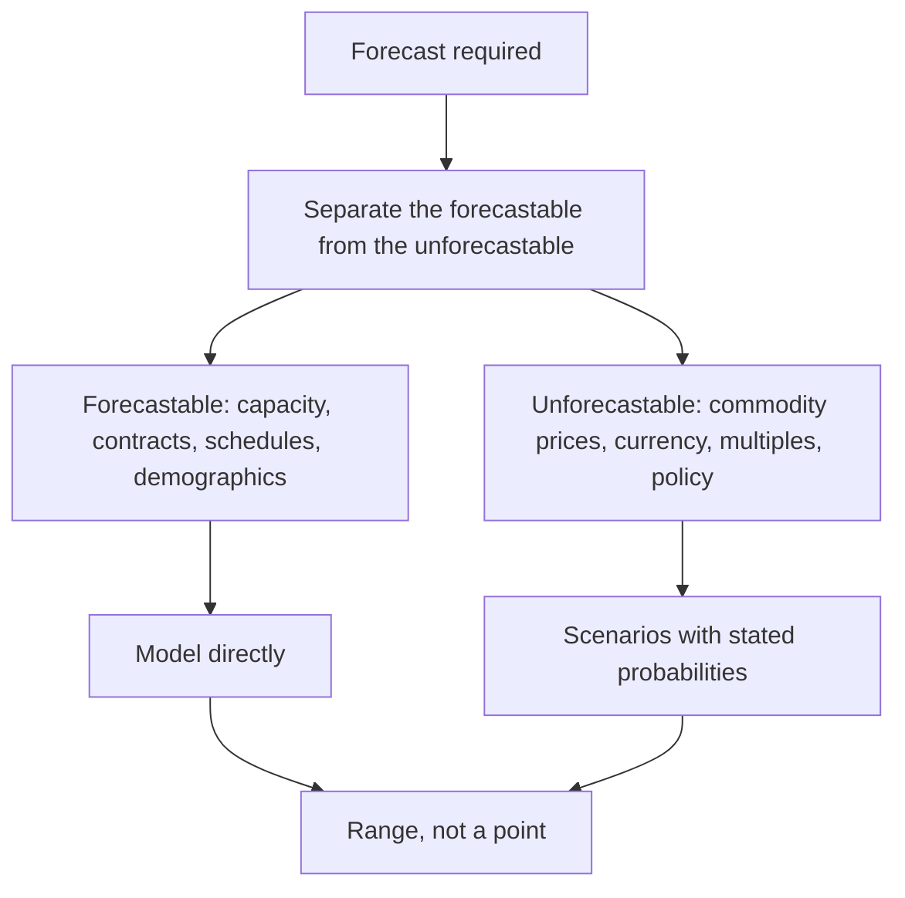

# Forecasting in Conditions of Low Visibility

## The Problem / Why this matters
Some businesses are genuinely hard to forecast — order-driven with lumpy revenue, exposed to volatile commodity prices, dependent on a binary regulatory outcome, or early in a business model's life. The temptation is to produce a point forecast anyway, because the model requires a number. The result is false precision that misleads readers about the reliability of the estimate.

## Core Idea
Where visibility is genuinely low, forecast in **ranges and scenarios with stated probabilities**, and be explicit about what is forecastable and what is not — because the distinction is itself the most useful information you can give.

## Why it works this way
A point estimate implies a confidence the evidence does not support. A client making a decision needs to know not just your central case but how wide the distribution is, because that determines position size and whether to act at all. Presenting a wide distribution as a point estimate removes exactly the information they need most.

## Full technical content

### What is genuinely forecastable

Recurring through these chapters, and worth consolidating:
- **Capacity commissioning schedules** — with a slippage haircut.
- **Contracted order books** — with a conversion haircut.
- **Regulatory decision timelines** — the process has stages, per the policy chapter.
- **Demographic and penetration trends**, which move slowly.
- **Debt maturities and scheduled repayments.**
- **Known events** — lock-in expiries, index rebalances, wage revision cycles.
- **Cost structures**, which are stable in the short run.

### What is not

- **Commodity prices** beyond the forward curve.
- **Currency**, beyond hedged positions.
- **Market multiples.**
- **Policy decisions** not yet in draft.
- **Competitive responses** to a new entrant.
- **The timing** of a cyclical turn, as distinct from its eventual occurrence.

**Stating this division explicitly in a note is unusual and valuable.** It tells the reader which parts of the forecast rest on analysis and which on assumption, which is precisely what they need to judge how much weight to give it.

### Techniques for low-visibility situations

**1. Scenario analysis with probabilities.** Three or four discrete outcomes with stated probabilities, rather than a single path. The probability-weighted value is the headline; the range is the risk.

**2. Decision-tree structure** where outcomes are sequential — a regulatory approval, then a launch, then adoption. Each stage has a probability, and the expected value follows.

**3. Reverse-DCF as the primary tool.** Where forecasting forward is unreliable, working backward from the price to the implied assumptions is more defensible: you may not know what will happen, but you can assess whether what is priced is plausible. **This is the most useful technique in low-visibility situations** and it inverts the problem into one that can be answered.

**4. Range-based valuation** across the key uncertainty, presented as a table so the reader can locate their own view.

**5. Normalised or mid-cycle basis**, per the cyclicals chapter, which sidesteps the timing question entirely by valuing through the cycle.

**6. Asset-based floors** — replacement cost, book value, liquidation — which give a downside anchor independent of the earnings forecast.

### Presenting it honestly

- **Lead with the range**, not a point.
- **State the key uncertainty** and its effect on value.
- **Give the scenarios** and their probabilities, with the basis for the probabilities.
- **Say which parts of the forecast you have confidence in** and which are assumption.
- **Specify what evidence would narrow the range**, and when it is expected — which converts uncertainty into a monitorable and sometimes a catalyst.
- **Where the uncertainty is irreducible, say so** rather than manufacturing precision, per the no-view chapter.

### The position-size link

Low visibility should flow through to the recommendation, not just the valuation:
- **A wide distribution argues for a smaller position** at the same expected return, per the sizing chapter.
- **Stating that explicitly** is more useful than a rating alone.
- **An entry trigger** may be the right answer where the business is attractive but the range is too wide to act at the current price.

### What not to do

- **Do not narrow the range artificially** to appear more confident. Readers who have followed a few of your forecasts will know.
- **Do not hide the uncertainty in the discount rate**, which is unfalsifiable and obscures where the risk actually sits.
- **Do not produce a point forecast and a risk section that contradicts it** — if the risks are large enough to matter, they belong in the scenarios.
- **Do not treat low visibility as a reason to avoid a view entirely** where the price is clearly outside any plausible range. Sometimes the range is wide and the price is still wrong, and saying so is the whole value of the work.

## Common mistakes
- Producing a **point forecast** where the distribution is wide.
- Failing to separate the **forecastable from the unforecastable**.
- Hiding uncertainty in the **discount rate**.
- Presenting **commodity or currency** forecasts as though they were analysis.
- Narrowing the range to appear confident.
- Not stating **what would narrow it**, and when.
- Failing to reflect low visibility in the **position size**.

## Interview angle
"How do you forecast a business with no visibility?" Start by separating what genuinely is forecastable from what is not — commissioning schedules, contracted order books, debt maturities, regulatory timelines and demographic trends can be modelled directly, while commodity prices, currency, market multiples and the timing of a cyclical turn cannot — and say that stating that division explicitly in the note is itself the most useful thing you can give a reader, because it tells them which parts of the forecast rest on analysis. Then invert the problem: where forecasting forward is unreliable, a reverse-DCF is more defensible, because you may not know what will happen but you can assess whether what the price implies is plausible. Present the output as a range with scenarios and stated probabilities rather than a point, specify what evidence would narrow the range and when it arrives, and flow the uncertainty through to position size rather than stopping at the valuation. And avoid the two evasions — narrowing the range to appear confident, and burying the uncertainty in the discount rate where it cannot be examined.
