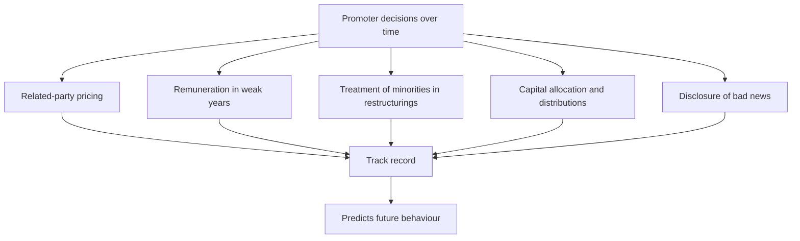

# Promoter Behaviour and Minority Outcomes

## The Problem / Why this matters
In a market where most listed companies are promoter-controlled, the promoter's behaviour is a larger determinant of minority shareholder outcomes than the quality of the underlying business. A good business under a promoter who extracts value produces poor returns for minorities; an ordinary business under a promoter who treats minorities as partners can produce good ones. This is the single most consequential assessment in Indian equity research, and it is made from evidence rather than impression.

## Core Idea
Promoter behaviour is a **track record, not a judgement of character** — assembled from disclosed actions over years, and predictive because behaviour is consistent.

## Why it works this way
A controlling shareholder faces the same set of decisions repeatedly: how to price related-party transactions, whether to take remuneration in weak years, how to treat minorities in a restructuring, whether to disclose bad news. How they have decided before is the best available predictor of how they will decide next, and every one of those decisions is disclosed.

## Full technical content

### Building the record

Each of these is disclosed and checkable:

| Behaviour | Where to find it | What it reveals |
|---|---|---|
| **Related-party pricing** | Related-party note over five years | Whether value flows out |
| **Remuneration through a downturn** | Remuneration disclosure | Whether pay falls when profits do |
| **Restructuring terms** | Scheme documents, swap ratios | Whether minorities were treated equally |
| **Preferential allotments** | Pricing versus floor and market | Whether the promoter allotted to themselves cheaply |
| **Dividend policy** | History | Whether cash is shared or retained |
| **Buyback participation** | Whether the promoter tendered | Whether control was increased at the company's expense |
| **Pledging** | Shareholding pattern | Whether personal leverage is imposed on the company's shareholders |
| **Disclosure of bad news** | Timing versus events | Whether problems are disclosed or minimised |
| **Group entity dealings** | Related-party and guarantee disclosures | Whether the listed company subsidises the group |

### The positive indicators

Worth stating, because the assessment should be symmetric:
- **Promoter buying in the open market** with personal capital, especially after declines.
- **Full participation in rights issues**, including subscribing to unsubscribed portions.
- **Remuneration that falls in weak years**, which is rare and genuinely informative.
- **Consistent dividend policy** maintained through downturns.
- **Related-party transactions minimal or clearly arm's-length**, with evidence rather than assertion.
- **Prompt disclosure of problems**, including ones that could have been delayed.
- **Professional management given genuine authority**, evidenced by decisions rather than titles.
- **Board with genuinely independent directors** who have challenged something, per the boards chapter.

### The negative indicators

- **Related-party transactions rising** as a share of the relevant base.
- **Royalty or remuneration that ratchets** but never falls.
- **Loans to related parties** rolled rather than repaid.
- **Guarantees for group entities** large relative to net worth.
- **Preferential allotments** at prices favourable to the promoter.
- **Restructurings** whose terms favour promoter-held entities.
- **Pledging rising**, especially while the price falls.
- **Auditor or independent director resignations**, particularly with vague reasons.
- **Disclosure deteriorating**, per that chapter.

### How it enters the valuation

Three treatments, in increasing severity, per the related-party chapter:
1. **Restate quantifiable extraction** — an above-market royalty, an inflated rent — and value the restated earnings. Most rigorous.
2. **Apply a governance discount**, stated and justified.
3. **Decline to recommend.** Where the structure permits extraction at discretion and history shows it occurring, no multiple compensates, because the minority's claim on future cash flow is not secure.

**The third is the correct answer more often than analysts are comfortable saying**, and saying it plainly is a service to clients.

### The asymmetry worth understanding

- **Good governance does not guarantee returns** — a well-governed company in a bad business still earns poorly.
- **Poor governance can destroy returns entirely** regardless of business quality, because the cash flows may not reach minorities.
- **Governance is therefore a precondition rather than a scoring factor** — the conclusion the related-party, boards and management chapters all reach independently.
- **The failures are usually not sudden.** The indicators above typically appear years before value is destroyed, which means the loss was avoidable by anyone reading the disclosures.

### Change over time

Behaviour is consistent but not immutable:
- **Generational transition** frequently changes practice, in either direction.
- **Institutional shareholding rising** brings scrutiny and can improve behaviour.
- **A capital-raising need** creates an incentive to improve governance, since investors price it.
- **Improvement is a genuine re-rating catalyst** — the uncertainty discount narrows, and this is one of the more reliable sources of multiple expansion.
- **Deterioration is equally real** and is visible in the same indicators.

## Common mistakes
- Assessing promoters on **impression** rather than on the disclosed record.
- Treating governance as **one factor among many** rather than a precondition.
- Ignoring **positive** indicators, making the assessment one-sided.
- Applying a vague discount instead of **restating** quantifiable extraction.
- Missing that the warning indicators appear **years in advance**.
- Recommending on cheapness where extraction is ongoing and unconstrained.
- Assuming behaviour never changes, and missing governance improvement as a catalyst.

## Interview angle
"How do you assess a promoter?" As a track record assembled from disclosure rather than as a judgement of character, because the same decisions recur and how they were made before predicts how they will be made next. Go through what you would check: related-party transactions as a proportion of the relevant base over five years and their direction; whether remuneration and royalty fall in weak years or only ratchet upward; whether loans to related parties have ever actually been repaid; the terms of past restructurings and whether minorities were treated equally; pledging and its trend; and how bad news has been disclosed historically. Be symmetric — promoter buying with personal capital, full participation in rights issues, pay that falls with profits and prompt disclosure of problems are all genuinely positive and disclosed. Then state how it enters the work: restate quantifiable extraction into the numbers rather than applying a vague discount, and where the structure permits discretionary extraction and history shows it happening, the honest answer is that no multiple compensates — which is the right answer more often than it gets said.
