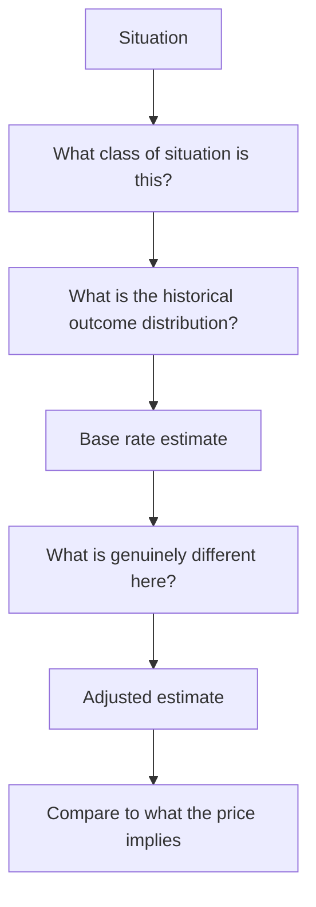

# Using History, Analogues and Base Rates

## The Problem / Why this matters
Every situation an analyst faces has happened before, somewhere. A company entering a new market, a cyclical industry adding capacity at peak margins, a serial acquirer, a business model transitioning to subscription — all have historical precedents with known outcomes. Ignoring those base rates in favour of a narrative about why this time is different is the most reliably expensive analytical error, and it is made constantly because the specific case always feels distinctive from inside.

## Core Idea
Start from the **base rate** — what usually happens in situations of this type — and adjust for what is genuinely different, rather than building a forecast from the specific case alone.

## Why it works this way
The specific case is vivid and detailed; the base rate is abstract and easy to dismiss. But the specific details that seem to justify an exception are usually present in the failures too. Anchoring to the historical outcome distribution and then adjusting is more accurate than reasoning from the particulars, and it is a discipline rather than an insight.

## Full technical content

### The base rates worth knowing

Assembled from these chapters, and each is checkable rather than asserted:

| Situation | Typical outcome |
|---|---|
| **Capacity added at peak margins** | Commissions into oversupply; returns far below those that justified it |
| **Large acquisitions** | Frequently destroy value; the acquirer's own record is the best predictor |
| **New product launches** | Most fail; conversion to material scale is low |
| **Geographic expansion** | Returns below the home market for years |
| **Project cost and schedule** | Overruns and slippage are the norm |
| **Turnarounds** | Most fail; liquidity to survive is the binding requirement |
| **Guidance** | Company-specific credibility record varies enormously |
| **Announced synergies** | Cost synergies partly achieved and late; revenue synergies rarely |
| **Index-inclusion price effects** | Real but compressed over time as the mechanic became known |
| **Published factor anomalies** | Several compressed after publication |
| **Distressed equity in insolvency** | Usually extinguished |

**The most useful base rates are company-specific**, per the guidance, capital allocation and product launch chapters: what proportion of *this* company's past projects came in on budget, what proportion of *its* launches scaled, whether *its* guidance is conservative or aspirational. Building those records is a few hours each and they are far more predictive than industry averages.

### Using analogues

Where the company's own history is short, look for the same situation elsewhere:
- **Other markets** where a transition has already happened, per the cross-market chapter — a category's penetration curve in a comparable economy at a similar income level is the strongest available evidence for thematic sizing.
- **Other companies** that made the same move — an acquirer entering an adjacent category, a manufacturer integrating backward.
- **Other cycles** in the same industry, which give the shape and typical duration.
- **Global peers at a later stage** of maturity, which indicate terminal margins and industry structure at scale.

**Analogues inform the forecast, not just the multiple**, and that is where most of their value sits — telling you what a business model earns at maturity is more useful than telling you what a comparable trades at.

### The adjustment step

Base rates are the starting point, not the answer. The question is what is genuinely different:
- **Is the company's execution record actually better** than the base rate, evidenced rather than asserted?
- **Is the structural situation different** — an underserved market, a genuine technology advantage, a regulatory change?
- **Is the scale different** in a way that matters?

**The discipline: state the base rate, state the adjustment, and state the evidence for the adjustment.** An adjustment without evidence is the narrative overriding the data, which is exactly the failure the base rate exists to prevent.

### "This time is different"

Sometimes it genuinely is, and dismissing every exception is its own error:
- **Structural changes do occur** — a market formalising, a technology genuinely displacing another, a regulatory regime changing permanently.
- **The test is whether the difference is mechanical** — a specific, identifiable change in the situation — **or narrative**, a story about why the usual outcome will not apply.
- **Ask what would have to be true**, and whether there is evidence for it.
- **Base rates are a prior, not a constraint.** Strong evidence should move you off them; the requirement is that the evidence be strong.

### Where to find the base rates

- **The company's own disclosures** over five to ten years — the highest-value source.
- **Peer histories** in the same sector.
- **Rating agency sector studies**, which aggregate outcomes across issuers.
- **Academic and practitioner literature** on acquisitions, capacity cycles and factor returns.
- **Your own post-mortem record**, per the learning chapter, which is the most personally calibrating source of all.

## Common mistakes
- Reasoning from the **specific case** without checking what usually happens.
- Accepting "**this time is different**" without a mechanical reason.
- Using **industry averages** where a company-specific record is available.
- Not building the company-specific records because they have **no deadline**.
- Treating base rates as a **constraint** rather than a prior that strong evidence can move.
- Applying an analogue without checking the **structural comparability**.
- Using analogues only for multiples rather than for **forecast assumptions**.

## Interview angle
"Management says this acquisition will be different from their last two, which failed. How do you respond?" Start from the base rate rather than the narrative: large acquisitions frequently destroy value, and the single best predictor of this one is the acquirer's own record — so compute RoCE with and without goodwill to quantify what the previous deals actually did, and check whether the stated synergies from those deals were ever achieved. Then apply the adjustment discipline: ask what is *mechanically* different about this transaction rather than what the story says — a different category, a different integration approach, a management change — and whether there is evidence for it beyond assertion. Say explicitly that base rates are a prior rather than a constraint, so strong evidence should move you off them, but an adjustment without evidence is just the narrative overriding the data. And note the general point: the most useful base rates are company-specific — the proportion of its past projects delivered on budget, of its launches that scaled, of its guidance met — and each takes a few hours to build from annual reports.
