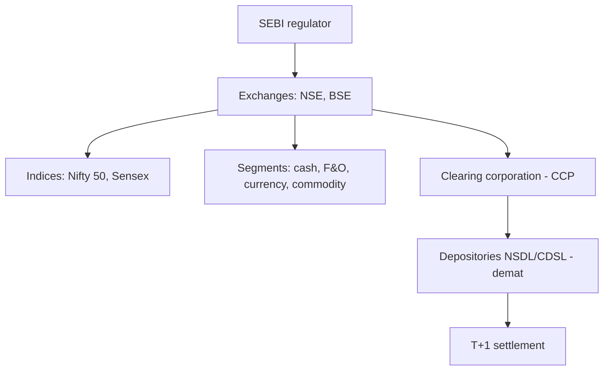

# Indian Equity Markets (Capstone)

## The Problem / Why this matters
For any finance role in India, you must know your home market cold — the regulator, the exchanges, the indices, how shares are held and settled, the segments, and the participants. It's the most common "home turf" interview check, and it ties together everything in this book in the specific institutional context you'll actually work in. This capstone maps the Indian equity ecosystem end to end.

## Core Idea
The Indian equity market is a **modern, electronic, well-regulated** market: **SEBI** regulates it; **NSE and BSE** are the exchanges; **Nifty 50 and Sensex** are the benchmarks; shares are held in **demat** via NSDL/CDSL and settle at **T+1**; and it spans cash, F&O, currency and commodity segments with deep participation from retail, domestic institutions, and foreign investors.

## Why it works this way
India built a fully dematerialized, exchange-traded, centrally-cleared market with strong disclosure and one of the world's fastest settlement cycles precisely to ensure trust, liquidity and investor protection — the conditions that let a large, diverse investor base participate and companies raise capital efficiently.

## Full technical content

**Regulator:** **SEBI (Securities and Exchange Board of India)** — regulates issuers (disclosure), intermediaries (registration/conduct), and markets (surveillance, insider-trading and manipulation enforcement); protects investors. **RBI** oversees monetary policy and banking; **IRDAI** insurance.

**Exchanges:** **NSE** (National Stock Exchange — the larger by volume, especially derivatives) and **BSE** (Bombay Stock Exchange — Asia's oldest). Both are fully electronic, order-driven markets.

**Benchmark indices:** **Nifty 50** (NSE, 50 large-caps) and **Sensex** (BSE, 30 large-caps), both **free-float market-cap weighted**. Broader: Nifty Next 50, Nifty 100/500, Midcap/Smallcap, and sectoral indices (**Bank Nifty**, Nifty IT, etc.).

**Holding & settlement:** shares held in **dematerialized (demat)** form via depositories **NSDL** and **CDSL** (through Depository Participants); trades cleared by the **clearing corporation** (central counterparty) and settled on **T+1** (India moved to T+1 fully in 2023 and is piloting T+0/instant) — among the fastest globally.

**Market segments:**
| Segment | What trades |
|---|---|
| **Cash / equity** | Delivery-based and intraday shares |
| **F&O (derivatives)** | Index and stock futures & options (Nifty, Bank Nifty are among the world's most traded) |
| **Currency derivatives** | USD/INR and other pairs |
| **Commodity** | Via MCX/NCDEX (and NSE/BSE segments) |

**Participants:** retail (large and growing, via demat/UPI-based investing), **domestic institutions (DIIs)** — mutual funds, insurers (LIC), pension (EPFO/NPS) — and **foreign portfolio investors (FPIs)**, whose flows often drive index moves. Promoters hold large stakes in many firms.

**Trading mechanics:** order-driven, price-time priority; **circuit breakers** (index-level halts) and **price bands** (stock-level) curb extreme moves; **UPI/ASBA** streamline IPO applications and payments.

**Recent evolution:** surging retail participation (record demat accounts), the rise of discount brokers and index/SIP investing, T+1 (moving to instant) settlement, and world-leading F&O volumes (prompting SEBI curbs on retail options speculation).

## Worked examples

**Example 1 — the full trade lifecycle.** A retail investor places a market buy for 100 shares of an NSE-listed company via a broker app. The order matches on the NSE by price-time priority; the **clearing corporation** guarantees it; on **T+1**, shares are credited to the investor's **CDSL/NSDL demat** account and cash debited. Regulated end-to-end by SEBI. Every institution in this chapter touched one small trade.

**Example 2 — FPI flows move the Nifty.** Foreign investors turn net sellers of ₹15,000 cr in a week on global risk-off. Because FPIs hold large weights in Nifty heavyweights and trade fast, the index falls sharply even without India-specific news — illustrating why FPI flows are watched as a key driver.

**Example 3 — F&O depth.** Bank Nifty and Nifty options are among the most actively traded derivatives in the world, giving Indian markets deep hedging and speculation venues — but also prompting SEBI to tighten rules to protect retail traders from outsized options losses. India's derivatives market is globally significant.

**Example 4 — DII flows offsetting FPI selling.** Continuing Example 2: the same week FPIs sell ₹15,000 cr, DIIs (domestic mutual funds, insurers) net-buy ₹11,000 cr, cushioning roughly three-quarters of the FPI outflow's index impact. This DII-as-stabiliser pattern has become a structural feature of Indian markets over the past decade, driven substantially by rising domestic SIP (Systematic Investment Plan) mutual-fund inflows — a monthly, relatively flow-insensitive-to-sentiment source of buying that didn't exist at the same scale two decades ago. An analyst explaining "why didn't the market fall as much as the FPI selling would suggest" should be able to name this DII/SIP-flow offset explicitly, not just cite "buying support" vaguely.

**Example 5 — a circuit breaker in action.** A stock-specific circuit filter (e.g. 10% for a mid-cap) halts trading in a single name after unexpected, severely negative news (a fraud allegation, a regulatory action) causes a rush of sell orders. The halt gives the market a cooling-off period — allowing information to be digested and genuine two-sided price discovery to resume — rather than letting a single wave of panic-selling execute against a thin, one-sided order book at an arbitrarily bad price. Index-level circuit breakers (triggered by a large move in Nifty/Sensex itself) work the same way at the market-wide level during systemic shocks. Knowing that circuit filters differ by stock category (larger, more liquid stocks typically have wider bands than smaller, more volatile ones) is the kind of granular, "home turf" detail this capstone chapter flags as a common interview differentiator.

## How it is tested in interviews
- **"Walk me through the Indian equity market structure."** — SEBI regulates; NSE/BSE are the exchanges; Nifty 50/Sensex are the benchmarks (free-float market-cap weighted); shares held in demat via NSDL/CDSL; cleared by the clearing corporation; settled T+1; segments cash/F&O/currency/commodity.
- **"Who regulates the Indian securities market?"** — "SEBI — issuers, intermediaries, and markets, with investor protection; RBI covers banking/monetary, IRDAI insurance."
- **"What are the main indices and how are they built?"** — "Nifty 50 (NSE) and Sensex (BSE), free-float market-cap weighted large-cap baskets."
- **"How are trades settled in India?"** — "T+1 rolling settlement, shares in demat via NSDL/CDSL, guaranteed by the clearing corporation as central counterparty — among the fastest cycles globally."
- **"What drives Indian market moves?"** — "FPI and DII flows, global cues, rates/inflation and RBI policy, earnings, and sentiment; FPI flows especially move the index."

## Traps & common mistakes
- Confusing **SEBI** (securities) with **RBI** (banking/monetary) roles.
- Not knowing India settles at **T+1** (and is going faster).
- Forgetting Nifty/Sensex are **free-float** market-cap weighted.
- Mixing up the **exchange** (NSE/BSE), **depository** (NSDL/CDSL), and **clearing corporation** roles.
- Underrating **FPI flows** and India's globally-large **F&O** volumes.

## First-principles recap
- **SEBI** regulates; **NSE/BSE** are the exchanges; **Nifty 50/Sensex** the free-float benchmarks.
- Shares are held in **demat** (NSDL/CDSL) and settle **T+1** (moving to instant).
- Segments: cash, F&O (globally large), currency, commodity.
- Participants: retail (surging), DIIs, FPIs (flow-drivers), promoters.
- A modern, electronic, centrally-cleared, well-regulated market — the context for every Indian finance role.

## Quick-reference
| Element | India |
|---|---|
| Regulator | SEBI (RBI banking, IRDAI insurance) |
| Exchanges | NSE, BSE |
| Indices | Nifty 50, Sensex (free-float mcap) |
| Depositories | NSDL, CDSL (demat) |
| Settlement | T+1 (→ instant), CCP-guaranteed |
| Segments | Cash, F&O, currency, commodity |
| Flow drivers | FPIs, DIIs |
