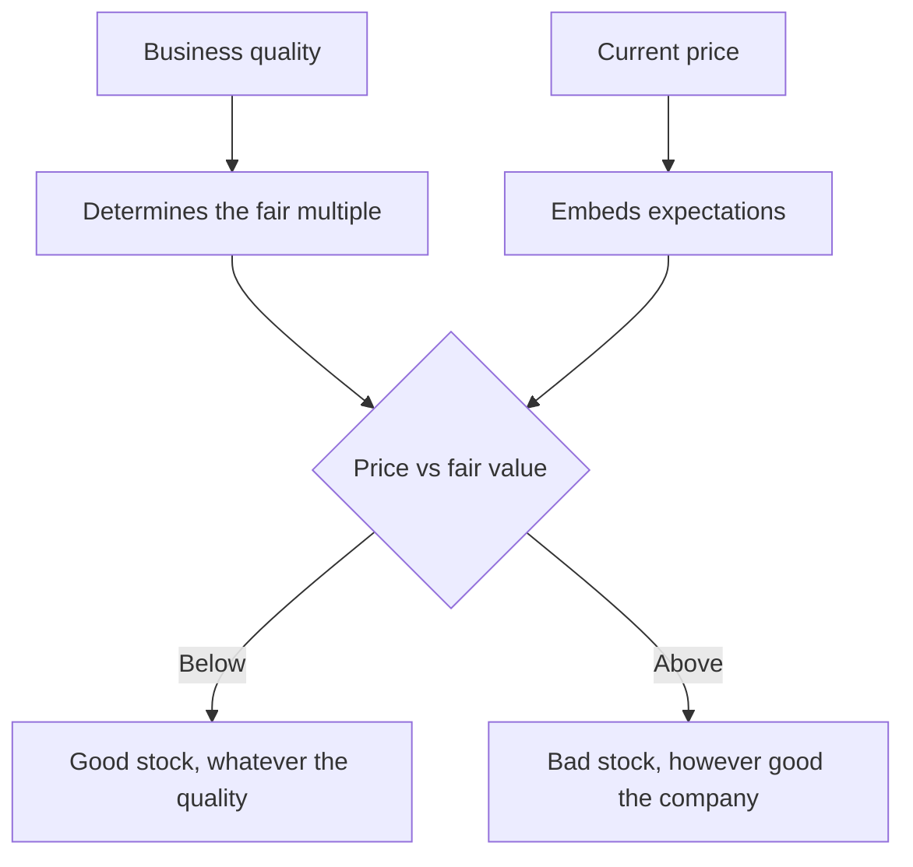

# The Difference Between a Good Company and a Good Stock

## The Problem / Why this matters
Analysts spend most of their effort assessing business quality — moats, returns, management, growth — and then recommend the companies that score highest. But the return on a stock depends on what was paid relative to what was received, and business quality is only one input to that. The best companies are frequently the worst stocks, and recognising when that is the case is a distinct skill from analysing the business.

## Core Idea
Business quality and expected return are **different questions**. A great company at a price that already reflects its greatness offers no excess return; an ordinary company priced for deterioration that does not occur offers a great deal.

## Why it works this way
Price embeds expectations. A company universally recognised as excellent trades at a multiple reflecting that recognition, so the return comes only from exceeding already-high expectations. A company expected to deteriorate needs only to deteriorate less than expected — a much lower bar that has nothing to do with quality.

## Full technical content

### The distinction in practice

| | Good company | Poor company |
|---|---|---|
| **Cheap** | The ideal, and rare — usually requires a temporary problem or neglect | The classic value situation; the question is whether it is a trap |
| **Expensive** | The most common trap — quality recognised and fully priced | Avoid |

**The top-left case is rare** and usually arises from one of three conditions: a temporary, fixable problem in a good business; genuine neglect because the company is under-covered; or a market-wide dislocation. Identifying which applies determines whether it is an opportunity or a value trap.

### Why great companies are often poor stocks

- **Quality is recognised** and priced; there is no informational edge in observing that a well-known franchise is a good business.
- **Expectations are high**, so meeting them produces no re-rating and missing them produces a large de-rating.
- **The multiple has more room to fall than to rise** — a business at 55× has limited multiple expansion available and substantial compression risk.
- **Growth decelerates** with scale, and multiples compress as it does, which is a mathematical near-certainty rather than a risk.

### Why ordinary companies are sometimes good stocks

- **Expectations are low**, so the bar is low.
- **Improvement from a poor base** produces both earnings growth and multiple expansion, which compound.
- **Neglect** means the analysis has not been done by others.
- **Mean reversion in returns** works in favour of a business earning below its normal level, provided it survives.

**The condition, always: survival.** A poor company that fails returns nothing, which is why the balance sheet checks matter more here than anywhere.

### How to hold both ideas

The framework that reconciles them:
1. **Assess business quality honestly** — it determines the fair multiple and the durability of the cash flows.
2. **Assess the price** against that fair value.
3. **The recommendation follows from the gap**, not from the quality.
4. **Quality affects position size and holding period** — a high-quality business can be held through uncertainty because time works for it, while a poor one requires the thesis to play out.

**Quality determines what you can hold; price determines what you should buy.** That formulation captures the whole distinction.

### The specific traps

- **"It's a great company"** as a recommendation. It is an observation, and the market has made it too.
- **Paying any price for quality**, which the growth chapters address — even an excellent business has a price above which it is a poor investment.
- **Avoiding an ordinary business at any price**, which forgoes the situations where expectations are lowest.
- **Confusing a low multiple with cheapness**, per the cyclicals and value-trap discussions — the multiple must be against normalised earnings and a defensible fair value.
- **Extrapolating quality indefinitely** — the franchise chapter's fade assumption is where this gets tested.

### The reverse-DCF as the reconciler

The single most useful tool here: **what does the current price require the company to achieve?**
- For a high-quality, highly valued business: does the implied growth and return persistence exceed anything achieved historically, by this or any comparable company?
- For a poor-quality, cheaply valued one: does the price imply permanent deterioration that the evidence does not support?

**This converts the quality debate into a testable question about assumptions**, which is where it should be resolved — and it is the same technique the triangulation and disagreement chapters rely on.

## Common mistakes
- Recommending on **business quality** rather than on the gap to fair value.
- Treating "great company" as an **investment case**.
- Paying any multiple for quality without testing the **implied assumptions**.
- Dismissing ordinary businesses regardless of **price**.
- Confusing a **low multiple** with cheapness.
- Ignoring that multiples compress as growth decelerates with scale.
- Buying a poor business without checking it will **survive**.

## Interview angle
"Is this a good company or a good stock?" Treat them as separate questions and say why: business quality determines the fair multiple and the durability of the cash flows, but the return comes from the gap between price and value, so a great company whose greatness is fully recognised offers no excess return while an ordinary company priced for deterioration that does not happen can offer a lot. Then give the reconciling tool — a reverse-DCF, asking what the current price requires the company to achieve, because for an expensive high-quality business the question is whether the implied growth and return persistence exceed anything ever achieved, and for a cheap poor-quality one whether the price implies permanent deterioration the evidence does not support. Add the formulation that ties it together: quality determines what you can hold, since a good business lets time work for you through uncertainty, while price determines what you should buy. And note the condition on the cheap side — a poor business has to survive for mean reversion to help, which is why the balance sheet checks matter more there than anywhere.
