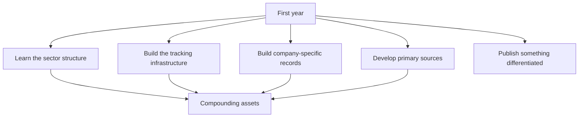

# What to Do in the First Year of the Job

## The Problem / Why this matters
A new analyst is given a sector, a model to maintain and a great deal to learn, with little structure about what to prioritise. The default is to be reactive — update models, answer requests, absorb the sector's conventional wisdom. That produces competence eventually. A deliberate first year produces competence faster and builds assets that keep paying afterwards.

## Core Idea
Spend the first year building the **compounding assets** — the sector framework, the tracking infrastructure, the company-specific records — because they are cheapest to build when you are new and are useful for as long as you cover the sector.

## Why it works this way
The records that make an experienced analyst effective — the guidance credibility record, the past project outcomes, the read-across map — are built from historical filings, which take the same time to assemble in year one as in year five. Building them early means operating with the advantage for four extra years, and most analysts never build them at all because they have no deadline.

## Full technical content

### Months 1–3: the framework

Per the first-90-days chapter: value chain, industry structure, the two or three variables that move earnings, where the data is published, and the companies. **Publish a sector primer**, which forces the framework to be articulated and establishes you with clients.

### Months 3–6: the infrastructure

The tracking assets, each built once:
- **The data tracker** — the high-frequency operating series for the sector, with the historical relationship to reported financials calibrated.
- **The read-across map** — suppliers, customers, competitors, global peers and their reporting calendars.
- **The competitive tracker** — participant-level revenue, capacity, pricing and share on a consistent basis.
- **Standardised models** across coverage, so updating is mechanical.

### Months 4–9: the company records

The historical records that predict, each a few hours from annual reports:
- **Guidance credibility** — five years of guidance versus delivery, per company.
- **Capital allocation** — past projects: announced versus actual cost, timeline and return.
- **Acquisition outcomes** — RoCE with and without goodwill.
- **Product launch conversion** — announced versus scaled.
- **Promoter behaviour record**, per that chapter.

**These are what separate an analyst who knows a sector from one who covers it**, and they are almost never built because nothing forces them.

### Throughout: primary sources

- **Meet management** across the sector, including smaller companies who speak more freely.
- **Build channel relationships** — distributors, suppliers, industry participants — within the compliance boundaries.
- **Do site visits**, which are disproportionately informative early and cost only time.
- **Find someone who has watched two cycles** in the sector and talk to them properly.

### Months 6–12: publish something differentiated

- **One piece of genuinely original work** — a proprietary dataset, a channel-check study, a contrarian initiation with primary evidence.
- **It matters more than a year of competent updates**, because it establishes what kind of analyst you are.
- **Choose a name where the coverage is thin** and the dispersion is high, per the breadth chapter, so the work has room to be differentiated.

### The habits to establish now

Because they are hard to start later:
- **Compare every quarter's actuals against your own estimate**, line by line, and record it. **This is the calibration record and it cannot be reconstructed retrospectively.**
- **Write down what seems odd** about the sector in the first months, before its conventions become invisible — the perishable advantage the first-90-days chapter identifies.
- **Conduct post-mortems** on calls, classified by error type.
- **Keep source notes** on every historical input.
- **Read full transcripts**, not summaries.

### What to avoid

- **Inheriting the previous analyst's conclusions** without rebuilding them.
- **Over-relying on management** as the primary source, which is the easiest path and the most self-interested source.
- **Publishing a stock call before the sector framework exists.**
- **Trying to cover too many names**, which produces shallow work everywhere.
- **Absorbing the sector's orthodoxy uncritically** — the conventional framework may be years out of date.

### The realistic expectation

- **The first year is mostly learning**, and the output will be more competent than differentiated. That is normal.
- **The compounding assets built now** are what make years two and three different.
- **One good call** in the first year, properly evidenced, is worth more than uniform competence.
- **The habits established now** — calibration records, post-mortems, primary work — determine the trajectory more than the analysis of any single company.

## Common mistakes
- Being **reactive** for a year and building nothing that compounds.
- Not building the **calibration record** from the first quarter, when it is impossible to reconstruct later.
- Inheriting the previous analyst's **framework** wholesale.
- Relying primarily on **management** for information.
- Missing the perishable window to record **what seems odd** about the sector.
- Covering too many names shallowly.
- Producing a year of competent updates and nothing differentiated.

## Interview angle
"What would you do in your first year covering a new sector?" Give a sequence and justify it by what compounds: first the structural framework — value chain, where the margin pool sits, the two or three variables that actually move earnings — published as a sector primer, which forces you to articulate it and establishes you with clients. Then the infrastructure that pays for years: a tracker for the sector's high-frequency operating data with its historical relationship to reported financials calibrated, a read-across map of suppliers, customers and global peers with their reporting calendars, and standardised models so updates are mechanical. Then the company-specific records that predict — guidance versus delivery over five years, past projects' announced versus actual cost and returns, acquisition outcomes — each a few hours from annual reports and almost never built because nothing forces them. Add the habit that cannot be started late: compare every quarter's actuals line by line against your own estimate and record it, because that calibration record is impossible to reconstruct retrospectively. And aim for one genuinely differentiated piece of work in the first year, which says more about what kind of analyst you are than a year of competent updates.
