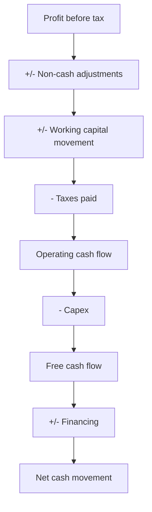

# Reading the Cash Flow Statement Properly

## The Problem / Why this matters
The cash flow statement is the hardest of the three statements to manipulate and the least read. Profit involves judgement at every line; cash either arrived or it did not. Yet analysts routinely read the P&L in detail, glance at the balance sheet and skip the cash flow entirely — which means missing the statement where the quality of everything else is tested.

## Core Idea
Read the cash flow statement **in full and in sequence**, because the classification of items between operating, investing and financing is where presentation choices live, and because the gap between profit and operating cash flow is the single most informative number in the accounts.

## Why it works this way
Every accounting judgement — revenue recognition, provisioning, capitalisation, depreciation — affects profit. None of them affects cash. Over a multi-year period the two must converge for a real business, so a persistent divergence means either heavy investment in growth or an accounting problem, and separating the two is the analytical task.

## Full technical content

### The reconciliation, line by line

The operating section starts at profit and adjusts. **Read every adjustment**, because each one tells you something:

| Adjustment | What it reveals |
|---|---|
| **Depreciation and amortisation** | Scale of the asset base; compare to capex |
| **Provisions charged** | Cross-check against the movement schedules, per that chapter |
| **Profit on asset sales** | Removed here; confirms the one-off in other income |
| **Interest and dividend income** | Removed and shown in investing; confirms non-operating income |
| **Unrealised forex** | Non-cash; confirms the hedging analysis |
| **Working capital movement** | The largest and most informative item |
| **Taxes paid** | Compare to the tax charge; a persistent gap indicates deferred tax or disputes |

**The working capital line should be broken into inventory, receivables and payables**, which most statements do. Each has a different meaning, per the inventory and working capital chapters.

### The classification questions

Where presentation choices live, and where comparability breaks:
- **Interest paid** — operating or financing? Practice varies, and it materially changes reported operating cash flow. **Check before comparing companies.**
- **Interest and dividends received** — operating or investing?
- **Lease payments** — the principal portion sits in financing under current standards, which raised reported operating cash flow at transition, per the leases chapter.
- **Supply chain finance flows** — operating or financing, per that chapter, and misclassification inflates operating cash flow.
- **Acquisition-related payments** — investing, but earnout payments may appear elsewhere.

**The rule for analysis: recompute on a consistent basis** across the comparison set rather than accepting the reported subtotals.

### The tests

**1. Cumulative CFO versus cumulative PAT over five years.** The single most efficient integrity check available, and it appears throughout these chapters for that reason. A persistent large gap requires an explanation, and "growth" is only a valid one if working capital *days* are stable.

**2. CFO versus EBITDA.** The gap is working capital, taxes and interest. A widening gap with stable EBITDA points to working capital deterioration.

**3. Capex versus depreciation.** Sustained capex below depreciation means a shrinking asset base; well above means expansion, which should be visible in capacity.

**4. Free cash flow over a cycle**, since single years are meaningless for lumpy-capex businesses.

**5. Financing section composition.** Where is the funding coming from — debt, equity, or asset sales? A company funding operations from asset sales is consuming its own base.

**6. The dividend and interest coverage from cash**, not from profit — a company paying dividends from borrowings rather than from operating cash is worth identifying.

### What a healthy pattern looks like

- **CFO consistently above PAT** for a mature, non-growing business, since depreciation exceeds the working capital drag.
- **CFO below PAT during rapid growth**, with stable working capital days — legitimate.
- **Capex approximating depreciation** in a steady state.
- **Financing showing debt repayment and distributions** rather than continuous fundraising.

### The warning patterns

- **PAT growing, CFO flat or falling** — the classic quality-of-earnings problem.
- **CFO positive only because of payable stretching**, which is borrowing from suppliers and may be a financing arrangement in disguise.
- **Recurring "one-off" items** in the adjustments.
- **Taxes paid far below the tax charge** for years, which points to disputes or aggressive positions.
- **Capex consistently far below depreciation** while claiming stable operations.
- **Continuous external funding** in a supposedly profitable business.

**The last pattern is the most diagnostic**: a genuinely profitable business that constantly needs new capital is not converting its profits into cash, and the cash flow statement shows exactly where they are going.

## Common mistakes
- **Skipping** the cash flow statement.
- Reading only the **subtotals** rather than the individual adjustments.
- Comparing operating cash flow across companies with **different classification** of interest.
- Accepting a CFO-PAT gap as "growth" without checking working capital **days**.
- Judging **free cash flow on a single year** in a lumpy-capex business.
- Missing **taxes paid** diverging from the tax charge.
- Not checking whether **dividends are funded from operations** or from borrowings.
- Overlooking continuous external funding in a profitable business.

## Interview angle
"Which statement do you read first?" The cash flow statement, because profit involves judgement at every line and cash either arrived or it did not — and over five years the two must converge for a real business, so cumulative operating cash flow against cumulative profit is the most efficient integrity test available. Say that you read it in full rather than the subtotals: the individual adjustments confirm or contradict what the P&L said about provisions, one-off gains and non-operating income, and the working capital line split into inventory, receivables and payables tells you where any deterioration sits. Add the comparability caution — interest paid may be classified as operating or financing depending on the company, and lease principal moved to financing under current standards, so reported operating cash flow is not directly comparable across companies until you recompute on a consistent basis. And name the most diagnostic pattern: a supposedly profitable business that continuously requires external funding is not converting profit into cash, and the statement shows exactly where it is going.
