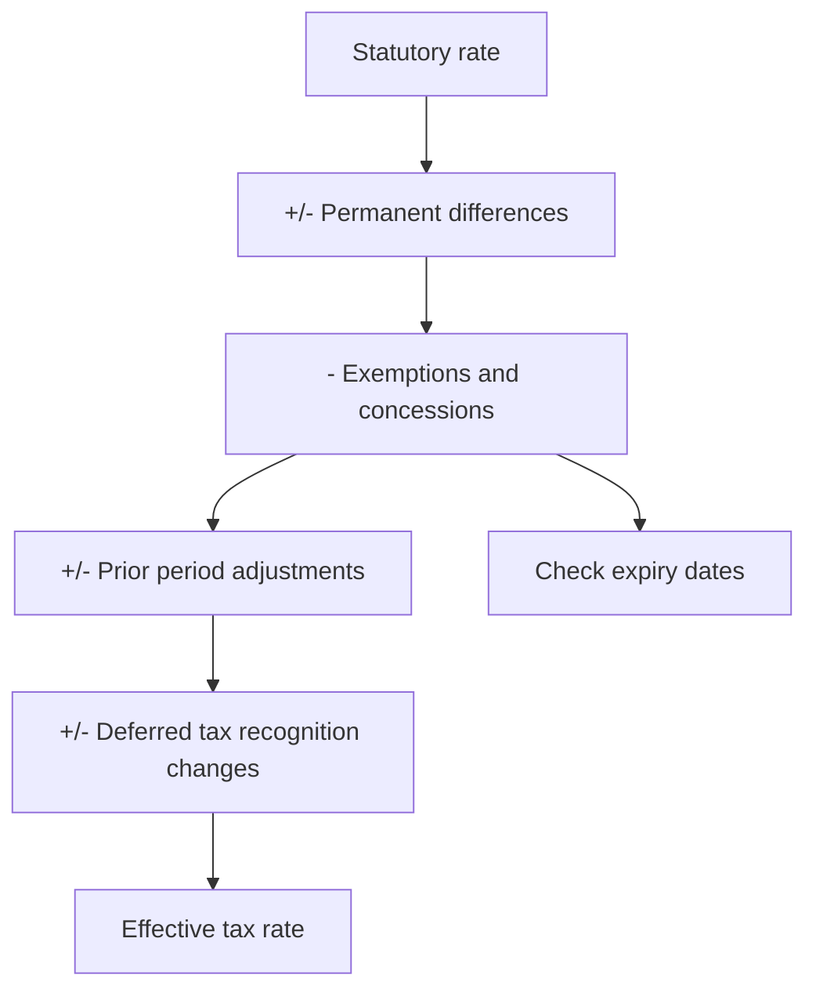

# Deferred Tax and Effective Tax Rate Analysis

## The Problem / Why this matters
The tax line is treated as a residual — apply a rate to profit before tax and move on. But the effective rate differs from the statutory rate for reasons that are disclosed and analytically meaningful, deferred tax assets embody management's assessment of future profitability, and concessional rates expire on known dates. A model holding the effective rate constant will be wrong in a predictable direction for several companies.

## Core Idea
The effective tax rate is an **output of specific, disclosed items**, and forecasting it requires knowing which of those items persist — because several of them have expiry dates that are public.

## Why it works this way
The tax charge reflects the statutory rate applied to taxable income, adjusted for permanent differences, concessions, prior-period items and changes in deferred tax recognition. Each of these behaves differently over time, and the reconciliation note discloses them individually.

## Full technical content

### The reconciliation note

Companies disclose a reconciliation from the statutory rate to the effective rate, itemised. **This is the direct source and takes minutes to read.** The items to identify:

| Item | Persistence |
|---|---|
| **Income exempt from tax** | Depends on the exemption's basis and duration |
| **Unit or location-based concessions** | **Have expiry dates — check them** |
| **Expenses not deductible** | Recurring |
| **Prior period tax adjustments** | One-off |
| **Deferred tax asset recognition or write-off** | One-off but signals expectations |
| **Losses not recognised** | Persistent while losses continue |
| **Overseas rate differences** | Persistent, varies with geographic mix |

**The concession expiry is the modelling trap.** A company enjoying a concessional rate under a scheme with a defined life will see post-tax earnings fall mechanically when it ends, and the date is disclosed. A model holding the current effective rate constant misses an earnings decline that is entirely predictable.

### Deferred tax assets as a signal

A deferred tax asset arises where past losses or timing differences will reduce future tax. **Its recognition depends on management's assessment that sufficient future taxable profit will exist** — which makes it a disclosed statement about expectations:

- **Recognising a large DTA** signals management expects to be profitable enough to use it.
- **Writing off a DTA** signals the opposite, and is a meaningful negative that flows through the tax line rather than through operating profit — so it can be missed by anyone reading only above the tax line.
- **A DTA carried for years without utilisation** raises a question about whether the profitability assumption remains valid.

**Check the DTA against the accumulated losses and the profit trajectory required to use them.** Where the required profitability is implausible, the asset is impaired in substance.

### Cash tax versus book tax

- **Taxes paid** in the cash flow statement versus the tax charge in the P&L.
- **A persistent gap** indicates deferred tax movements, disputed amounts paid under protest, or timing differences.
- **Cash tax is what matters for valuation**, since a DCF discounts cash flows — so a company with a large book charge and low cash tax is worth more than the reported earnings suggest, and the reverse.
- **Advance tax paid against disputed demands** is cash out sitting in other assets, per the contingent liabilities chapter.

### Forecasting the rate

1. **Read the reconciliation** for the last three years and identify the recurring items.
2. **Check concession expiry dates** and step the rate up accordingly.
3. **Model geographic mix** where overseas rates differ materially.
4. **Do not extrapolate one-off items** — prior period adjustments and DTA movements should not persist.
5. **Sense-check the forecast rate** against the statutory rate; a forecast far below it needs an identified, durable reason.
6. **State the assumption**, since the rate assumption is a material driver of the target and readers may hold different views on concession renewal.

### Where it matters most

- **Companies with unit-based concessions** — export-oriented units, specified zones, new manufacturing regimes with defined qualifying periods.
- **Companies with accumulated losses** carrying large DTAs.
- **Multinationals** with meaningful geographic mix shifts.
- **Companies in disputes**, where amounts paid under protest distort the cash position, per the contingent liability chapter.
- **Sectors with specific regimes** — infrastructure, power, and certain manufacturing incentives.

## Common mistakes
- Holding the **effective rate constant** across a forecast.
- Missing a **concession expiry** with a disclosed date.
- Extrapolating **one-off** tax items.
- Ignoring a **DTA write-off** as a signal about management's own expectations.
- Not comparing **cash tax to the book charge**.
- Using book tax in a DCF where cash tax differs materially.
- Not reading the **reconciliation note**, which itemises all of this directly.

## Interview angle
"The company's effective tax rate is 14% against a statutory rate well above that. What do you do?" Read the tax reconciliation note, which itemises exactly why — exempt income, unit or location-based concessions, non-deductible expenses, prior period adjustments and deferred tax movements — and then classify each by persistence, because the modelling question is which of them survive. The trap is concessional rates with a defined qualifying period: the expiry date is disclosed, and post-tax earnings fall mechanically when it arrives, so a model holding 14% constant misses an entirely predictable decline. Add two further checks — compare taxes actually paid in the cash flow statement to the charge in the P&L, since cash tax is what a DCF should discount and a persistent gap points to deferred items or disputed amounts paid under protest; and look at any deferred tax asset, because recognising one is management's disclosed statement that they expect enough future profit to use it, and writing one off is a meaningful negative that appears below operating profit where it is easily missed.
