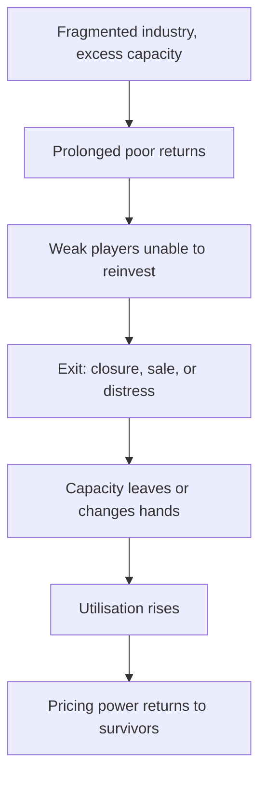

# Industry Consolidation and Structure Change

## The Problem / Why this matters
Industry structure determines returns more reliably than company execution. A fragmented industry with excess capacity competes returns away regardless of how well any participant is run; a consolidated one with disciplined capacity earns well for everyone. Recognising when a structure is changing — and it changes slowly, visibly and predictably — is one of the more valuable multi-year calls an analyst can make.

## Core Idea
Consolidation improves returns for survivors, and the process is **observable in advance** through capacity exits, distress, regulatory pressure and the cost curve — so the analytical task is identifying which participants survive rather than forecasting the industry average.

## Why it works this way
Returns in a competitive industry are driven to the marginal producer's economics. Remove the marginal capacity — through closure, acquisition or regulatory exclusion — and the marginal producer becomes someone with better economics, so prices and returns rise for everyone remaining. The mechanism is structural rather than cyclical.

## Full technical content

### The signs a structure is changing

| Signal | What it indicates |
|---|---|
| **Sustained losses at the marginal producer** | Exit pressure building |
| **Capacity closures announced** | Supply actually leaving |
| **Acquisitions of distressed capacity** | Consolidation underway; check the price against replacement cost |
| **Regulatory tightening** | Compliance costs forcing sub-scale exits, per the second-order chapter |
| **Insolvency proceedings** | Capacity changing hands, often cheaply |
| **Imports being restricted** | Domestic supply effectively reduced |
| **The top players' share rising** | The measurable outcome |

**The strongest configuration is regulatory tightening in a fragmented industry with excess capacity**, because compliance costs are largely fixed and fall hardest on sub-scale players — which forces exits that years of poor returns alone had not.

### Measuring concentration

- **Top three or five share of capacity and of revenue**, tracked over years.
- **Number of participants** above a meaningful scale.
- **Capacity share versus revenue share** — capacity share leads, per the market share chapter.
- **The unorganised segment's share** where relevant, since formalisation is a distinct process that shifts share to all organised players simultaneously without any competitive change.

### The returns consequence

- **Utilisation rises** as capacity leaves and demand grows, and pricing power returns sharply above a threshold, per the cyclicals and capacity chapters.
- **Discipline matters as much as concentration.** Three players who each expand aggressively can compete returns away as effectively as twenty; the question is whether the survivors behave rationally about capacity.
- **The best evidence of discipline** is whether participants added capacity during the last upcycle and what happened to returns as a result.
- **Consolidation improves returns on existing capacity too**, which is why an acquisition in a fragmented industry can be worth more than the assets acquired, per the build-versus-buy chapter.

### Who survives

The question that converts a structural view into a stock call:
- **Cost position** — bottom-quartile producers survive troughs and set the price afterwards.
- **Balance sheet** — the ability to fund losses through the shakeout, which is frequently the binding constraint rather than operating efficiency.
- **Scale relative to the compliance or capital requirement** creating the pressure.
- **Access to capital** to acquire exiting capacity cheaply, which turns a downturn into a share gain.

**A strong balance sheet in a consolidating industry is worth more than in any other situation**, because it converts an industry problem into a company opportunity.

### The timeline

- **Consolidation is slow** — years, often a decade — because owners resist exit and capacity is written down before it is closed.
- **Regulatory or financial triggers accelerate it** sharply, which is why those events are worth watching.
- **The market prices it late**, since the improvement appears in results only after the structure has already changed — which is what creates the opportunity for an analyst tracking capacity rather than earnings.

### Where it reverses

Structures also deteriorate, and the same framework applies inverted:
- **New capacity from a well-funded entrant**, including foreign players.
- **Import liberalisation** effectively adding supply.
- **Technology lowering the entry barrier**, per the disruption chapter.
- **A high-return industry attracting expansion**, which is the standard cyclical trap and the reason returns rarely persist without a structural barrier.

## Common mistakes
- Analysing companies without assessing **industry structure**, which explains more of returns than execution.
- Assuming **concentration alone** produces discipline, ignoring behaviour.
- Missing **regulatory tightening** as a consolidation accelerator.
- Attributing **formalisation** gains to competitive performance.
- Forecasting the industry average rather than identifying **who survives**.
- Underweighting the **balance sheet** in a shakeout.
- Ignoring capacity data, which leads the earnings improvement by years.

## Interview angle
"A fragmented industry you cover has had poor returns for five years. Is there an opportunity?" Look for evidence the structure is changing rather than waiting for earnings: capacity closures announced, distressed assets changing hands, insolvency proceedings, and above all regulatory tightening — because compliance costs are largely fixed and fall hardest on sub-scale players, which forces exits that years of poor returns alone had not. Then convert it into a stock call by identifying who survives: cost position determines who is still standing at the trough, but the balance sheet is usually the binding constraint, and a well-capitalised player can acquire exiting capacity cheaply and turn the industry's problem into its own share gain. Add the discipline caveat — concentration alone does not guarantee returns, since three players who each expand aggressively compete them away as effectively as twenty, so check what participants did with capacity in the last upcycle. And note the timing: the market prices this late because the improvement shows in results only after the structure has already changed, which is exactly why tracking capacity rather than earnings creates the opportunity.
