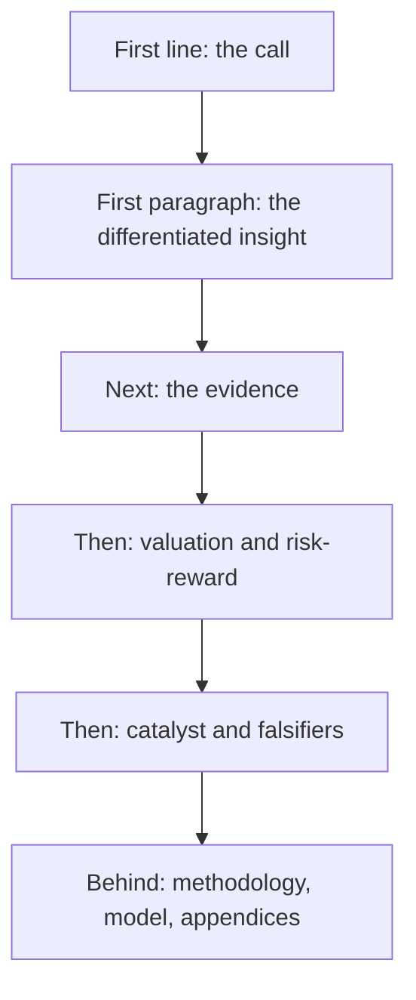

# The Analyst as a Writer

## The Problem / Why this matters
Research is delivered in writing, and a correct view expressed badly reaches fewer people and persuades fewer still. Most analyst writing is poor in identifiable, fixable ways — hedged, front-loaded with context, dense with jargon, and structured so the conclusion arrives last. Writing well is a learnable craft that directly multiplies the value of the analysis.

## Core Idea
Write so the reader can **act after the first paragraph** — conclusion first, evidence second, everything else behind — because a reader who stops after two paragraphs should still have the view and its basis.

## Why it works this way
Readers are time-constrained and read in descending order of attention. The first line gets full attention, the first paragraph most, and the rest progressively less. Structuring a note to build toward a conclusion means the conclusion reaches the smallest audience, which inverts the intended effect.

## Full technical content

### The structural rules

1. **Conclusion first.** The rating, target and upside in the first line, per the one-page chapter.
2. **One idea per paragraph**, stated in its first sentence.
3. **Evidence attached to claims**, immediately, not in a later section.
4. **Descending order of importance** throughout, so any truncation loses the least.
5. **Methodology and model detail behind the argument**, not in front of it.

### The sentence-level rules

- **Cut hedging.** "We believe there may be potential for some improvement" commits to nothing. If you think margins improve, write that; if you are uncertain, quantify the uncertainty.
- **Use specific numbers.** "Distribution reach of 1.1mn outlets against 640,000 for the nearest competitor" beats "strong distribution" — the specific fact both informs and demonstrates the work.
- **Prefer active voice.** "Management cut advertising by 22%" is clearer than "advertising was reduced."
- **Cut adjectives that do no work.** "Robust," "healthy," "strong" mean nothing without a number attached.
- **Define jargon or avoid it.** A reader outside the sector should be able to follow.
- **Keep sentences short** where the content is complex; complexity in the idea does not require complexity in the sentence.

### The habitual weaknesses

| Weakness | Fix |
|---|---|
| **Building to the conclusion** | Invert — lead with it |
| **Describing rather than concluding** | Every section should support a claim |
| **Hedging** | State the view and the uncertainty separately |
| **Restating consensus** | Cut it; the reader has it |
| **Methodology upfront** | Move to an appendix |
| **Undifferentiated adjectives** | Replace with numbers |
| **Length as effort** | Cut to what changes the reader's decision |

**The most common structural failure is describing what happened rather than concluding what it means.** A results note that recounts the quarter has told the reader nothing they could not read in the release.

### The tests

Applied to every note before publishing:
- **The first-paragraph test.** If the reader stops there, do they have the view and its basis?
- **The deletion test.** Delete each sentence — does the reader's decision change? If not, cut it.
- **The number test.** Every adjective describing performance should have a number attached or be removed.
- **The so-what test.** Every paragraph should answer why the reader should care.
- **The stranger test.** Would someone who does not cover this sector follow the argument?

### Writing about uncertainty

Where the evidence is genuinely mixed, per the low-visibility and no-view chapters:
- **State the range and the probabilities** rather than hedging every sentence.
- **Separate the confident from the uncertain** explicitly, which is more useful than uniform tentativeness.
- **Hedged prose about a confident view** and **confident prose about an uncertain one** are both failures — match the language to the actual state of the evidence.

### Different formats

- **The initiation** — the full argument, structured for a reader who will read the summary and consult the rest.
- **The update** — short, leading with what changed and whether the view holds.
- **The email** — the first line is the whole message for most recipients; the subject line should carry the call.
- **The sector piece** — the ranking is the product, per that chapter.
- **The one-pager** — the compression that tests whether the argument exists.

### Why it compounds

- **Clarity is read as competence**, fairly or not, and confused writing is read as confused thinking.
- **Clients circulate what they can forward** — a clear note travels further inside a client institution than a dense one.
- **The discipline improves the analysis.** Writing the argument plainly exposes the steps that do not follow, which is why the one-page compression is an analytical exercise as much as a communication one.

## Common mistakes
- **Building** to the conclusion rather than leading with it.
- **Describing** the quarter rather than concluding what it means.
- **Hedging** language that commits to nothing.
- Adjectives with **no numbers** attached.
- **Methodology** in front of the argument.
- Treating **length** as evidence of effort.
- Uniform tentativeness rather than separating confident from uncertain.
- Jargon that excludes readers outside the sector.

## Interview angle
"What makes research writing good?" Structure and specificity. Lead with the conclusion — rating, target, upside in the first line — because readers give descending attention and building toward a conclusion means it reaches the smallest audience. Attach evidence to claims immediately rather than in a later section, put methodology behind the argument, and order everything so that truncation loses the least. At sentence level, cut hedging that commits to nothing, replace performance adjectives with numbers, since "reach of 1.1mn outlets against 640,000 for the nearest competitor" both informs and demonstrates the work while "strong distribution" does neither. Add the two tests you would apply before publishing: delete each sentence and ask whether the reader's decision changes, and check whether someone who stops after the first paragraph still has the view and its basis. And note why it matters analytically rather than only presentationally — writing the argument plainly exposes the steps that do not follow, which is why compressing a thesis to one page is an analytical exercise as much as a communication one.
