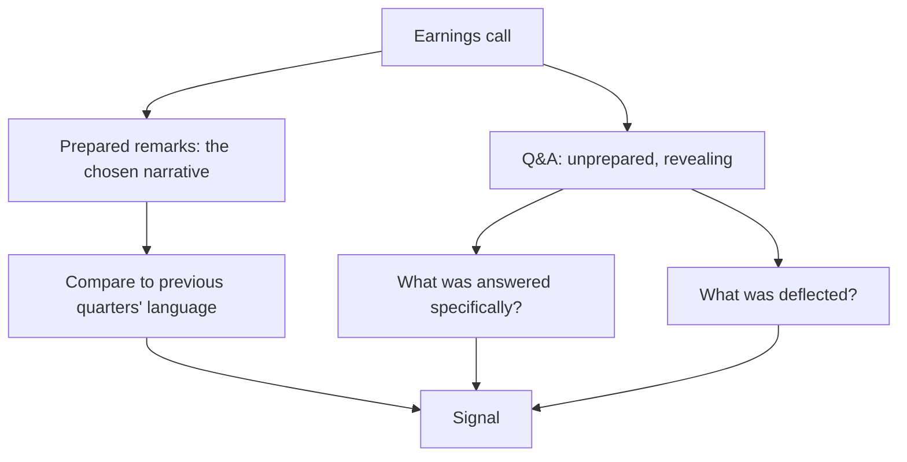

# Interpreting Management Language on Calls

## The Problem / Why this matters
Earnings calls are the most information-dense recurring disclosure event, and most of what matters is in how things are said rather than what is said. Management prepares the opening remarks carefully and answers questions in real time, which means the Q&A contains signals the prepared script does not. Reading a transcript for content while ignoring structure, evasion and change in language discards most of the available information.

## Core Idea
The call's information is in **what changed, what was avoided and what was answered specifically** — not in the prepared narrative, which is written to a plan.

## Why it works this way
Prepared remarks are drafted, reviewed and approved; they reflect what management wants said. Answers to unanticipated questions are given under time pressure and reveal what management actually knows and how comfortable they are with it. The gap between the two is where the signal lives.

## Full technical content

### Reading the prepared remarks

The value is comparative rather than absolute:
- **Compare to the previous quarter's script.** Companies reuse structure, so changes are deliberate. A metric that was highlighted and is now absent has gone the wrong way, per the disclosure chapter.
- **Note the order.** What is discussed first is what management wants emphasised; a segment moved to the end is being de-emphasised.
- **Note the length allocated** to each topic, which is the same signal as investor-day agenda time.
- **Watch for new framing** — a company that starts describing itself differently is preparing the ground for something.

### Reading the Q&A

The higher-value section, and where the specific signals are:

| Behaviour | What it suggests |
|---|---|
| **Specific, quantified answer** | Management knows and is comfortable disclosing |
| **General answer to a specific question** | Either they do not know or do not want to say |
| **"We don't disclose that"** to something previously disclosed | Something changed |
| **Answering a different question** | Deliberate deflection |
| **Deferring to a follow-up offline** | Sometimes legitimate, sometimes avoidance — note whether it recurs |
| **A different executive answering** | The primary one is uncomfortable with the topic |
| **Repeated questions on one topic** | Analysts are not satisfied, which is itself information |

**The most informative single observation is a question asked repeatedly by different analysts and never answered specifically.** That topic is where the uncertainty is, and the market's collective inability to get an answer is a signal in itself.

### Language shifts worth tracking

- **From specific to vague** on a metric or target — "we expect 18% growth" becoming "we expect healthy growth."
- **From committed to conditional** — "we will commission in Q3" becoming "we aim to commission by year-end."
- **Introduction of qualifiers** — "excluding," "adjusted for," "on a like-for-like basis" appearing where they did not before.
- **Changing the metric emphasised**, per the disclosure chapter, which is among the clearest warning signals.
- **Attribution shifting from internal to external** — a company that explained good results by its execution and now explains weak ones by the environment.

That last pattern is worth watching specifically, because it is consistent and revealing: **attribution asymmetry — crediting internal factors for success and external ones for failure — is a management-quality signal**, and it accumulates across quarters into a clear picture.

### Who is on the call

- **The analysts asking questions** — which firms cover the stock actively, and whether the tone is challenging or accommodating.
- **New analysts appearing** signals coverage initiation, which brings a new view and potentially new flows.
- **Analysts dropping off** may signal coverage being dropped.
- **The seniority of company participants** and whether operating executives are present or only the CFO.

### The practical routine

1. **Read the full transcript**, not a summary, for covered companies — the signals above do not survive summarisation, per the AI chapter.
2. **Compare the prepared remarks** to the previous two quarters.
3. **List questions that were not answered specifically**, and track whether they recur.
4. **Record quantified statements** with dates, for the guidance credibility record.
5. **Note language shifts** on metrics and targets.
6. **Listen to the audio** where possible for hesitation and tone, which the transcript does not carry — this is a genuine marginal edge and costs only time.

### The cautions

- **Do not over-read.** Executives are human, calls are long, and not every hesitation means something.
- **Look for patterns across quarters** rather than drawing conclusions from a single exchange.
- **Corroborate with numbers.** A language signal should send you to a disclosure to check, not straight to a conclusion.
- **Cultural and individual differences** in communication style vary, so the baseline is the same person over time rather than a comparison across managements.

## Common mistakes
- Reading a **summary** rather than the full transcript.
- Focusing on **prepared remarks** rather than the Q&A.
- Not comparing the script to **previous quarters**.
- Missing a metric that **stopped being disclosed**.
- Ignoring **repeatedly unanswered** questions.
- Over-reading a **single** exchange rather than looking for patterns.
- Not recording quantified statements for later **accountability**.
- Drawing conclusions from language without **corroborating against disclosure**.

## Interview angle
"What do you get from an earnings call that isn't in the results release?" The Q&A, mainly, because prepared remarks are drafted and approved while answers to unanticipated questions are given under pressure and reveal what management actually knows. Say what you look for: whether a question was answered specifically or generally, whether a different executive fielded a difficult topic, and above all whether the same question was asked repeatedly by different analysts and never answered — because that topic is where the uncertainty is, and the collective failure to get an answer is itself the signal. Add the comparative reading of the prepared script against previous quarters, since companies reuse structure and any change is deliberate: a metric that stopped being highlighted has gone the wrong way, and language moving from specific to vague or from committed to conditional on a target is an early warning. Mention the attribution pattern too — management crediting internal execution for good results and the external environment for bad ones is a quality signal that accumulates across quarters. And note the discipline: corroborate every language signal against a disclosure rather than concluding from tone alone.
