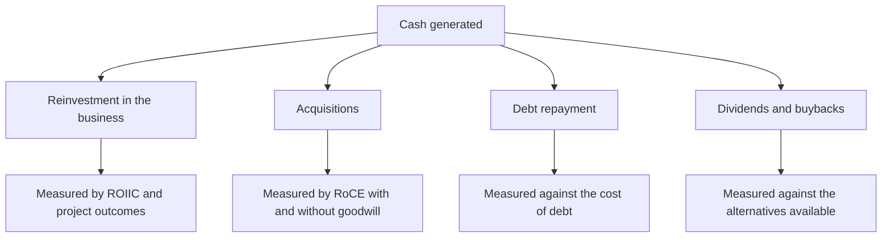

# The Capital Allocation Scorecard

## The Problem / Why this matters
Over a decade, how a company deploys its cash matters more to shareholder returns than almost anything else management does. Yet capital allocation is usually assessed qualitatively — a sense that management is "disciplined" or "aggressive" — when it is fully quantifiable from disclosure. A scorecard built once from historical filings replaces impression with evidence and predicts future decisions better than any commentary.

## Core Idea
Score capital allocation on the **outcomes of past decisions**, tabulated — because every deployment of cash was a choice with a measurable result, and the pattern predicts the next one.

## Why it works this way
Management faces the same allocation decision repeatedly: reinvest, acquire, repay debt, or return capital. Each decision has a return that can be computed after the fact. A company that has consistently deployed capital above its cost of capital has demonstrated a capability; one that has not has demonstrated the opposite, and neither is likely to change quickly.

## Full technical content

### Building the scorecard

Assemble from ten years of annual reports — a few hours, and useful for as long as you cover the company:

**1. Sources and uses.** Total cash generated over the period, and where it went: capex, acquisitions, debt repayment, dividends, buybacks. **Expressed as percentages, this alone is revealing** — a company that spent 70% of a decade's cash on acquisitions is a different business from one that spent it on organic capex, and both should be judged on the returns achieved.

**2. Organic reinvestment outcomes.** Per the capex chapter: each major project's announced cost, actual cost, announced timeline, actual timeline, target return and achieved return. **Companies rarely disclose the last one, which is itself informative** — a project whose returns are never mentioned again did not meet them.

**3. Acquisition outcomes.** Per the goodwill chapter: RoCE including and excluding goodwill, impairments taken, and whether announced synergies were ever quantified as achieved.

**4. Incremental returns.** ROIIC over rolling multi-year periods, per that chapter, which is the summary measure of whether the reinvestment created value.

**5. Distribution decisions.** Whether buybacks were executed below intrinsic value, whether they merely offset ESOP dilution, and whether dividends were maintained through downturns.

**6. Debt decisions.** Whether leverage was raised at the top of a cycle and reduced at the bottom, or the reverse — which is the most common and most damaging error, since capacity added with debt at peak margins is the standard route to distress.

### Scoring it

| Dimension | Good | Poor |
|---|---|---|
| **Project delivery** | On budget and on time, returns disclosed and met | Overruns, silence on outcomes |
| **Acquisition returns** | RoCE gap with and without goodwill is small | Wide gap; repeated impairments |
| **ROIIC** | Consistently above the cost of capital | Below, while growing |
| **Timing** | Invested counter-cyclically | Expanded at peaks, retrenched at troughs |
| **Distributions** | Returned capital when reinvestment returns were poor | Retained cash earning below the cost of equity |
| **Buybacks** | Executed below intrinsic value | At peaks, or merely offsetting dilution |
| **Honesty** | Discloses outcomes including failures | Discusses announcements, not results |

**The honesty dimension deserves weight.** A management that reports what happened to past projects, including the disappointing ones, is providing the information needed to hold them accountable — and companies that do this are rare enough that it is a genuine differentiator.

### The counter-cyclical test

The single most revealing item, because it is hard and most managements fail it:
- **Expanding when returns are high and everyone else is expanding** is the standard behaviour and the standard error, per the cyclicals and capex chapters.
- **Investing at the trough**, when the balance sheet permits and assets are cheap, is what separates the best allocators.
- **Check what the company did in the last downturn** — acquired distressed capacity, or retrenched and missed the recovery?

### Using it

- **In the initiation**, as a section with the table, which is more persuasive than any assessment of the current strategy.
- **In assessing a new proposal** — the base rate for this specific management, per that chapter.
- **In assessing new management**, where the record travels with the individual.
- **As a monitorable** — each new deployment adds to the record and should be tracked to its outcome.

**The scorecard is more predictive of the next decision than the analysis of that decision's merits**, which is the uncomfortable and useful conclusion.

## Common mistakes
- Assessing capital allocation **qualitatively** when it is quantifiable.
- Not building the historical table because it has **no deadline**.
- Judging a proposal on its **stated merits** rather than against the company's record.
- Ignoring the **timing** dimension — expansion at peaks.
- Crediting buybacks without checking whether they **offset dilution**.
- Missing that **silence on a past project's returns** is the disclosure.
- Treating retained cash as neutral when it earns below the cost of equity.

## Interview angle
"How do you judge whether management allocates capital well?" Build the record rather than form an impression: take ten years of annual reports and tabulate where the cash went — capex, acquisitions, debt repayment, distributions — as percentages, then measure each. For organic reinvestment, list each major project's announced versus actual cost and timeline, and note that companies rarely mention a project's achieved return again if it disappointed, so the silence is the disclosure. For acquisitions, compare RoCE with and without goodwill, which quantifies exactly what was destroyed by overpaying. Then apply the counter-cyclical test, which most managements fail: did they expand when returns were high and everyone else was expanding, or invest at the trough when assets were cheap and the balance sheet allowed it? Add why this matters practically — the scorecard predicts the next capital allocation decision better than analysing that decision's stated merits does, which is uncomfortable but is what the evidence supports.
