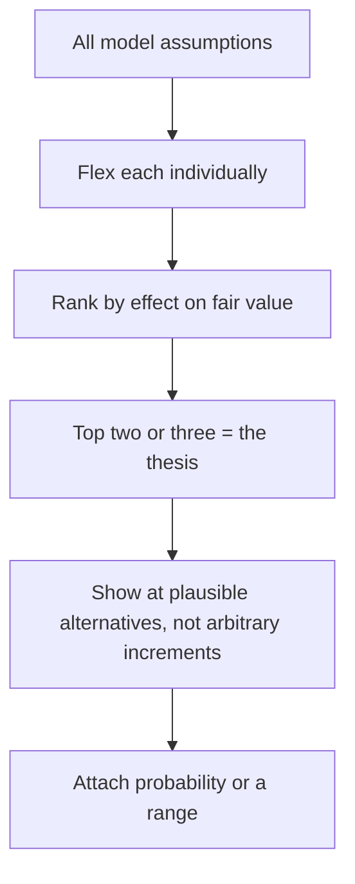

# Sensitivity Analysis Done Properly

## The Problem / Why this matters
Most sensitivity tables in research notes flex growth and the discount rate, produce a grid of values, and add nothing — because those are rarely the assumptions the thesis actually depends on, and a grid without a probability attached tells the reader nothing about likelihood. Done properly, sensitivity analysis identifies what the valuation rests on and communicates it in a form the reader can use.

## Core Idea
Sensitivity analysis should identify the **assumptions that actually drive the value** and show their effect at plausible alternatives — not produce a symmetric grid around inputs chosen for convenience.

## Why it works this way
A valuation depends unequally on its inputs. Flexing an assumption that moves fair value by 2% wastes the reader's attention; flexing one that moves it by 40% tells them where the entire debate is. The purpose is to direct attention, not to demonstrate thoroughness.

## Full technical content

### The ranking step

Before building any table:
1. **Flex each assumption individually** by a plausible amount and record the effect on fair value.
2. **Rank them.** The top two or three are what the valuation rests on.
3. **Those are the ones to present**, and they are frequently not growth and the discount rate.

**The commonly decisive assumptions across these chapters:**
- **Terminal margin or return**, which drives most of a DCF's terminal value.
- **The fade period** for excess returns, per the franchise chapter.
- **Mid-cycle spread or margin** for cyclicals.
- **Volume at a capacity constraint.**
- **Credit cost** for lenders.
- **Retention or churn** for subscription models.
- **Order book conversion** for engineering businesses.

**These are business-specific, which is the point.** A generic growth-and-discount-rate grid ignores what makes this particular company uncertain.

### Choosing the ranges

- **Plausible alternatives, not symmetric increments.** If the historical range of a spread is ₹2,400–₹4,100 per tonne, show those, not the base case plus and minus 10%.
- **Anchor to history and to peers** — what has this company or industry actually achieved?
- **Asymmetry is legitimate.** Where the downside is wider than the upside, the table should show that rather than being forced into symmetry.

### Presenting it

- **One-way tables** for the single dominant assumption, which is clearer than a grid.
- **Two-way tables** only where two assumptions genuinely interact — and note that a grid implies independence, which may be false.
- **Show the implied multiple** alongside the value, so the reader can sanity-check each cell against the stock's own history.
- **Mark the base case** clearly.
- **State the probability or the basis** for the range, since a table without it communicates spread but not likelihood.

### The scenario alternative

Where assumptions are correlated, a grid is misleading — because a weak-demand scenario has low volume *and* low pricing *and* worse fixed-cost absorption simultaneously, per the stress-testing chapter.

**Scenarios handle this correctly:**
- **Build coherent states of the world**, each with internally consistent assumptions.
- **Assign probabilities** with a stated basis.
- **Present the probability-weighted value and the range.**

**This is the better tool for most situations** and is used less than the grid because it requires deciding what a bad outcome actually looks like rather than mechanically reducing inputs.

### What sensitivity analysis is for

- **Directing the reader's attention** to where the debate is.
- **Letting them substitute their own view** on the key assumption without rebuilding the model.
- **Testing your own thesis** — if fair value is insensitive to everything you have argued about, the argument is not where the value is.
- **Establishing the bear case** properly, per the stress-testing chapter, with the multiple moving alongside earnings.

### What it is not for

- **Demonstrating thoroughness.** A large grid signals effort, not insight.
- **Concealing uncertainty** by presenting a range so wide it commits to nothing.
- **Substituting for a view.** The base case is still a view, and the sensitivity shows what it depends on.

## Common mistakes
- Flexing **growth and the discount rate** by default rather than the assumptions that matter.
- Using **symmetric increments** rather than plausible historical ranges.
- Presenting a **grid** where the assumptions are correlated.
- Omitting the **implied multiple** at each value.
- Giving no **probability or basis** for the range.
- Producing a table that shows the value is **insensitive** to everything argued in the note.
- Using width to avoid taking a view.

## Interview angle
"What would you put in a sensitivity table?" Not growth and the discount rate by default — first flex every assumption individually and rank them by effect on fair value, because the top two or three are what the valuation actually rests on, and they are usually business-specific: terminal margin, the fade period on excess returns, mid-cycle spread for a cyclical, credit cost for a lender, churn for a subscription model. Then choose ranges anchored to what the company or industry has actually achieved rather than symmetric increments around the base case, and show the implied multiple alongside each value so the reader can sanity-check it against the stock's own history. Add the case for scenarios over grids: a two-way grid implies the assumptions are independent, but in a genuine downturn volume, pricing and fixed-cost absorption all deteriorate together, so coherent scenarios with stated probabilities describe the real distribution better. And note the test it applies to your own work — if fair value turns out to be insensitive to everything you argued about in the note, the argument was not where the value is.
