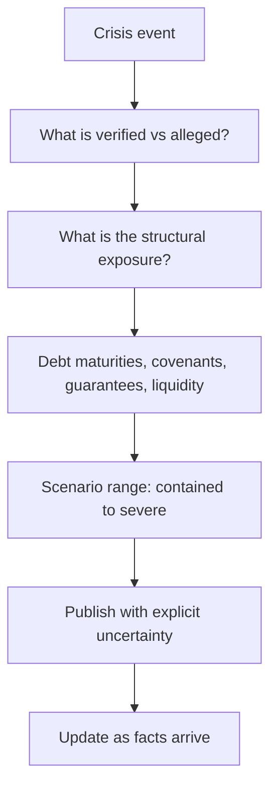

# Covering a Company Through a Crisis

## The Problem / Why this matters
Occasionally a covered company faces an acute crisis — a fraud allegation, a regulatory action, a plant disaster, a funding failure, a sudden management exit. Information is incomplete, the price moves violently, clients need a view immediately, and the analyst's normal process does not fit the timescale. How an analyst handles this is disproportionately visible and is remembered long after the specific event.

## Core Idea
In a crisis, work from **what is verifiable and what is structurally at risk**, publish quickly with explicit uncertainty, and update as facts arrive — because the alternative, silence, leaves clients with nothing when they need most.

## Why it works this way
Crises produce a flood of claims, denials and speculation, most of which cannot be verified quickly. What can be established immediately is the structural exposure: how much debt matures when, what the covenants say, what the contingent liabilities are, and what happens to the equity under a range of outcomes. That analysis is available from filings already read and does not depend on resolving the disputed facts.

## Full technical content

### The first hours

1. **Establish what is actually alleged or has occurred**, and by whom — an allegation from a short seller, a regulatory action, a court order and a media report have different evidentiary weight.
2. **Read the company's response** and note whether it addresses the specifics or is a general denial. **A response that does not engage with the specific claims is informative.**
3. **Separate verified facts from claims**, explicitly, in anything you publish.
4. **Do not amplify unverified claims.** Repeating an allegation as though established is both a professional and a legal problem.

### The structural analysis

This is the part that can be done immediately, from filings you already have:
- **Liquidity** — cash on hand, undrawn facilities, and the next debt maturity.
- **Covenants** and whether the event triggers any.
- **Guarantees given**, which may crystallise.
- **Pledged promoter shares**, which can trigger the reflexive loop, per that chapter.
- **Counterparty exposure** — will lenders, customers or suppliers change terms?
- **Regulatory consequences** — licence, approval or listing implications.
- **The equity's position** under a range of outcomes, including the severe one.

**The severe case matters most in a crisis**, because that is the scenario the price is trying to assess and the one clients most need quantified.

### Scenario framing

Publish a range rather than a point:
- **Contained** — the allegation is refuted or the event is operational and recoverable; value returns toward the prior estimate.
- **Material but survivable** — a real cost, a real reputational effect, a rating action, but the business continues.
- **Severe** — solvency or licence at risk, and the equity's value approaches zero, per the distress chapter.

**Give probabilities with a stated basis**, acknowledging they are provisional, and update them as facts arrive. A client can use a probability-weighted range immediately; they cannot use silence.

### Communicating

- **Publish quickly**, even with an incomplete view. **"Here is what we know, what we do not, and what each outcome implies" is a complete and useful note.**
- **State explicitly what is unverified.**
- **Be available.** Clients holding the position need contact most in exactly this situation.
- **Do not defend the company** out of relationship considerations, and do not pile on to be seen taking a hard line. Neither is analysis.
- **Suspend the rating** if the situation genuinely cannot be assessed, per the no-view chapter — but publish the framework and the scenarios alongside the suspension.
- **Update as facts emerge**, and say plainly where you were wrong.

### The specific case of fraud allegations

- **Assess the evidence presented**, not the source's motives — a short seller's incentive does not make the analysis wrong, and dismissing it on that basis is a failure.
- **Check the claims against the filings yourself.** Many allegations rest on public disclosure that can be verified in hours.
- **The company's response quality** is often the most informative single input: a detailed, specific rebuttal is very different from a general denial and a threat of legal action.
- **Auditor and independent director behaviour** in the following weeks is the strongest confirming or disconfirming signal, per those chapters — a resignation is close to decisive.

### Afterwards

- **Conduct the post-mortem** regardless of the outcome: were the warning indicators present in the disclosures beforehand, and did you check them?
- **Most governance failures were visible in advance** in the indicators the forensic, related-party and audit chapters describe — that is the uncomfortable finding in most such reviews.
- **Record what to check earlier next time**, which is how the process actually improves.

## Common mistakes
- **Going silent** because the situation is unclear.
- Repeating **unverified allegations** as established.
- Dismissing an allegation because of the **source's incentives**.
- Not doing the **structural analysis**, which is available immediately from filings.
- Publishing a **point estimate** where the range is genuinely wide.
- Defending the company for **relationship** reasons, or piling on for appearance.
- Failing to **update and correct** as facts arrive.
- Skipping the post-mortem on whether the warning signs were visible beforehand.

## Interview angle
"A short seller publishes a report alleging fraud at a company you cover. What do you do?" First, assess the evidence rather than the source's motives, because the incentive to profit does not make the analysis wrong and dismissing it on that basis is a failure — and much of what such reports allege rests on public filings that can be verified in hours. Second, do the structural analysis immediately, since it does not depend on resolving the disputed facts: cash and undrawn facilities against the next debt maturity, covenant triggers, guarantees that could crystallise, promoter pledging that could start a forced-selling loop, and what the equity is worth under a severe outcome. Then publish quickly with explicit scenarios — contained, material but survivable, severe — with provisional probabilities and a clear statement of what is verified versus alleged, because a client can act on a probability-weighted range and cannot act on silence. Add that the company's own response is often the most informative input, since a detailed specific rebuttal differs entirely from a general denial and a legal threat, and that auditor or independent director resignations in the following weeks are close to decisive.
