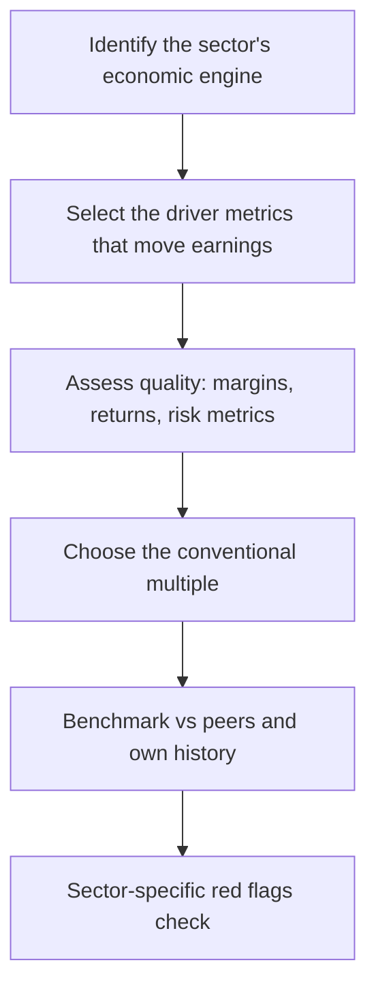

# Sector-Specific Analysis Frameworks

## The Problem / Why this matters
The generic research process (coverage → model → value → thesis) is the same for every stock, but the **drivers, metrics and red flags are not**. An analyst who values a bank the way they value an FMCG company will produce a confidently wrong number. Equity research is organised by sector precisely because each sector has its own economics, its own vocabulary, and its own valuation convention — and "walk me through how you'd analyse a bank" is one of the most common senior equity-research interview questions.

## Core Idea
Every sector has a **primary value driver**, a **sector-specific metric set**, and a **conventional valuation multiple** that reflects its economics. Master the framework for the sectors you cover: what actually moves earnings, which metrics reveal quality, and which multiple the market actually uses.

## Why it works this way
Valuation multiples are shorthand for underlying economics. Banks trade on P/B because their earnings power is a return *on the balance sheet* (equity), so book value is the anchor. Asset-light IT services trade on P/E because earnings are the asset. Cyclicals trade on EV/EBITDA through the cycle because leverage and depreciation distort net income at cycle extremes. The multiple follows the economics — it is not an arbitrary convention.

## Full technical content

### Banks and NBFCs — a balance-sheet business

A lender's product *is* its balance sheet. Earnings = income earned on assets minus cost of funds minus credit losses minus operating cost.

**The core P&L bridge:**

| Line | Meaning |
|---|---|
| Interest income − Interest expense | **Net Interest Income (NII)** — the core revenue |
| NII ÷ average earning assets | **Net Interest Margin (NIM)** — pricing power/spread |
| + Fee & other income | Non-interest income (cards, distribution, treasury) |
| − Operating expense | Measured as **Cost-to-Income ratio** |
| − Provisions | Credit cost, the swing factor |
| = Profit | Measured as **RoA** and **RoE** |

**Asset quality — the metrics that matter most:**
- **GNPA / NNPA (%)** — Gross and Net Non-Performing Assets as a share of advances. NNPA is after provisions already taken.
- **Provision Coverage Ratio (PCR)** — provisions held against GNPAs. A low PCR means future P&L pain is still to come.
- **Slippage ratio** — fresh NPAs created in the period, the *forward-looking* stress signal. Rising slippages precede rising GNPA.
- **Credit cost (%)** — provisions ÷ average advances. The single most important swing variable in a bank's earnings.
- **Restructured book / SMA-1 / SMA-2** — loans showing early stress but not yet NPA. A leading indicator.

**Funding and capital:**
- **CASA ratio** — Current Account Savings Account deposits as a share of total. High CASA = cheap, sticky funding = structurally better NIM. The single biggest quality differentiator between Indian banks.
- **Credit-Deposit (CD) ratio** — how much of deposits are lent out; very high CD ratio constrains further growth.
- **CAR / Tier-1 capital** — regulatory capital adequacy. Low Tier-1 means dilution risk (an equity raise) is coming.

**How to value:** **P/B (Price to Book)**, cross-checked against RoE. The relationship is fundamental: a bank earning RoE above its cost of equity deserves P/B > 1, and the higher the sustainable RoE, the higher the justified P/B. Use **P/ABV** (Adjusted Book Value, net of unprovided NPAs) for stressed lenders, because reported book value overstates real equity when provisioning is inadequate.

**NBFC-specific differences:** no deposit franchise (mostly), so funding is wholesale (bank borrowings, NCDs, CPs) and therefore more expensive and less sticky. Watch **ALM (Asset-Liability Management) mismatch** — borrowing short to lend long is the structural NBFC risk, and it is exactly what turns a liquidity event into a solvency event. Also watch **spread** (yield minus cost of funds) rather than NIM, and **leverage** (debt/equity), which is far higher than in most sectors by design.

**Red flags:** falling PCR while GNPA rises; sharp loan growth in a single risky segment; rising restructured book; repeated capital raises; NIM held up only by rising risk (lending down the credit ladder); divergence between RBI-assessed and company-reported NPAs.

### IT services — a people-and-contracts business

**Drivers:** headcount, utilisation, billing rate, and currency.

| Metric | Why it matters |
|---|---|
| **Revenue growth in constant currency (cc)** | Strips out FX so you see real business momentum |
| **Utilisation** (%) | Billable hours ÷ available hours — the operating leverage lever |
| **Attrition** (%) | High attrition raises replacement and training cost, hurts margin and delivery quality |
| **Deal TCV** (Total Contract Value) | Forward-looking order book; the leading indicator of revenue |
| **Revenue per employee** | Productivity / value-add of the mix |
| **Offshore-onsite mix** | Offshore work is far higher margin |
| **Client concentration** | Top-5/top-10 client revenue share = risk |

**Margin bridge:** wage inflation and rupee appreciation hurt; utilisation, offshoring, automation and pricing help. In an Indian IT model, a **1% INR depreciation vs USD typically adds roughly 20–30bps to EBIT margin** — currency is a genuine earnings driver, not noise.

**How to value:** **P/E**, benchmarked to growth (a PEG-style view) and to the company's own historical band. Tier-1 names command a premium for scale, client relationships and delivery consistency.

**Red flags:** growth held up by low-margin deals; rising attrition with flat margins (cost pressure not yet visible in P&L); declining deal TCV while revenue still grows (the pipeline is emptying); heavy dependence on one vertical (e.g. BFSI) heading into that vertical's downturn.

### Pharma — a pipeline-and-regulation business

**Two very different business models under one sector label:**
- **Generics / API** — commodity-like, competes on cost and regulatory compliance. Price erosion in the US generics market is the structural headwind.
- **Branded / domestic formulations** — brand-led, better pricing power, closer to an FMCG model.

**Metrics:** R&D as % of sales, **ANDA filings and approvals** (US pipeline), **Para-IV / FTF (First-to-File)** opportunities (180-day exclusivity = outsized but temporary profit), US price erosion rate, and the domestic formulation growth rate versus IPM (Indian Pharmaceutical Market) growth.

**The regulatory factor that dominates everything:** a **USFDA inspection outcome** — specifically a Form 483 observation, a Warning Letter, or an Import Alert on a plant — can wipe out a facility's US revenue overnight. Plant-level regulatory status is a first-order equity risk, not a compliance footnote. Always know which plants serve which revenue.

**How to value:** **P/E** for stable domestic-led businesses; **EV/EBITDA** where leverage or heavy depreciation distorts; sum-of-the-parts where a company has genuinely different segments (domestic branded vs US generics vs API vs CDMO).

**Red flags:** revenue concentrated in one product's exclusivity period (a cliff is coming); repeated regulatory observations across plants; capitalising R&D aggressively; receivables stretching in the US channel.

### FMCG / consumer — a brand-and-distribution business

**Drivers:** **volume growth versus value growth** — the single most important decomposition. Value growth without volume growth means price hikes are carrying the quarter, which is not durable; volume growth is real demand.

**Metrics:** volume growth, gross margin (raw-material sensitive), **A&P (advertising & promotion) spend as % of sales**, distribution reach (outlets covered, direct vs indirect), rural-urban mix, and new-product contribution.

**How to value:** **P/E**, typically at a structural premium to the market, justified by high RoCE, low capital intensity, and predictable cash generation. Also cross-check **EV/EBITDA**.

**Red flags:** value growth persistently outrunning volume growth; A&P cut to protect reported margin (borrowing from future brand equity); channel stuffing (primary sales to distributors outpacing secondary sales to consumers — watch distributor inventory days).

### Autos and cyclicals — a volume-and-operating-leverage business

**Drivers:** monthly **volume data** (a rare high-frequency, publicly disclosed operating metric — auto companies report monthly dispatches), realisation per unit, product mix, and raw-material cost (steel, aluminium, rubber).

**Key structural distinction:** dispatches (to dealers) versus retail sales (to customers). Divergence signals dealer inventory build — a warning that future dispatches must fall.

**How to value:** **EV/EBITDA** through the cycle, because net income is distorted by leverage and depreciation at cycle extremes, and P/E is famously misleading for cyclicals — a cyclical looks *cheapest* on P/E at the peak (peak earnings, low multiple) and *most expensive* at the trough. This is the classic cyclical trap.

### Cross-sector summary

| Sector | Primary driver | Signature metrics | Conventional multiple |
|---|---|---|---|
| Banks / NBFC | Balance-sheet growth × spread − credit cost | NIM, CASA, GNPA/NNPA, PCR, slippage, RoA, CAR | **P/B** vs RoE |
| IT services | Headcount × utilisation × rate | cc growth, utilisation, attrition, deal TCV | **P/E** |
| Pharma | Pipeline + regulatory status | ANDA filings, US price erosion, plant status | **P/E**, EV/EBITDA, SOTP |
| FMCG | Volume growth × pricing | Volume vs value growth, A&P%, distribution | **P/E** (premium) |
| Autos/cyclicals | Volumes × operating leverage | Monthly volumes, realisation, RM cost | **EV/EBITDA** through cycle |

## Common mistakes
- Applying **P/E to a bank** instead of P/B, or to a cyclical at peak earnings.
- Reading a bank's falling GNPA as improving asset quality without checking whether **write-offs** (not recoveries) drove the fall.
- Treating an IT company's reported USD revenue growth as business momentum without stripping out **currency**.
- Assuming FMCG value growth equals demand strength when it is entirely **price-led**.
- Ignoring **plant-level USFDA status** in pharma because it looks like a compliance rather than a financial issue.

## Interview angle
"Walk me through how you'd analyse a bank" is a standard question. Structure the answer: (1) the balance sheet is the product — growth in advances and deposits; (2) spread — NIM, driven by CASA and the lending mix; (3) asset quality — GNPA/NNPA, PCR, and *especially* slippages as the forward indicator; (4) efficiency — cost-to-income; (5) capital — CAR/Tier-1 and therefore dilution risk; (6) output — RoA and RoE; (7) valuation — P/B justified by sustainable RoE versus cost of equity. Naming slippages and CASA specifically is what separates a prepared candidate from a generic one.
