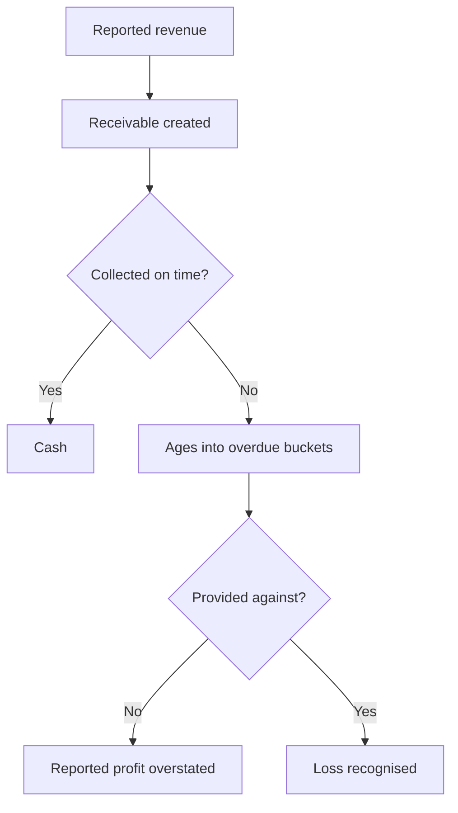

# Receivables Quality and Credit Exposure

## The Problem / Why this matters
A receivable is a bet that a customer will pay. For most industrial and B2B companies, receivables are the largest current asset, and their quality determines whether reported revenue becomes cash. Ageing schedules and provisioning are disclosed, yet analysts typically look only at the days figure — missing that the same number of days can conceal a healthy book or a deteriorating one.

## Core Idea
Receivable days are an average that hides the distribution — the **ageing profile and the provisioning against it** are what reveal whether reported revenue is collectible.

## Why it works this way
A company can hold stable receivable days while the composition shifts from current to long-overdue, because growth in current receivables offsets ageing in the old ones. The average moves slowly; the ageing bucket moves immediately, and it is disclosed.

## Full technical content

### What the disclosure contains

Companies disclose receivables by ageing bucket — typically not due, and overdue by ranges up to and beyond a year — along with the expected credit loss provision against each. **The bucket-level detail is where the information sits.**

| Item | What to check |
|---|---|
| **Ageing distribution** | The proportion beyond six months and beyond a year, and its trend |
| **Provision by bucket** | Whether coverage on aged balances is adequate |
| **Total provision to total receivables** | The headline coverage ratio |
| **Write-offs during the year** | Actual losses realised |
| **Concentration** | Exposure to individual customers, per that chapter |
| **Related-party receivables** | Separately disclosed; different in character |

### The tests

**1. Ageing shift.** Track the proportion in each bucket over several years. **A rising share beyond one year is the clearest signal**, and it can occur with flat headline days.

**2. Coverage adequacy.** Compare provisions to aged balances. Receivables more than a year overdue with minimal provision are a deferred loss, and the gap is computable.

**3. Provision to write-off ratio.** If write-offs consistently exceed the provisions carried, the provisioning was inadequate; if provisions consistently exceed write-offs, they may be conservative or the ageing may not be genuine.

**4. Receivables against revenue growth.** Receivables growing faster than revenue means either extended terms — a competitive concession — or collection difficulty.

**5. Related-party receivables** tracked separately, since the credit assessment is entirely different and the related-party chapter's framework applies.

**6. Unbilled versus billed**, per the percentage-of-completion chapter, since unbilled amounts have not even reached the receivable stage.

### The distinctions that matter

- **Extended terms as a competitive tool** versus **inability to collect.** The first is a deliberate margin-for-volume trade with a cost that can be quantified; the second is a quality problem. Management commentary and the ageing profile separate them.
- **Government and institutional receivables** are typically slow but ultimately collectible, so long ageing carries a different meaning — the working capital cost is real but the credit loss risk is not.
- **Retention money** in contracting, held pending completion, which is contractual rather than delinquent.
- **Disputed amounts**, which may be recovered in full or not at all, and are worth identifying separately.

### The financing overlay

Per the supply chain finance chapter, receivable days can be reduced without any collection improvement:
- **Factoring or bill discounting** removes receivables from the balance sheet, so days fall while nothing has been collected from the customer.
- **Check recourse terms** — without recourse the credit risk transfers; with recourse it does not.
- **Compare receivable days to the cash flow statement**, since a genuine collection improvement shows up in operating cash flow while a financing arrangement may not.

### Building it into the model

- **Model receivable days by segment or customer type** where the mix differs materially.
- **Forecast the provision charge** from the ageing trajectory rather than as a percentage of revenue.
- **Model the working capital cash requirement** that the days imply, per the working capital chapter.
- **Include a bad-debt scenario** in the bear case where concentration or ageing is material.

## Common mistakes
- Looking only at **receivable days** rather than the ageing distribution.
- Missing an ageing shift concealed by **stable headline days**.
- Not comparing **provisions to aged balances**.
- Treating **government receivables** as equivalent to commercial ones.
- Confusing a **factoring-driven** fall in days with a collection improvement.
- Ignoring **related-party receivables**, which need separate assessment.
- Forecasting the provision charge as a flat percentage of revenue.

## Interview angle
"Receivable days are flat at 78. Is that reassuring?" Not by itself, because the average can hold while the composition deteriorates — growth in current receivables offsets ageing in older ones, so the headline moves slowly while the ageing buckets move immediately. Go to the ageing schedule and track the proportion beyond six months and beyond a year over several years, then compare the provision carried against each bucket, because aged balances with minimal provision are a deferred loss you can compute. Add the checks that separate explanations: receivables growing faster than revenue means either extended terms as a competitive concession or a collection problem, and the ageing profile plus management commentary distinguish them; government and institutional receivables are slow but collectible, so long ageing there is a working capital cost rather than a credit risk. And verify that any improvement is real — factoring or bill discounting reduces days without anything being collected, so check the recourse terms and whether the improvement shows up in operating cash flow.
