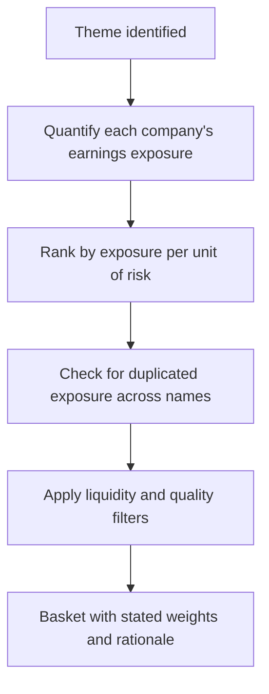

# Thematic Baskets and Multi-Stock Ideas

## The Problem / Why this matters
Clients increasingly ask for exposure to a theme rather than a single stock — a policy shift, a capex cycle, a consumption trend. Constructing a basket is a distinct skill from single-stock analysis, and the standard failure is assembling the companies whose names most obviously match the theme rather than those whose earnings are most exposed to it, correctly sized and free of duplicated risk.

## Core Idea
A thematic basket should contain the companies with the **highest earnings exposure per unit of risk**, not those with the strongest narrative association — and the exposure must be quantified rather than asserted.

## Why it works this way
Association with a theme and exposure to it are different. A company widely described as a beneficiary may derive 4% of profit from the relevant activity, while a less obvious one derives 40%. The second gives the client the exposure they asked for; the first gives them a stock whose price may move on the theme without its earnings doing so.

## Full technical content

### Quantifying exposure

The step that distinguishes a real basket from a list:
1. **Define the theme precisely** — not "infrastructure" but "orders arising from a specific programme over a specific period."
2. **For each candidate, compute** what proportion of revenue and, more importantly, of *profit* is exposed.
3. **Estimate the incremental effect** — how much does the theme add to earnings over the horizon, and by when?
4. **Rank by exposure**, not by name recognition.

**Profit exposure matters more than revenue exposure**, since the theme-related business may carry very different margins from the rest — and a company with 30% of revenue and 60% of profit from the exposed segment is far more geared than the revenue figure suggests.

### The construction

| Consideration | Why |
|---|---|
| **Exposure weighting** | Higher exposure warrants a larger weight, adjusted for risk |
| **Avoiding duplication** | Two companies exposed through the same customer or the same mechanism are one position |
| **Quality filter** | Theme exposure does not excuse governance or balance sheet problems |
| **Liquidity** | Each name must be deployable at the client's size |
| **Direct versus derived** | Suppliers to the beneficiaries are sometimes better exposed than the beneficiaries |
| **Valuation** | A theme already priced into a name offers nothing, per the good-company-good-stock chapter |

**The derived-exposure point is frequently where the differentiated idea sits.** In a capex cycle, the obvious beneficiaries are the companies building; the less obvious are the suppliers of the specific equipment, and their exposure may be more concentrated and less priced.

### The pitfalls

- **Narrative baskets** assembled from companies mentioned alongside the theme in commentary.
- **Ignoring valuation** — a theme widely recognised is priced, and the basket then offers thematic exposure with no expected excess return.
- **Duplicated risk** presented as diversification, per the factor chapter's point that several ideas on the same driver are one position.
- **Ignoring the timing** — a theme playing out over a decade does not produce returns in twelve months, and the client's horizon must match.
- **Quality dilution** — including a poorly governed company because its exposure is high, which risks losing more to the governance than the theme delivers.
- **No exit condition** — a theme basket needs a statement of what would end it, the same falsification discipline as a single stock.

### Presenting it

- **State each name's quantified exposure**, which is the analytical content.
- **Give weights and their basis.**
- **Identify the purest expression** and the safest expression, which are usually different names — the purest has the highest exposure, the safest the best balance sheet and governance.
- **State what is already priced**, using peer-relative multiples or a reverse-DCF on the most exposed name.
- **Give the timeline** over which the theme plays out.
- **State the exit conditions** — what would indicate the theme is not materialising.

### The honest caveats

- **Themes are the easiest research to sell and the hardest to get right**, because the narrative is compelling and the quantification is tedious.
- **Most themes take longer than expected**, per the disruption chapter's timing point.
- **A theme that is widely discussed is largely priced**, and the value comes from either an earlier identification or a differentiated view on which companies actually benefit.
- **The second is more achievable than the first** for most analysts, and it is where sector knowledge pays: knowing which supplier is qualified into which programme is exactly the kind of specific knowledge a generalist reading the theme does not have.

## Common mistakes
- Assembling names by **narrative association** rather than quantified exposure.
- Using **revenue** exposure where profit exposure differs materially.
- Including names with **duplicated** exposure and calling it diversification.
- Ignoring **valuation** — a priced theme offers no excess return.
- Overlooking **derived** beneficiaries, often the better exposure.
- Including a poorly governed company because its exposure is high.
- No stated **timeline** or exit condition.

## Interview angle
"A client wants exposure to a government infrastructure programme. What do you give them?" Quantify rather than associate: for each candidate compute what proportion of *profit* — not revenue, since margins differ — comes from the exposed activity, and how much the programme adds to earnings over what period. Rank by that exposure, then check for duplication, because two companies exposed through the same customer or mechanism are one position rather than diversification. Add the point where the differentiated idea usually sits: the obvious beneficiaries are the companies executing the projects, but the suppliers of specific qualified equipment often have more concentrated exposure and less of it priced in. Then apply the filters — liquidity at the client's size, and a quality screen, because high theme exposure does not excuse a governance problem that can lose more than the theme delivers. Present the purest expression and the safest expression separately, since they are usually different names, state what is already priced using a reverse-DCF on the most exposed name, and give the timeline and the conditions that would tell you the theme is not materialising.
