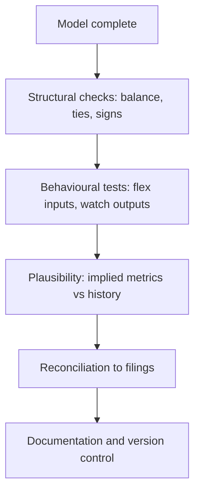

# The Model Audit

## The Problem / Why this matters
A financial model is an argument expressed in formulas, and like any argument it can contain errors that invalidate the conclusion. Spreadsheet errors are common, frequently material, and rarely caught because nobody checks — the analyst who built it knows what it should say and reads it that way. A systematic audit takes an hour and catches things that would otherwise reach a published note.

## Core Idea
Audit a model by testing **whether it behaves correctly** — flexing inputs and checking that outputs move sensibly — rather than by reading formulas, because behaviour reveals errors that inspection misses.

## Why it works this way
Reading a formula tests whether it says what you intended; flexing an input tests whether the whole chain produces a sensible result. Most material errors are not in individual formulas but in linkages — a hardcoded number where a link should be, a reference to the wrong row, a circularity resolved incorrectly — and those show up only in behaviour.

## Full technical content

### Structural checks

- **The balance sheet balances** in every forecast year — the single most basic test and one that catches a great deal.
- **Cash flow ties** to the change in cash on the balance sheet.
- **Retained earnings roll forward** correctly: opening plus profit less dividends.
- **Debt schedules reconcile** — opening, drawdowns, repayments, closing.
- **Share count rolls forward** with issuance and buybacks, per the ESOP chapter.
- **Signs are consistent** — a persistent source of error where costs are sometimes negative and sometimes positive.
- **No hardcoded values in formula cells**, which is the commonest and most damaging error because it breaks silently when inputs change.

### Behavioural tests

The part that catches real errors:
- **Flex revenue by 10%** — does EBITDA move by more, per operating leverage? If it moves proportionally, costs are being grown with revenue and the model has no operating leverage.
- **Flex a cost input** — does it flow to margin, cash and the balance sheet?
- **Set growth to zero** — does the model still balance, and does capex fall to maintenance?
- **Flex the discount rate** — does fair value move in the right direction and by a sensible amount?
- **Zero out an assumption entirely** — does anything break, revealing an unintended dependency?
- **Extend the forecast horizon** — do terminal-year values remain plausible, or does something compound to absurdity?

**The zero-growth test is the most revealing single check**, because a model that cannot handle zero growth usually has costs and capex hardwired to revenue in ways that misstate the economics.

### Plausibility checks

Per the triangulation chapter, applied to the model's own outputs:
- **Implied margins** in the terminal year against anything the company or industry has achieved.
- **Implied market share** against the addressable market.
- **Implied RoCE** against history.
- **Terminal capex versus depreciation** — below it implies a shrinking asset base.
- **Terminal growth** against nominal GDP.
- **Working capital days** in the forecast against history — a model that silently improves them is assuming an improvement nobody argued for.
- **Growth-reinvestment consistency**, per the ROIIC chapter.

**These catch the errors that structural checks miss**, because a model can balance perfectly while assuming something impossible.

### Reconciliation

- **Historical years tie to the filings**, line by line, at least annually.
- **Source notes** on every historical input, per the data-integrity chapter.
- **Restatements handled** consistently across the series.
- **Segment sums equal consolidated** where both are modelled.

### Documentation and control

- **Colour-code** inputs, formulas and links, so a reader can see what is assumption.
- **Assumptions on one sheet**, not scattered through the calculations.
- **An assumptions log** with dates and reasons for changes.
- **Version the model** at each publication, so published numbers are reproducible — a compliance requirement as much as a good practice.
- **Write the model to be read by someone else**, which is also how you find your own errors.

### The independent check

- **Have someone else flex the model**, which catches what familiarity conceals.
- **Rebuild the key calculation separately** — a back-of-envelope estimate of fair value that lands far from the model's output means one of them is wrong, and finding out which is the point.
- **Sanity-check the target against a simple multiple** on normalised earnings; a DCF far from that comparison needs an explanation.

## Common mistakes
- Auditing by **reading formulas** rather than testing behaviour.
- Not checking that the **balance sheet balances** in forecast years.
- **Hardcoded values** in formula cells.
- Growing **every cost with revenue**, eliminating operating leverage.
- Never running the **zero-growth** test.
- Missing implausible **terminal-year** implications.
- No **source notes** on historical inputs.
- Publishing numbers from an **unversioned** model.

## Interview angle
"How do you check a model for errors?" By testing behaviour rather than reading formulas, because most material errors are in linkages — a hardcoded number where a link should be, a reference to the wrong row — and those only show up when you flex something. Give the specific tests: flex revenue 10% and check EBITDA moves by more, because if it moves proportionally the costs have been grown with revenue and the model contains no operating leverage; set growth to zero and see whether the model still balances and capex falls to maintenance, which is the most revealing single check; and extend the horizon to see whether anything compounds to absurdity. Then the plausibility layer, which catches what structural checks miss, since a model can balance perfectly while assuming the impossible: terminal margins against anything the industry has achieved, implied market share against the addressable market, terminal capex against depreciation, and working capital days against history. Add the discipline points — colour-code inputs so a reader can see what is assumption, keep an assumptions log, and version the model at each publication so published numbers are reproducible.
