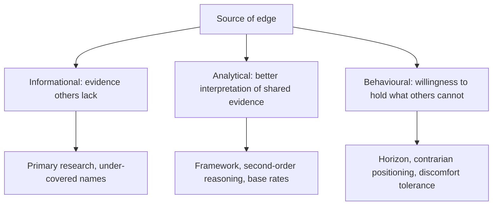

# Understanding Your Own Edge

## The Problem / Why this matters
An analyst competes against everyone else covering the same companies with the same public information. Producing a differentiated view requires having something others do not, and most analysts never articulate what that is — which means they cannot deliberately build it or recognise when a situation offers none. Knowing your edge is what lets you choose where to spend effort and where to decline a view.

## Core Idea
Edge comes from **information, analysis, or behaviour** — knowing which one you have in a given situation determines whether a differentiated view is available at all.

## Why it works this way
Public information reaches everyone. A view that differs from the price must rest on something the price does not reflect: evidence others lack, an interpretation others have not made, or a willingness to act where others cannot. Absent all three, the analysis will reproduce consensus however well executed.

## Full technical content

### The three types

**1. Informational edge.** Evidence others do not have:
- **Primary research** — channel checks, site visits, former employees, per the scuttlebutt chapter.
- **Coverage of under-followed names**, where the public information has simply not been processed.
- **Assembling scattered public data** — competitor filings, regulatory data, unlisted company accounts, foreign peers' disclosures.
- **The limit:** it decays, since information eventually becomes known, and it is bounded by compliance.

**2. Analytical edge.** The same evidence interpreted better:
- **A framework others lack** — knowing which metrics matter in a sector, per the sector chapters.
- **Second-order reasoning**, per that chapter, where the first-order effect is priced and the consequence is not.
- **Base rates**, per that chapter, where others reason from the narrative.
- **Rigour** — running the checks others skip, which is how most forensic findings arise.
- **The limit:** it is replicable, so it erodes as an approach becomes standard.

**3. Behavioural edge.** The willingness to act where others cannot or will not:
- **A longer horizon** than the market's, which is the most durable edge available because it is structural rather than informational.
- **Tolerating discomfort** — holding a position through a period when it looks wrong.
- **Publishing a Sell**, per the ratings chapter, where the structural pressures push the other way.
- **Acting in under-owned or unfashionable areas.**
- **The limit:** it requires an institutional setting that permits it, and most do not.

### Identifying yours

Honest questions:
- **What do I know about this company or sector that others do not?** If nothing, there is no informational edge here.
- **What framework am I applying that they are not?** If none, the analytical edge is rigour rather than insight — which is real but narrower.
- **What can I do that they cannot?** Horizon, position size, willingness to be alone.
- **If the answer to all three is nothing**, the honest conclusion is that no differentiated view is available, which the no-view chapter treats as a legitimate position.

### Building it deliberately

- **Informational**: cover under-followed names, do primary research systematically, assemble the data others do not bother with.
- **Analytical**: build the sector framework and the company-specific records, per the first-year chapter — these are analytical edge made permanent.
- **Behavioural**: establish a process that permits holding through discomfort, principally pre-committed falsification conditions, which convert conviction from a feeling into a testable position.

### Where edge is not available

Worth recognising, because effort spent there is wasted:
- **Large, heavily covered companies** on public information alone.
- **Situations turning on information you cannot legally obtain.**
- **Macro and market-level calls**, where the competition is enormous and the base rate of success is poor.
- **Short-horizon price movements**, which is a different game with different participants.

**Recognising these is what makes the coverage-universe and time-allocation decisions rational** — spend effort where edge is available rather than where the questions are interesting.

### The honest assessment

- **Most analysts' edge is analytical rigour and sector-specific framework**, not proprietary information — and that is a legitimate and sufficient basis for a career.
- **Informational edge is rarer and decays** faster than practitioners like to admit.
- **Behavioural edge is the most durable** and the least available, because it depends on the institution's structure as much as the individual's temperament.
- **Claiming an edge you do not have** produces confident wrong views, which is worse than acknowledging that a situation is efficiently priced.

## Common mistakes
- Never articulating what the **edge** is in a given situation.
- Assuming **effort** produces edge on a heavily covered name.
- Overestimating **informational** edge and its durability.
- Failing to build **analytical** edge deliberately, since it is the most controllable.
- Spending effort where **no edge is available**.
- Claiming an edge that is really just a strong opinion.

## Interview angle
"Why would your view be right when the market's is wrong?" That question has only three legitimate answers, and naming them shows you have thought about it: an informational edge, meaning evidence others do not have — primary research, coverage of an under-followed name, or public data nobody has bothered to assemble; an analytical edge, meaning the same evidence interpreted better through a sector framework, second-order reasoning, or simply running the checks others skip; or a behavioural edge, meaning a willingness to hold what others cannot, principally a longer horizon, which is the most durable because it is structural rather than informational. Say that if the answer to all three is nothing, the honest conclusion is that no differentiated view is available on that name, and declining is better than manufacturing one. Add the practical use — this is what makes coverage and time allocation rational, because effort spent on a heavily covered large cap using public information alone produces competence rather than edge, however well executed.
