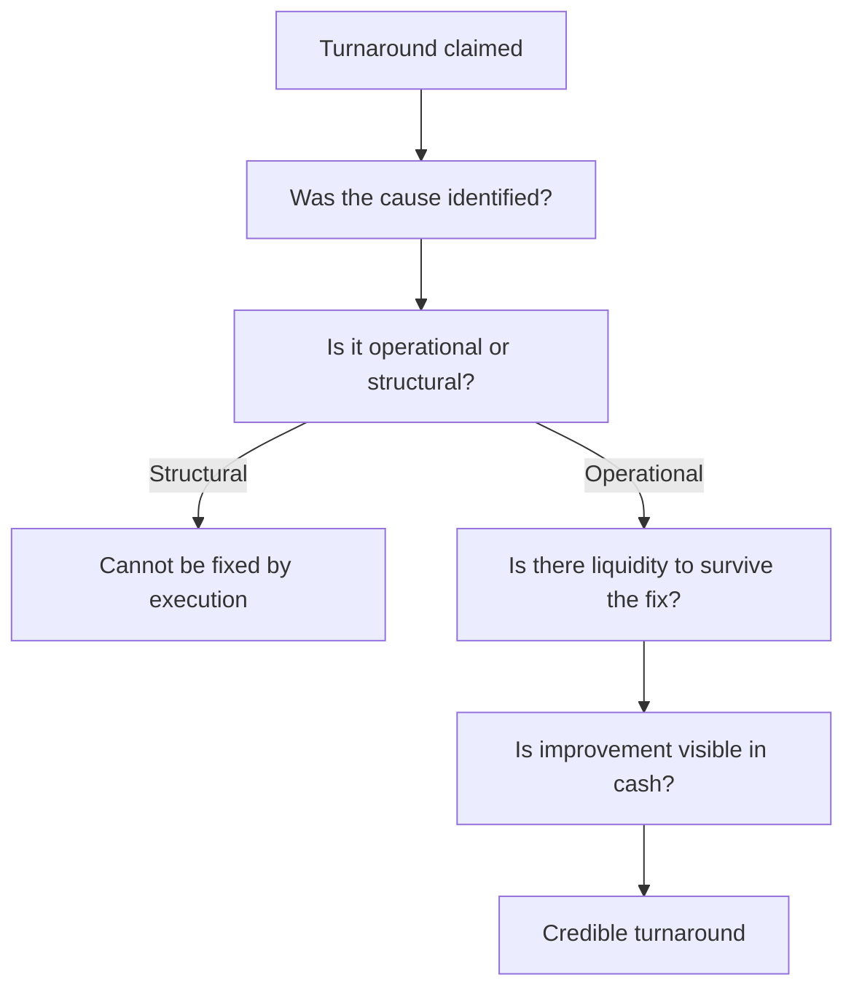

# Analysing a Turnaround in Progress

## The Problem / Why this matters
A company that has been performing badly and claims to be improving presents a specific analytical problem: the historical record argues against it, management has every incentive to claim progress, and early evidence is ambiguous. Turnarounds that work produce large returns because expectations start low; most fail. Distinguishing them requires knowing which early signals are real and which are cosmetic.

## Core Idea
A turnaround is credible when the **cause of the decline has been identified and addressed**, the company has liquidity to survive the fix, and improvement appears in cash rather than only in reported profit.

## Why it works this way
Reported profit can improve through cost cuts, provision releases, asset sales and accounting choices — none of which fix the business. Cash conversion improves only when the operations do. A turnaround visible in profit but not in cash is presentation; one visible in both is real.

## Full technical content

### The preconditions

Per the distress chapter, restated as tests:

**1. The cause is identified and specific.** "Things will improve" is not a diagnosis. A credible turnaround names the problem — a loss-making segment, an over-leveraged balance sheet, a broken distribution arrangement, a failed product — and states what is being done about it.

**2. It is operational rather than structural.** Execution problems in a viable business can be fixed; a business whose end market has structurally declined cannot be executed back to health. **This distinction is the one the sector chapters call the hardest judgement in the job**, and it determines everything else.

**3. Liquidity to survive.** Most turnarounds fail because time runs out, not because the plan was wrong. Model the cash flow to the nearest debt maturity and check whether the company reaches it.

**4. A credible agent of change.** New management with a relevant record, a new owner, or creditor pressure. Turnarounds do not happen spontaneously, and the same management that presided over the decline rarely reverses it without something changing.

### Reading the early evidence

| Signal | Weight |
|---|---|
| **Cost reduction achieved** | Real but often the easy part, and can be deferred maintenance |
| **Asset sales completed** at reasonable prices | Strong — proves both liquidity and the asset values assumed |
| **Debt refinanced or extended** | Strong — converts a crisis into time |
| **Promoter or management capital infusion** | Strong — costly and undiversifiable |
| **A quarter of operational improvement** | Weak alone; needs three |
| **Operating cash flow turning positive** | The key signal, since it cannot be manufactured easily |
| **Loss-making segments exited** | Real, and measurable in segment disclosure |
| **Working capital days improving** | Real if not achieved through payable stretching |

**The cost-cut caveat matters:** margin improvement from cutting advertising, maintenance or R&D is borrowing from the future, per the gross margin and R&D chapters. Check what was cut and whether it was discretionary spending or investment.

### The sequence that usually holds

Genuine turnarounds tend to progress in a recognisable order:
1. **Stop the bleeding** — exit loss-making activities, cut discretionary cost.
2. **Fix the balance sheet** — asset sales, refinancing, sometimes equity.
3. **Stabilise operations** — margins stop falling, working capital normalises.
4. **Return to growth** — the last stage, and often years after the first.

**Knowing where a company sits in this sequence sets the expectation.** A company at stage one being valued as though it has reached stage four is the standard turnaround mistake, in both the enthusiasm and the timing.

### Valuing it

- **Scenario-weight explicitly** — recovery, muddle-through, and failure with the equity worth little.
- **Value the normalised business** and discount heavily for the probability of not reaching normalisation.
- **Model the dilution.** Recovery frequently requires new equity at a depressed price, so existing holders may own much less of the recovered business — the point the distress chapter makes, and the one that most often surprises.
- **Balance sheet first**, since solvency determines whether the earnings recovery is ever realised.
- **Use asset-based floors** where available, per the cyclicals chapter, since they anchor the downside independent of the earnings forecast.

### What to monitor

- **Operating cash flow**, quarterly, as the primary signal.
- **The specific commitments** management made, with dates, per the guidance chapter.
- **Debt maturities** approaching and whether refinancing is secured.
- **Segment disclosure** on the exited or fixed businesses.
- **Whether disclosure improves or deteriorates** — a turnaround accompanied by reducing disclosure is not one.
- **Whether the agent of change remains.** A new CEO leaving mid-turnaround is close to decisive.

## Common mistakes
- Accepting a turnaround claim without an **identified cause**.
- Confusing an **operational** problem with a **structural** decline.
- Ignoring whether there is **liquidity to survive** the fix.
- Crediting **cost cuts** that are deferred maintenance or cut investment.
- Reading one quarter of improvement as a trend.
- Modelling recovery without modelling the **dilution** required to fund it.
- Valuing a company at stage one as though it were at stage four.
- Missing that improvement in profit without cash is presentation.

## Interview angle
"Management says the turnaround is working. How do you test that?" Check the preconditions first: has the cause been identified specifically rather than described generally, is it an execution problem in a viable business or a structural decline that cannot be executed away, and is there liquidity to survive the fix — because most turnarounds fail on time rather than on plan, so model the cash flow to the nearest debt maturity. Then weigh the early evidence properly: cost reduction is real but is often the easy part and may be deferred maintenance or cut advertising, which borrows from the future; asset sales completed at reasonable prices and refinancing secured are strong because they prove both liquidity and the asset values assumed; and operating cash flow turning positive is the key signal because it is the one thing that cannot be manufactured through accounting. Add the sequencing point — turnarounds run from stopping the bleeding, to fixing the balance sheet, to stabilising operations, to growth, and valuing a company at the first stage as though it had reached the last is the standard error. And model the dilution, since recovery often requires equity at a depressed price and existing holders end up owning much less of the recovered business than they expect.
