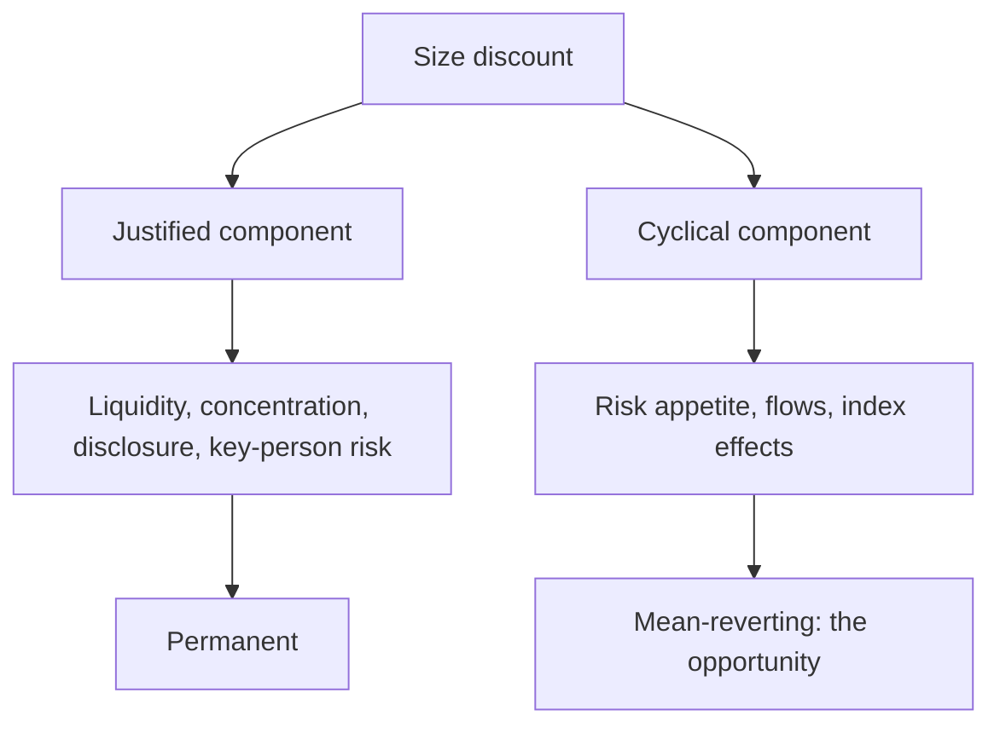

# Comparing Across Market Capitalisations

## The Problem / Why this matters
Large, mid and small caps trade at systematically different multiples, and the gap widens and narrows over cycles. Analysts frequently compare a mid cap's multiple to a large-cap peer's and conclude it is cheap — ignoring that the discount reflects real differences in liquidity, disclosure, diversification and risk. Knowing what the discount should be is what makes the comparison meaningful.

## Core Idea
The size discount is **partly justified and partly cyclical** — the justified portion reflects liquidity, concentration and disclosure, and the cyclical portion reflects risk appetite, which is where the opportunity sits.

## Why it works this way
A smaller company is genuinely riskier: less diversified by product and customer, more dependent on individual people, harder to exit, and less disclosed. Those justify a lower multiple permanently. But the observed discount also expands and contracts with sentiment far beyond what those factors change, and that variation mean-reverts.

## Full technical content

### The justified discount

| Factor | Why it justifies a lower multiple |
|---|---|
| **Liquidity** | Exit is costly and slow; institutions require a discount to accept it |
| **Customer and product concentration** | Higher variance of outcomes |
| **Key-person dependence** | A single individual's departure can be material |
| **Disclosure depth** | Less information means more uncertainty, per that chapter |
| **Analyst coverage** | Less scrutiny; a wider range of possible surprises |
| **Access to capital** | Higher cost and less reliable in a downturn |
| **Governance** | Weaker on average, though with wide dispersion |
| **Cyclical vulnerability** | Thinner balance sheets, less able to survive a downturn |

**The balance sheet point is the one that matters most in a downturn** and is frequently underweighted in a bull market: smaller companies fail at higher rates when conditions tighten, which is a genuine and permanent justification for a discount.

### The cyclical component

- **The discount narrows in risk-on periods** and widens sharply in risk-off ones, by far more than the fundamentals change.
- **Domestic flows matter** — mid and small cap funds' inflows and outflows drive the segment's relative valuation, per the institutional flows chapter, and are a mechanical rather than fundamental driver.
- **Index effects** — inclusion in a mid-cap index brings passive flow, per that chapter.
- **At extremes the relationship inverts**: periods where mid caps trade at a premium to large caps, against a long history of discounts, are specific and checkable observations, and they have historically preceded poor relative returns.

**Tracking the mid-cap-to-large-cap multiple relative to its own history is a simple, useful measure** for the sector-allocation question, and it is one of the few market-level observations with a defensible empirical basis.

### Making the comparison properly

1. **Compare against the appropriate peer set** — a mid cap against other mid caps, not against a large-cap leader with different characteristics.
2. **Adjust for the justified factors** rather than treating the whole gap as opportunity.
3. **Compare growth and returns**, since a mid cap growing faster with similar returns may deserve a premium on those grounds.
4. **Check liquidity against deployable size** before concluding anything, per the small-cap chapter.
5. **Assess governance individually** rather than applying a segment average — the dispersion within mid caps is very wide, which is precisely why selection pays there.

### Where the opportunity is

- **A mid cap with large-cap characteristics** — diversified, well governed, liquid, well disclosed — trading at the segment discount is the clearest opportunity, since the discount is being applied for reasons that do not hold.
- **Graduation** — a company moving from small to mid to large cap gains index inclusion, institutional eligibility and coverage, which is a structural re-rating that is partly forecastable from the eligibility criteria.
- **Segment dislocation** — a period when the discount has widened well beyond its historical range without a corresponding change in fundamentals.

**The graduation case is the most forecastable**, since index eligibility criteria are published and a company approaching them can be identified in advance, per the index chapter.

### The reverse case

- **A large cap trading at a mid-cap multiple** usually has a reason — a governance issue, a structural decline, a regulatory problem — and the discount may be justified rather than an opportunity.
- **Check what changed** before assuming a large cap at a low multiple is cheap; the market has more scrutiny on it, not less.

## Common mistakes
- Comparing a mid cap's multiple to a **large cap's** and calling the gap opportunity.
- Treating the entire size discount as **unjustified**.
- Ignoring **liquidity** against deployable size.
- Applying a **segment average** governance assumption rather than assessing individually.
- Missing that the discount's **cyclical component** mean-reverts.
- Ignoring **graduation** as a forecastable re-rating.
- Assuming a large cap at a mid-cap multiple is cheap without finding the reason.

## Interview angle
"This mid cap trades at 14× against 22× for the sector leader. Is it cheap?" Not automatically, because part of that gap is justified: less liquidity, higher customer and product concentration, key-person dependence, thinner disclosure, weaker access to capital in a downturn, and a higher failure rate when conditions tighten — all of which warrant a permanent discount. So separate the justified component from the cyclical one, since the observed discount widens and narrows with risk appetite by far more than fundamentals change, and that portion mean-reverts. Then make the comparison properly: against other mid caps rather than the leader, adjusted for growth and returns, and with governance assessed individually because dispersion within the segment is very wide. Name where the real opportunity usually sits — a mid cap with large-cap characteristics being discounted for reasons that do not apply to it, and graduation, where index eligibility criteria are published so a company approaching them can be identified in advance and the re-rating is partly forecastable.
