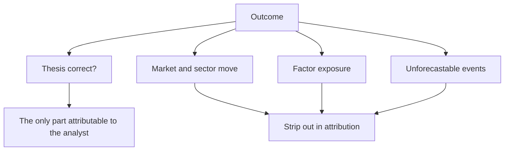

# The Role of Luck and Honest Attribution

## The Problem / Why this matters
Outcomes in equity research are noisy. A correct analysis can produce a loss and a poor one a profit, over horizons long enough that the difference is not obvious. An analyst who evaluates themselves purely on outcomes will learn the wrong lessons — reinforcing bad process that happened to work and abandoning good process that happened not to. Separating skill from luck is what makes experience improve judgement rather than just accumulate.

## Core Idea
Evaluate **decisions rather than outcomes** — because the outcome of a single call contains a large random component, while the quality of the reasoning is assessable directly and is what generalises.

## Why it works this way
A single stock's return over twelve months depends on the thesis, the market, the sector, flows, and events nobody forecast. The analyst controls one of those. Judging the analysis by the return therefore attributes to skill what was largely determined by everything else — and the sample of calls needed to distinguish them statistically is larger than most careers provide.

## Full technical content

### The four-quadrant view

| | Good process | Poor process |
|---|---|---|
| **Good outcome** | Deserved success — reinforce | **Lucky — the dangerous quadrant** |
| **Poor outcome** | **Unlucky — do not abandon the process** | Deserved failure — change |

**The two off-diagonal cases are where the learning goes wrong.** A lucky success reinforces a process that will fail later; an unlucky failure discards a process that would have worked. Both are avoided only by assessing the reasoning independently of the result.

### Assessing the decision

Per the post-mortem discipline, applied to every material call regardless of outcome:
- **Was the evidence sufficient** for the confidence expressed?
- **Were the falsification conditions** stated and appropriate?
- **Was the risk-reward** correctly assessed, with a genuine bear case?
- **Was the position size** consistent with the uncertainty?
- **Given only what was knowable at the time**, was this a reasonable decision?

**That last question is the whole exercise**, and it must exclude everything learned since — hindsight makes the outcome look inevitable and the reasoning look obvious or foolish, neither of which was true at the time.

### Attribution

Per the factor chapter, decompose the return:
- **Market return** over the period.
- **Sector return** relative to market.
- **Factor exposures** — value, quality, momentum, size.
- **The residual**, which is the stock-specific return and the only part attributable to the analysis.

**A 30% return on a call where the sector rose 26% is a 4% contribution**, and treating it as a triumph misreads it. The residual is what should be tracked over time.

### Sample size

The uncomfortable statistical reality:
- **Individual calls carry almost no information** about skill.
- **Tens of calls** begin to be informative; hundreds are needed for confidence.
- **A run of successes proves little**, and so does a run of failures.
- **The implication:** judge the process continuously and the outcomes only in aggregate over long periods.

### The biases to guard against

- **Hindsight bias** — the outcome makes the cause seem obvious, so a post-mortem conducted without the pre-committed reasoning is worthless. This is why writing down the thesis and its falsifiers matters analytically, not just for accountability.
- **Outcome bias** — judging a decision by its result.
- **Attribution asymmetry** — crediting skill for success and circumstance for failure, which the management-language chapter identifies in executives and which applies equally to analysts.
- **Survivorship in memory** — remembering the calls that worked.

**The defence is a written record made at the time**, which is the practical purpose of stating theses and falsification conditions in advance.

### What this means practically

- **Keep the record** — every call, its reasoning, its falsifiers, and its outcome, per the first-year chapter.
- **Post-mortem the successes too**, which almost nobody does and which is where lucky processes are caught.
- **Classify errors by type** — analytical, evidential, timing, sizing, or simply unforecastable — because the response differs for each.
- **Accept that some losses were correct decisions**, and say so, which requires the pre-committed reasoning to demonstrate.
- **Be sceptical of your own good runs**, which is harder than being sceptical of bad ones.

### The connection to credibility

- **An analyst who attributes honestly** is more reliable than one with a better raw record, because the honest one knows which parts of their process work.
- **Clients and employers who understand this** value the attribution discipline itself.
- **It is also the only defence against the confidence that a good run produces**, which is what precedes most large errors.

## Common mistakes
- Judging decisions by **outcomes**.
- Not post-morteming **successes**, where lucky processes hide.
- Failing to strip out **market, sector and factor** returns in attribution.
- Conducting post-mortems without the **contemporaneous** reasoning, so hindsight dominates.
- Drawing conclusions from a **small sample** of calls.
- Attribution asymmetry — skill for wins, circumstance for losses.
- Increasing conviction and size after a good run without new evidence.

## Interview angle
"Tell me about a call that worked." A strong answer separates the decision from the outcome: describe the reasoning, the evidence available at the time, the falsification conditions you set, and then attribute the return honestly — how much was the market, how much the sector, how much factor exposure, and how much was genuinely stock-specific. If a 30% return came in a sector that rose 26%, say so, because the residual is the only part attributable to the analysis. Then make the general point: individual calls carry almost no information about skill given how noisy outcomes are, so the useful practice is judging decisions on whether the reasoning was sound given what was knowable at the time, and judging outcomes only in aggregate over long periods. Add the discipline nobody does — post-mortem the successes as well as the failures, because that is where a lucky process hides and gets reinforced, and it is the only real defence against the confidence that follows a good run.
