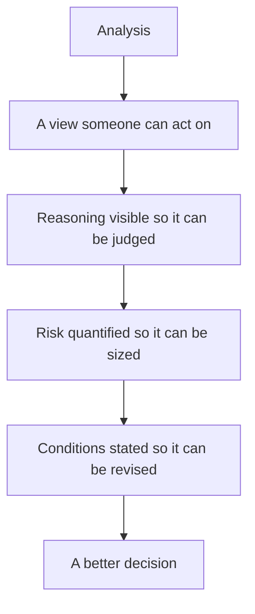

# Final Note — What the Work Is For

## The Problem / Why this matters
It is possible to master every technique in these chapters and still lose sight of what the work is for. Research exists to help someone make a better decision about where to put capital. Everything else — the models, the frameworks, the notes, the ratings — is instrumental to that, and technique detached from the purpose produces analysis that is thorough and useless.

## Core Idea
The purpose of research is to **improve a decision** — so the test of any piece of work is whether someone can act better because of it, not whether it was rigorous or comprehensive.

## Why it works this way
A client allocates capital under uncertainty. What helps them is a view they can act on, with the reasoning visible so they can judge it, the risk quantified so they can size it, and the conditions stated so they know when to change. Analysis that does not deliver those may be correct and still be of no use.

## Full technical content

### What makes research useful

- **A view.** Comprehensive analysis with no conclusion has not done the job, per the sector-outlook chapter.
- **Visible reasoning**, so the reader can disagree with a specific step rather than accepting or rejecting the whole.
- **Quantified risk** — a bear case and a risk-reward ratio, so the position can be sized, per the stress-testing and sizing chapters.
- **Stated conditions** for changing the view, so the reader knows what to watch.
- **Honesty about confidence**, so high-conviction calls are distinguishable from marginal ones.
- **Something the reader did not have.** Restating consensus adds nothing, however well done.

### What makes it useless

- **Thoroughness without a conclusion.**
- **Hedged language** that cannot be acted on.
- **A rating without a bear case**, so no risk-reward exists.
- **False precision** where the uncertainty is genuinely wide.
- **A recommendation the reader cannot implement** — wrong size, no liquidity, no mechanism.
- **Analysis that arrives after the decision**, however good.

### The three obligations

Running through these chapters, and worth stating together:

**To the client** — a view they can use, with the risk stated, changed promptly when the evidence changes, and communicated most attentively when it is uncomfortable to do so.

**To the evidence** — every number verified, every claim traceable, no fabrication, and conclusions that follow from what was found rather than from what was wanted.

**To yourself** — a record of what was decided and why, post-mortems conducted honestly including on the successes, and a willingness to be publicly wrong rather than quietly vague.

### What the job actually develops

- **Judgement about businesses** — which are durable, which are cyclical, which are structurally impaired.
- **Judgement about people** — whether management is honest, capable and aligned.
- **Judgement about your own reasoning** — where it is reliable and where it is not.

**None of these come from technique alone**, and all of them come faster with the disciplines these chapters describe: stating theses in advance, checking them against outcomes, and classifying the errors.

### The realistic view of the career

- **Most calls are approximately right and unremarkable.** The differentiated ones are a minority.
- **The errors will include some that were avoidable**, and reviewing them honestly is what stops them repeating.
- **Credibility compounds** and is the only thing that does.
- **The frameworks narrow where judgement operates**; they never replace it, per the synthesis chapter.
- **The job is an apprenticeship**, which is why the record-keeping matters more than any single insight.

### The closing point

The five habits from the synthesis chapter — decompose before concluding, check cash against profit, compare against the right benchmark, know what the market believes and why, state what would prove you wrong — and the five standards from the closing note — verify every number, state the falsifiers, change the view promptly, admit uncertainty, report outcomes honestly — are the whole of it.

**Everything else in these chapters is the application of those ten things to particular situations.** An analyst who has them will handle situations no chapter covers; one who has the chapters without them will not.

## Common mistakes
- Producing **rigorous work with no view**.
- Mistaking **comprehensiveness** for usefulness.
- Publishing a recommendation the reader **cannot implement**.
- Treating technique as a substitute for **judgement**.
- Keeping no **record**, so experience accumulates without improving judgement.
- Losing sight of the fact that the work exists to help someone **decide**.

## Interview angle
"What is equity research for?" To help someone make a better decision about where to put capital — which means the test of any piece of work is whether it can be acted on, not whether it was thorough. So the output needs a view rather than a survey, reasoning visible enough that a reader can disagree with a specific step, risk quantified through a genuine bear case so the position can be sized, and stated conditions for changing the view. Say what makes work useless despite being correct: hedged language that commits to nothing, a rating with no bear case and therefore no risk-reward, false precision where the uncertainty is wide, and a recommendation the client cannot implement at their size. Then close on what the job actually builds — judgement about businesses, about management, and about your own reasoning — and note that none of it comes from technique alone. It comes from stating views in advance, checking them against outcomes, and reviewing the errors honestly, which is why the record-keeping matters more than any single framework.
