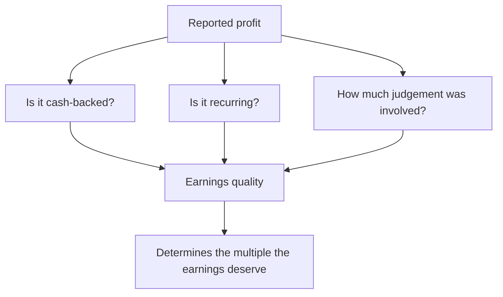

# Earnings Quality — A Consolidated Framework

## The Problem / Why this matters
Earnings quality is discussed constantly and defined loosely. The individual tests appear throughout these chapters — cash versus profit, provisioning, revenue recognition, other income, capitalisation — but an analyst needs them as a single framework, because quality assessment is done on every company and skipping any one test is how problems get missed.

## Core Idea
High-quality earnings are **cash-backed, recurring, and produced without unusual accounting judgement** — so the assessment is three questions asked systematically rather than a general impression.

## Why it works this way
Reported profit is an estimate. Its reliability depends on how much of it converted to cash, how much of it will recur, and how much of it depended on management's discretion. Each is testable from disclosure, and a company scoring poorly on all three is reporting a number that will not persist.

## Full technical content

### Question 1 — Is it cash-backed?

| Test | Source |
|---|---|
| **Cumulative CFO versus cumulative PAT**, five years | Cash flow statements |
| **CFO versus EBITDA** and the gap's composition | Cash flow statement |
| **Working capital days** by component, and their trend | Balance sheet |
| **Unbilled revenue** relative to revenue | Balance sheet |
| **Receivable ageing** and provisioning against it | Notes |
| **Taxes paid versus the tax charge** | Cash flow versus P&L |

**The five-year cumulative comparison is the single most efficient test available** and is the one that recurs throughout these chapters for that reason.

### Question 2 — Is it recurring?

| Test | Source |
|---|---|
| **Other income decomposed** into recurring and one-off | Notes |
| **"Exceptional" items** and whether they recur annually | P&L and notes |
| **Provision reversals** flowing into profit | Movement schedules |
| **Asset sale gains and write-backs** | Other income note |
| **Government incentives** and their expiry | Notes; where booked |
| **Foreign exchange gains** | Notes |
| **Treasury and investment gains** for financials | Segment disclosure |
| **Adjusted-earnings symmetry** — are gains excluded as readily as losses? | Presentation |

### Question 3 — How much judgement was involved?

| Area | What to check |
|---|---|
| **Revenue recognition** | Percentage-of-completion estimates; changes in estimated costs |
| **Provisioning** | Adequacy against ageing and peers; reversal patterns |
| **Capitalisation** | Development costs, interest, repairs; against cash outflow |
| **Depreciation policy** | Asset lives and residuals against peers; any life extension |
| **Impairment** | Goodwill and asset test assumptions; sensitivity disclosure |
| **Actuarial assumptions** | Discount and salary escalation against peers |
| **Inventory valuation** | Net realisable value; write-down history |
| **Deferred tax recognition** | Whether the required future profitability is plausible |

**The auditor's Key Audit Matters point directly at where judgement was greatest**, per that chapter, which makes this section quick to prioritise.

### Scoring it

- **High quality**: cash converts consistently, other income is small and recurring, accounting choices are conservative relative to peers, and disclosure is stable and detailed.
- **Low quality**: persistent cash-profit gap unexplained by growth in working capital days, material one-off items recurring, aggressive relative to peers on several judgemental areas, and disclosure narrowing.
- **The valuation consequence:** low-quality earnings deserve a lower multiple, and stating that explicitly with the evidence is far more persuasive than applying an unexplained discount.

### The composite signals

Where several indicators appear together, the concern compounds rather than adds:
- **Profit growing, cash flat, receivables and inventory rising** — the classic pattern.
- **Margin improving while provisions fall and disclosure narrows.**
- **A cash-profit gap alongside heavy related-party activity** — the two most serious findings together.
- **Aggressive accounting alongside a stretched balance sheet**, where the incentive to manage earnings is strongest.

### The honest framing

- **Most companies are not manipulating anything.** The task is establishing how much of reported profit is cash-backed, recurring and judgement-free — not alleging misconduct.
- **State it factually**, which is both more credible and more defensible.
- **Quantify where possible** — "adjusting for non-recurring items and the provision reversal, underlying profit was ₹X against reported ₹Y" is a finding; "earnings quality is poor" is an assertion.

## Common mistakes
- Treating earnings quality as an **impression** rather than a set of tests.
- Running only the **cash test** and skipping recurrence and judgement.
- Accepting a cash-profit gap as "growth" without checking working capital **days**.
- Missing **provision reversals** flowing into profit.
- Ignoring **asymmetric** adjusted-earnings presentation.
- Applying an unexplained quality discount rather than **quantifying** the adjustment.
- Alleging manipulation where the finding is about composition.

## Interview angle
"How do you assess earnings quality?" Three questions asked systematically. Is it cash-backed — cumulative operating cash flow against cumulative profit over five years, with working capital days checked by component so that "growth" is a verified explanation rather than an assumed one. Is it recurring — decompose other income, check whether "exceptional" items appear every year, look for provision reversals flowing into profit, and test whether the company's adjusted earnings exclude gains as readily as losses. And how much judgement was involved — revenue recognition estimates, provisioning adequacy, capitalisation policy, depreciation lives and impairment assumptions, all of which the auditor's Key Audit Matters point you to directly. Then say how you use it: quantify the adjustment rather than asserting poor quality, because "adjusting for non-recurring items and the provision reversal, underlying profit was ₹X against reported ₹Y" is a finding a client can act on, while a general quality concern is not.
