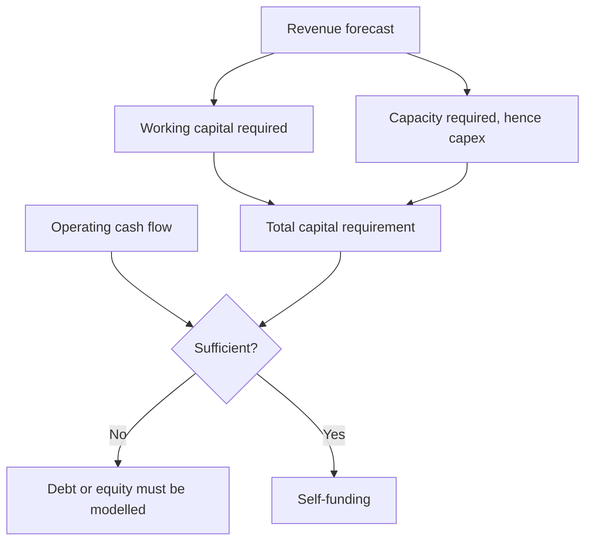

# Forecasting the Balance Sheet

## The Problem / Why this matters
Analysts build detailed P&L forecasts and treat the balance sheet as an afterthought, filled in with ratio assumptions to make it balance. But the balance sheet determines whether the forecast is feasible — whether growth can be funded, whether covenants hold, whether the capital required actually exists. A forecast that is arithmetically consistent but financially impossible is a common and avoidable failure.

## Core Idea
The balance sheet forecast tests whether the **P&L forecast can actually happen** — because growth consumes capital, and a model that grows revenue without funding the working capital and capex it requires is asserting something impossible.

## Why it works this way
Revenue growth requires inventory, receivables and often capacity. Those require capital, which comes from operating cash flow, debt or equity. If the forecast's cash generation cannot fund its own growth assumptions and no external funding is modelled, the model is internally inconsistent — and the inconsistency is invisible unless the balance sheet is built properly.

## Full technical content

### Building it properly

**1. Working capital from days, not percentages.** Forecast inventory, receivable and payable days — informed by history and by the business model, per that chapter — and derive the balances. Days are the assumption; rupees are the output.

**2. Capex from the capacity requirement.** Per the capacity chapter: what volume does the revenue forecast imply, what utilisation does that require, and does existing capacity support it? If not, capex and its commissioning timeline must be modelled, with a slippage haircut.

**3. Depreciation from the asset base**, rolling forward with additions, rather than as a percentage of revenue.

**4. Debt from the actual schedule** — opening, scheduled repayments, drawdowns — with interest computed from the schedule and the fixed-floating split, per the capital structure chapter.

**5. Equity rolling forward** — opening plus profit less dividends, plus any issuance, with the share count rolling in parallel per the ESOP chapter.

**6. The plug.** Something must balance the model — typically cash or revolving debt. **Where the plug goes persistently negative, the forecast requires funding that has not been modelled**, and that is the finding rather than a technical problem to be suppressed.

### The tests the balance sheet applies

| Test | What it catches |
|---|---|
| **Does the plug stay positive?** | Unfunded growth |
| **Do covenants hold** in every year, including the bear case? | Capital structure fragility, per that chapter |
| **Is capex consistent** with the volume forecast? | Growth without capacity |
| **Do working capital days** stay at plausible levels? | Silent assumed improvement |
| **Does the asset base grow** at a rate implying plausible returns? | Poor incremental returns, per ROIIC |
| **Is the implied RoCE** achievable versus history? | An earnings forecast the capital base cannot support |

**The silent working capital improvement is the most common hidden assumption.** A model where days quietly fall over the forecast period is assuming an operational improvement nobody argued for, and it flatters both cash flow and returns.

### The funding decision

Where the forecast requires external capital, the model must make a choice and state it:
- **Debt** — with the effect on interest, leverage and covenants modelled.
- **Equity** — with the dilution modelled at a stated price, per the ESOP and rights chapters.
- **Slower growth** — the alternative the company may actually choose, and which should be presented as a scenario.

**A growth forecast requiring capital the company cannot raise is not a forecast**, and identifying that is one of the more valuable things a balance sheet model does.

### Where it matters most

- **High-growth companies** in working-capital-intensive businesses, where growth consumes cash fastest.
- **Capital-intensive sectors** where capacity must precede revenue.
- **Levered companies**, where covenant headroom is the binding constraint.
- **Lenders**, where the balance sheet *is* the business and capital adequacy governs growth — a bank's loan growth forecast must be consistent with its capital, and a model growing the book beyond what capital supports is assuming a raise.
- **Turnaround situations**, where solvency rather than earnings is the question.

### The presentation

- **Show the funding requirement** explicitly in the note where it is material.
- **State the funding assumption** — debt, equity or slower growth — since it materially affects per-share value.
- **Show covenant headroom** in the forecast years and in the bear case.
- **Flag where the model requires an equity raise**, since that is a genuine finding and clients want it.

## Common mistakes
- Forecasting working capital as a **percentage of revenue** rather than from days.
- Letting working capital days **silently improve** across the forecast.
- Modelling revenue growth without the **capex** the capacity requires.
- Computing interest as a rate on **average debt** rather than from the schedule.
- Suppressing a **negative plug** rather than treating it as a finding.
- Not testing **covenants** in the forecast and bear case.
- Growing a lender's book beyond what its **capital** supports.
- Failing to state the **funding assumption** where external capital is required.

## Interview angle
"Why does the balance sheet forecast matter if you have the P&L?" Because it tests whether the P&L forecast can actually happen. Growth consumes working capital and often capacity, both of which require capital, so a model that grows revenue 20% a year without funding the inventory, receivables and capex that implies is asserting something impossible — and the inconsistency is invisible unless the balance sheet is built properly and the plug is allowed to go negative rather than being suppressed. Say how you build it: working capital from days rather than percentages, capex from the volume and utilisation the revenue forecast requires, depreciation rolled forward from the asset base, and interest from the actual debt schedule with the fixed-floating split. Then name the checks it applies — whether covenants hold in every forecast year including the bear case, whether the implied RoCE is achievable against history, and whether working capital days have quietly improved across the forecast, which is the most common hidden assumption and flatters both cash flow and returns. And when the model does require external funding, that is the finding: state whether it is debt, equity with the dilution modelled, or slower growth.
