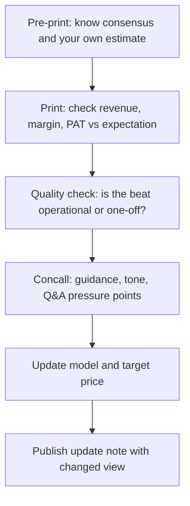

# Earnings Season and Concall Analysis

## The Problem / Why this matters
Four times a year, every company you cover reports — and an analyst's credibility is made or lost in the 48 hours around each print. The job is not to read the press release; it is to know **before** the print what the market expects, judge **within minutes** whether the result beat or missed on the lines that matter, extract what management said that wasn't in the numbers, and update the model and the view. This is the single most repetitive, highest-frequency task in an equity research seat.

## Core Idea
An earnings event has three separable information layers: the **reported numbers** (versus consensus, versus your own estimate), the **quality** of those numbers (how they were achieved), and the **forward guidance and tone** from the concall. Price reacts to all three, and the third is often the largest mover.

## Why it works this way
Markets price expectations, not levels. A company can grow profit 30% and fall 8% because consensus expected 40%, or report a loss and rally because management guided to a turnaround. The reported number only matters relative to what was already discounted — which is why knowing consensus *before* the print is a prerequisite, not a nicety.

## Full technical content

### Stage 1 — Pre-print preparation

Before the result, you must have on one page:
- **Consensus estimates** for revenue, EBITDA, margin and PAT (Bloomberg/Refinitiv, or a poll of broker estimates).
- **Your own estimate**, and explicitly *where you differ from consensus and why* — this is where research value is created.
- The **key swing variables** for this specific quarter (a raw-material move, a price hike taken mid-quarter, a plant shutdown, a large order execution).
- **What the stock has already done** into the print. A stock up 20% into results has a high bar; the same result produces a different price reaction depending on positioning.
- The **questions you want answered** on the concall.

### Stage 2 — Reading the print, in order

Read in this sequence, because it is the order of information value:

1. **Revenue** — versus consensus, and decomposed into **volume versus price/realisation** where disclosed. Volume-led beats are higher quality than price-led ones.
2. **Gross margin** — the rawest read on pricing power and input costs, before management discretion enters via opex.
3. **EBITDA and EBITDA margin** — the operating result. Compare margin YoY *and* QoQ; QoQ catches the recent inflection, YoY catches the trend.
4. **Below EBITDA** — depreciation, interest, other income, tax rate. A PAT beat driven by a **low tax rate** or a spike in **other income** is a low-quality beat and should not be extrapolated.
5. **Exceptional / one-off items** — always identify and strip these. Reported PAT and *adjusted* PAT can differ enormously.
6. **Balance sheet and cash flow**, if disclosed (in India, half-yearly for most) — receivables, inventory, and debt movement. Profit without cash conversion is the classic warning.

### The beat/miss quality matrix

| Beat driven by | Quality | Extrapolate? |
|---|---|---|
| Volume growth | High | Yes |
| Sustainable price increase holding | High | Yes |
| Cost efficiency / operating leverage | Medium-high | Partly |
| Favourable raw-material swing | Medium | No — mean-reverts |
| Lower tax rate | Low | No |
| Other income / treasury gains | Low | No |
| One-off asset sale | Very low | No |
| Lower provisions/depreciation charge | Low — check why | Investigate |

### Stage 3 — The concall

The earnings call is where the **forward-looking** information lives. Structure your listening:

**Management's prepared remarks** — usually the narrative they want you to leave with. Note what they lead with, and note carefully **what they do not mention** that they discussed last quarter. A segment that was a highlight last quarter and goes unmentioned this quarter is usually a problem.

**Guidance** — the most price-sensitive content on the call. Track:
- Was guidance **raised, maintained, or cut**?
- Is guidance for revenue, margin, or both?
- Compare the *language* to last quarter's exact language. A shift from "we are confident of" to "we are hopeful of" is a real downgrade even with the same number attached.

**The Q&A section** — the most valuable part, because it is not scripted. Watch for:
- Which questions get **specific numeric answers** versus deflection ("we don't guide on that", "let's take this offline").
- **Repeated questions** from multiple analysts on the same issue — the buy side has collectively identified a concern.
- Whether the CFO or CEO answers a difficult question — deflection to a junior executive can signal discomfort.
- Hedging language density (see the tone-tracking discipline: "broadly", "largely", "we believe", "should normalise") — rising hedging around a specific topic across successive calls is a genuine, trackable signal.

### Stage 4 — Model update and the response note

Update the model for: the actual quarter (replacing your estimate with reported), any guidance change, and any structural change to your forecast drivers. Then recompute the target price.

The output is a **results update note**, typically published within hours, containing: the beat/miss summary, what drove it, what changed in the concall, your revised estimates (with the % change to EPS clearly shown), and whether your rating and target price change — and if they do not change, *why not*, which is equally a view.

### Estimate revision as a signal in itself

The **direction and breadth of consensus estimate revisions** after a print is itself one of the more robust equity signals: stocks with broad upward EPS revisions tend to be re-rated, and the market often under-reacts initially to a genuine change in the earnings trajectory (post-earnings-announcement drift). Track whether *your* revision is with or against the consensus direction, and be explicit when you are the outlier.

## Common mistakes
- Reacting to **reported PAT** without adjusting for one-offs and tax-rate effects.
- Not knowing consensus before the print, so being unable to judge beat/miss at all.
- Treating a **raw-material-driven margin beat** as structural.
- Listening only to prepared remarks and skipping Q&A — where the real information is.
- Failing to note **language changes** in guidance because the headline number was unchanged.
- Publishing an update that restates the numbers without stating a **view change or explicit reaffirmation**.

## Interview angle
Expect: "A company reports 25% PAT growth and the stock falls 6%. Explain." A strong answer covers: consensus expected more (the beat/miss frame); the *quality* of the growth (was it other income or a low tax rate rather than operations?); guidance was cut or the tone on the call deteriorated; and the stock had already run into the print so expectations were elevated. Naming all four dimensions — expectations, quality, guidance, positioning — is a complete answer.
