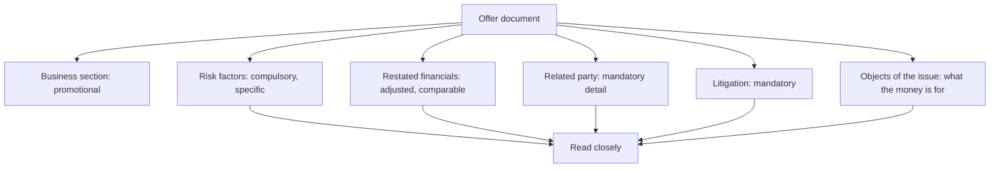

# Reading an Offer Document

## The Problem / Why this matters
An IPO prospectus is the most detailed disclosure a company ever produces — often several hundred pages containing business description, financials, risk factors, litigation, related-party transactions and shareholding history. It is also written by advisers to sell securities. Reading it efficiently means knowing which sections carry information and which carry marketing, and doing so is the foundation of any view on a new listing.

## Core Idea
The offer document's value is in the **sections written under regulatory compulsion** — risk factors, litigation, related-party transactions, restated financials — rather than in the business description, which is promotional by construction.

## Why it works this way
The narrative sections are drafted to present the company attractively. The mandatory disclosure sections are drafted to satisfy regulators and to limit liability, which means they must include things the company would rather not say. That asymmetry tells you where to read carefully.

## Full technical content

### The reading order

**1. Objects of the issue.** What the money is for, and how much is fresh issue versus offer for sale. **A pure offer for sale means no capital enters the company** — existing holders are selling, which is a different proposition from funding growth. The split is the first thing to establish.

**2. Risk factors.** Long and formulaic in part, but companies must disclose specific material risks. **Read for the specific ones** — a named customer concentration, a pending regulatory action, a dependence on a single facility, an unresolved title issue. These are frequently the only place such facts appear.

**3. Restated financial statements.** Prepared on a consistent basis across the presented years, which makes them more comparable than the company's historical annual reports. **Look for the pattern the recently-listed chapter describes**: margins expanding, working capital improving and growth accelerating into the listing period.

**4. Related-party transactions.** Disclosed in detail, often revealing arrangements that were restructured shortly before listing. **Check whether the economics changed or only the presentation.**

**5. Litigation and contingent liabilities.** Mandatory disclosure covering the company, its promoters, directors and group entities. **Litigation against promoters is disclosed here and rarely anywhere else**, which makes this section disproportionately informative about governance.

**6. Capital structure and shareholding history.** Prices at which shares were issued to pre-IPO investors, which establishes what sophisticated buyers paid recently — a direct valuation reference point.

**7. Management and promoter background**, including other ventures and any regulatory actions.

**8. Industry section.** Usually commissioned from a consultant and paid for by the issuer. **Treat the market size and growth figures with scepticism** and verify against independent sources where the thesis depends on them.

### The specific checks

| Check | Why |
|---|---|
| **Fresh issue versus offer for sale** | Whether capital enters the business |
| **Selling shareholders' identity and cost** | What early investors paid and are now realising |
| **Pre-IPO placement price** | A recent transaction price from informed buyers |
| **Lock-in periods** | Dated supply overhang, per the index and recently-listed chapters |
| **Use of proceeds specificity** | Vague "general corporate purposes" is a poor disclosure |
| **Auditor identity and any qualifications** | Per the audit chapter |
| **Employee stock options outstanding** | Future dilution, per the ESOP chapter |
| **Promoter shareholding post-issue** | Control and future selldown pressure |

**The pre-IPO placement price is a particularly useful anchor** — it tells you what informed investors paid recently, and a large gap between that and the IPO price band requires an explanation beyond the passage of time.

### The valuation section

- **The basis of the issue price** is disclosed, including the peer comparison the issuer chose. **Check the peer set** — issuers select comparables that support the price, and substituting a more appropriate set frequently changes the conclusion materially.
- **The accounting ratios** presented are on the restated basis.
- **Compare the implied valuation** to your own, built independently.

### After the listing

The offer document remains useful:
- **As the baseline** against which post-listing performance is measured, per the recently-listed chapter — this is the single highest-value use.
- **For the risk factors**, which remain relevant and are more specific than subsequent annual reports.
- **For the related-party and litigation history**, which subsequent disclosure may not repeat.
- **For the lock-in calendar**, which drives supply for the first year or more.

### What the document does not tell you

- **How the business will perform** after the pressure of pre-IPO preparation is removed.
- **Whether the growth is sustainable** without the working capital and cost decisions made to present well.
- **How management behaves as a listed company**, which only time reveals.

## Common mistakes
- Reading the **business section** and skipping the mandatory disclosures.
- Not checking **fresh issue versus offer for sale**.
- Accepting the issuer's chosen **peer set** in the valuation basis.
- Trusting the commissioned **industry report** without verification.
- Missing **litigation against promoters**, disclosed only here.
- Ignoring the **pre-IPO placement price** as a reference point.
- Not using the document as the **baseline** for post-listing comparison.
- Overlooking the **lock-in calendar**.

## Interview angle
"How do you read a 500-page IPO prospectus efficiently?" By reading the sections written under regulatory compulsion rather than the ones written to sell: objects of the issue first, to establish whether this is a fresh issue funding the business or an offer for sale where existing holders are exiting and no capital enters the company; then risk factors, for the specific disclosures — a named customer concentration, a pending regulatory action, an unresolved title issue — which often appear nowhere else; then the restated financials, checking for margins expanding and working capital improving into the listing period, which is the standard pre-IPO pattern; then related-party transactions and litigation, where actions against promoters are disclosed and rarely repeated later. Add two anchors most people miss: the pre-IPO placement price, which tells you what informed investors paid recently and needs explaining if the band is far above it, and the issuer's chosen peer set in the valuation basis, which is selected to support the price and frequently changes the conclusion when substituted. And note the highest-value use afterwards — the document is the baseline against which every post-listing quarter should be measured.
