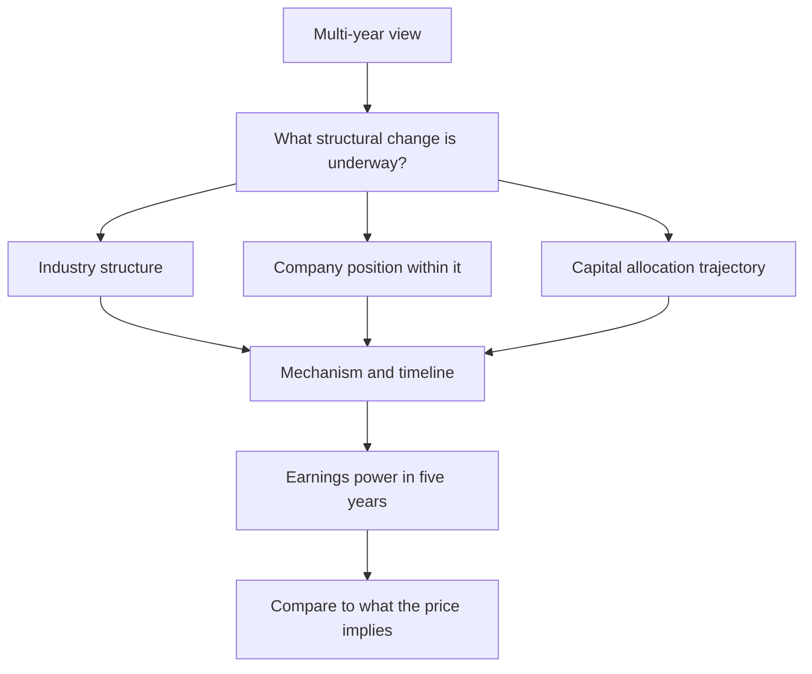

# Building a Multi-Year View

## The Problem / Why this matters
Most research operates on a twelve-month horizon because that is the convention for target prices and the frequency at which performance is measured. But the largest returns come from multi-year positions, and the analytical work required is different — less about the next quarter's estimate and more about whether a structural change is underway. Analysts who only produce twelve-month views miss the situations where research adds the most.

## Core Idea
A multi-year view rests on a **structural change with a mechanism**, not on extrapolated growth — and the analysis is about whether the change is real and how long it takes, rather than about the next few quarters.

## Why it works this way
Over twelve months, price is dominated by expectations, flows and the cycle. Over five years, it converges toward the change in underlying earnings power and returns. So a multi-year view needs a reason why earnings power will be structurally different, which is a different claim from a forecast that this year's growth continues.

## Full technical content

### The sources of multi-year change

Drawing on the structural chapters:
- **Industry consolidation**, per that chapter — the survivor's returns improve structurally, and it is visible in capacity data years ahead.
- **A capacity cycle turning**, where utilisation crosses the threshold at which pricing power returns.
- **Value chain shift**, per that chapter — the margin pool moving to a different stage.
- **Regulatory change** creating or removing a barrier.
- **A company's competitive position changing** — qualification into new customers, distribution built, a cost position established.
- **Capital allocation improving** — a company that starts earning above its cost of capital on new investment, per ROIIC.
- **Governance improvement**, which narrows the discount and is one of the more reliable multi-year re-ratings.
- **Penetration in an under-served category**, sized from analogues per the base-rates chapter.

**Each of these has a mechanism and a rough timeline**, which is what distinguishes them from a growth extrapolation.

### The analytical work

**1. Establish the structural claim precisely.** Not "the company will grow" but "industry utilisation crosses the pricing threshold in FY28 as no new capacity has been announced, and this company's cost position means it captures a disproportionate share."

**2. Identify the mechanism**, so the claim is testable.

**3. Estimate the timeline honestly**, since multi-year changes take longer than expected — the disruption chapter's timing point applies generally.

**4. Model the end state**, not the path: what does earnings power look like when the change has occurred, and what returns does the business earn then?

**5. Compare to what the price implies**, via reverse-DCF. If the market already assumes the change, there is no view.

**6. Identify the milestones** — dated, observable evidence that the change is progressing on schedule, which converts a long thesis into something monitorable.

### The discipline problem

Multi-year views are hard to hold, and the failure modes are specific:
- **No feedback for long periods**, which makes it impossible to distinguish early from wrong without pre-committed milestones.
- **The temptation to reinterpret** every quarter as confirmation.
- **Career pressure** to produce twelve-month views that can be judged sooner.
- **Client horizons** that may be shorter than the thesis.

**The defence is milestones**: specific, dated, observable evidence that the structural change is progressing. A thesis with annual milestones can be assessed annually even if the payoff is five years out — and without them, a multi-year thesis is unfalsifiable, which is the state the conviction chapter warns against.

### Presenting it

- **State the horizon explicitly** and separate it from any twelve-month target.
- **Give the end-state economics** — revenue, margin, returns — and the valuation on those.
- **Give the milestones** with dates.
- **State what the price currently implies**, so the differentiation is visible.
- **Acknowledge the timing uncertainty** rather than presenting a precise path.
- **Address the interim**: what happens in the meantime, and can the company survive the wait? A multi-year thesis on a levered company requires the balance sheet to reach the destination.

### Where multi-year views work best

- **Structurally changing industries**, where the direction is identifiable and the timing is not.
- **Under-covered companies**, where the market has not modelled the change.
- **Situations requiring patience** that most participants cannot supply — the behavioural edge from that chapter, which is the most durable kind.
- **Businesses where compounding matters** — high-return companies reinvesting well, where time is the mechanism rather than a re-rating.

**That last category is distinctive**: for a business earning well above its cost of capital and reinvesting, the return comes from compounding rather than from the multiple changing, and the analysis is about durability rather than about a catalyst.

## Common mistakes
- Extrapolating **growth** and calling it a multi-year view.
- No identified **mechanism** for the structural change.
- Underestimating the **timeline**.
- No **milestones**, making the thesis unfalsifiable.
- Ignoring what the price already **implies**.
- Not checking the company **survives the interim**, especially if levered.
- Confusing a long horizon with an excuse for imprecision.

## Interview angle
"Give me a five-year idea." The structure differs from a twelve-month pitch: name the structural change and its mechanism rather than a growth rate — industry consolidation with capacity leaving, a utilisation threshold being crossed, a value chain shift, or a company's competitive position genuinely changing — then model the end state rather than the path, giving the earnings power and returns once the change has occurred, and compare that to what the current price implies via reverse-DCF. The part that makes it holdable is milestones: specific, dated, observable evidence each year that the change is progressing, because a five-year thesis with no interim tests is unfalsifiable and you cannot distinguish being early from being wrong. Add the interim check — whether the company, particularly if levered, survives long enough to reach the destination. And note where this kind of view pays best: in under-covered situations, and where the edge is behavioural rather than informational, since a longer horizon than the market's is the most durable advantage available.
