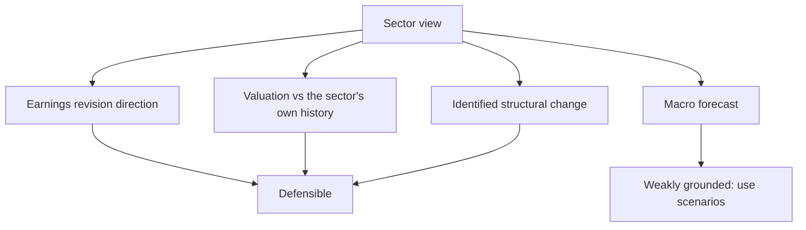

# Sector Rotation and Relative Positioning

## The Problem / Why this matters
Clients allocating across sectors need a relative view, not just stock-level ones. Sector rotation is discussed constantly in market commentary, usually with weak empirical grounding, and an analyst asked for a sector view needs to distinguish what is defensible from what is narrative. The honest answer is narrower than commentary suggests but is genuinely useful.

## Core Idea
Sector positioning is defensible when it rests on **earnings revision direction, valuation against a sector's own history, and identified structural change** — and much less so when it rests on macro forecasts or cycle-stage narratives.

## Why it works this way
Sectors differ in what drives their earnings, and those drivers move at different times. Where a driver is observable — capacity, spreads, credit growth, order flow — the sector's earnings direction is partly forecastable. Where the view depends on forecasting rates, commodity prices or the market cycle, the base rate of success is poor and the honest position is to say so.

## Full technical content

### What is defensible

**1. Earnings revision direction.** Estimate revisions are serially correlated — sectors seeing upgrades tend to continue seeing them for a period. This is among the better-documented relationships and is directly observable from consensus data.

**2. Valuation against the sector's own history.** More meaningful than cross-sector comparison, since it controls for the structural differences that make sectors trade differently. **The range matters more than the point.**

**3. Structural change identified**, per the consolidation and value chain chapters — capacity leaving, a margin pool shifting, regulation changing. These play out over years and are visible in advance.

**4. Observable driver direction** — industry utilisation, credit growth, order inflow, spreads. Where the driver is published, the sector's earnings direction is partly knowable, per the leading-metrics chapter.

**5. Positioning and ownership extremes**, which are observable from fund disclosures and give a sense of how much is already reflected.

### What is weakly grounded

- **Cycle-stage frameworks** that prescribe which sectors to own at which point — appealing, widely repeated, and poorly supported by evidence, partly because identifying the current stage in real time is the hard part.
- **Macro-forecast-driven rotation**, since the forecasts themselves are unreliable.
- **Momentum extrapolation** without a fundamental driver.
- **Analogies to previous cycles** without checking what has structurally changed since.

**Being explicit about this distinction is what makes a sector view credible to a sophisticated audience**, and it is unusual enough to be noticed.

### Constructing the view

1. **Rank sectors on the defensible criteria** — revision direction, valuation versus own history, structural change, driver direction.
2. **State it as overweight, neutral or underweight** relative to the benchmark, since that is how clients hold positions.
3. **Give one or two stock expressions** per sector call, since a sector view a client cannot implement is incomplete.
4. **State the key risk** to each call, which is what makes it accountable.
5. **Give the horizon**, since sector calls and stock calls often have different ones.

### Relative versus absolute

The distinction that causes most confusion, per the ratings chapter:
- **A relative overweight** says the sector will outperform the market, not that it will rise.
- **Clients with a cash alternative** need the absolute view too.
- **State which you are giving.** A sector expected to fall less than the market is an overweight and a poor absolute proposition simultaneously, and both statements are true and useful.

### The correlation issue

- **Sectors are not independent.** Overweighting several sectors that share a driver — rate sensitivity, commodity exposure, rural demand — is one bet expressed several times, per the factor chapter.
- **Check the shared drivers** across your recommended overweights before presenting them as diversified.
- **The clearest expression** is to state the underlying bet: "our overweights collectively express a view on domestic rate cuts" is more honest and more useful than presenting four independent-looking calls.

### The honest limits

- **Sector calls have a poor hit rate** across the industry, and the base rate deserves respect.
- **Stock selection within a sector** is frequently the more reliable value-add, particularly where dispersion is high, per the breadth chapter.
- **A sector view that is really a macro view** should be labelled as such, so the client knows what they are actually taking a position on.
- **Where the honest answer is neutral**, say so rather than manufacturing a view to seem decisive — the no-view chapter's discipline applies at sector level too.

## Common mistakes
- Basing a sector view on a **macro forecast** without saying so.
- Using **cycle-stage frameworks** as though empirically grounded.
- Comparing sector multiples **across sectors** rather than against their own history.
- Presenting correlated overweights as **diversified**.
- Not stating whether the view is **relative or absolute**.
- Giving a sector view with no **stock expression**.
- Manufacturing a view where neutral is the honest answer.

## Interview angle
"Which sectors would you overweight?" Answer with the criteria you would use and be explicit about which parts are defensible: earnings revision direction, which is serially correlated and directly observable; valuation against each sector's own historical range rather than against other sectors, since that controls for structural differences; identified structural change such as capacity leaving an industry or a margin pool shifting; and the direction of published drivers like utilisation, credit growth or order inflow. Then say what you would not lean on — cycle-stage frameworks prescribing sectors by phase are widely repeated and poorly supported, mainly because identifying the stage in real time is the hard part, and rotation driven by macro forecasts inherits the unreliability of those forecasts. Add two disciplines: check whether your overweights share a driver, because several sectors exposed to the same rate or commodity view is one bet expressed multiple times rather than a diversified position; and state whether the call is relative or absolute, since a sector expected to fall less than the market is an overweight and a poor absolute proposition at the same time.
