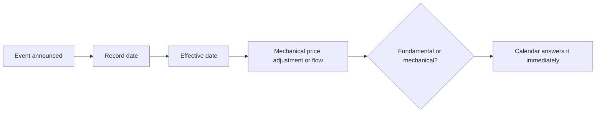

# Corporate Action Calendars and Event Tracking

## The Problem / Why this matters
A substantial number of price movements have mechanical explanations — a record date, a lock-in expiry, an index rebalance, a scheme becoming effective. These events are announced in advance, published by exchanges, and entirely forecastable, yet analysts regularly attribute the resulting moves to fundamentals. Maintaining an event calendar is a low-effort discipline that prevents a recurring class of error and occasionally identifies an opportunity.

## Core Idea
Maintain a **forward calendar of dated corporate and market events** for every covered name, because these events explain price moves that have no fundamental content and are the only genuinely predictable flows in the market.

## Why it works this way
Corporate actions and index events have record dates, effective dates and mandated procedures. The resulting buying or selling is compelled rather than discretionary, which makes it predictable in direction and approximately in size — the one category of flow that can be forecast, per the index chapter.

## Full technical content

### The events to track

| Event | Effect |
|---|---|
| **Dividend record date** | Price adjusts by the dividend; not a decline |
| **Bonus and split record dates** | Price adjusts proportionally; historical series must be restated |
| **Rights issue ex-date** | Price adjusts to TERP, per that chapter |
| **Demerger record date and listing** | Parent adjusts; resulting entity faces forced selling |
| **Index inclusion or exclusion** | Passive flow on the effective date |
| **Lock-in expiry** | Dated supply overhang, especially post-IPO |
| **Buyback record date and tender window** | Supply and demand effects |
| **Open offer opening and closing** | Arbitrage flows and the acceptance-ratio outcome |
| **Scheme effective dates** | Merger, demerger and restructuring completion |
| **F&O expiry and ban periods** | Mechanical positioning effects |
| **Results dates** | The obvious one, but often not calendared systematically |
| **Regulatory decision dates** | Where a process has a stated timeline |
| **Minimum public shareholding deadlines** | Dated dilution requirement |

### Building and using the calendar

1. **Populate from exchange filings and announcements**, which publish record and effective dates.
2. **Add regulatory and policy dates** where a process is underway, per the policy chapter.
3. **Add index review dates** for the relevant index families.
4. **Estimate the flow** where the event is index-driven — weight times AUM divided by ADTV, per the index chapter.
5. **Check the calendar before attributing any price move** to fundamentals. **This single habit prevents a recurring embarrassment.**
6. **Publish ahead of significant events**, explaining the mechanical effect so clients are not surprised.

### The pre-emptive note

Genuinely useful and rarely written:
- **Before an ex-dividend or bonus date**, explain that the price adjustment is arithmetic — retail-facing clients in particular misread this.
- **Before a demerger listing**, explain the forced-selling dynamic and whether you would buy into it, per that chapter.
- **Before a lock-in expiry**, size the potential supply against average traded volume.
- **Before an index effective date**, size the flow in days of volume.

**These notes require little analysis and are disproportionately appreciated**, because they prevent clients from misinterpreting a move they will certainly see.

### The opportunities

Where mechanical flows create genuine dislocations:
- **Post-demerger forced selling**, the most reliable, per that chapter.
- **Index exclusion**, where forced selling in a shrinking-liquidity name overshoots.
- **Lock-in expiry** overhangs that clear, after which the suppressed price recovers.
- **Post-buyback stub** trading, where the residual price after a tender can dislocate.

**The condition in every case: the horizon must exceed the mechanical pressure**, and the position must be sized for the liquidity available during it.

### Distinguishing mechanical from fundamental

The routine, per the index, surveillance and flows chapters:
1. **Check the event calendar.**
2. **Check block and bulk deal data.**
3. **Check whether the stock entered a surveillance measure.**
4. **Check index announcements.**
5. **Check peer and sector moves**, which separates company-specific from broader.
6. **Only then** consider fundamental explanations.

**Eliminating mechanical explanations first is faster and more often correct** than starting from the fundamentals, and it is the discipline that keeps a results-day or price-move note from being wrong in an avoidable way.

## Common mistakes
- Attributing a **mechanical** price move to fundamentals.
- Reading an **ex-dividend or ex-bonus** adjustment as a decline.
- Missing a **lock-in expiry** as a dated supply event.
- Not sizing **index flows** in days of volume.
- Failing to restate historical per-share data after **bonuses and splits**.
- Not maintaining a forward calendar at all.
- Buying into a mechanical dislocation without a horizon that exceeds it.

## Interview angle
"A stock in your coverage fell 6% today with no news. What's your process?" Eliminate mechanical explanations before fundamental ones, because they are faster to check and more often the answer: look at the corporate action calendar for an ex-dividend, ex-bonus or rights ex-date where the adjustment is arithmetic rather than a decline; check for a demerger record date or an index rebalance with its effective date; check whether a lock-in expired, releasing dated supply; check block and bulk deal data; check whether the stock entered a surveillance measure that raised margins and removed buyers; and check peer and sector moves to separate company-specific from broader. Only after those would I look for a fundamental explanation. Add that maintaining this calendar forward rather than reconstructing it also lets you write the pre-emptive note — explaining before an ex-date that the adjustment is arithmetic, or sizing a lock-in expiry against average traded volume — which takes little analysis and is disproportionately valued because it stops clients misreading a move they will certainly see.
