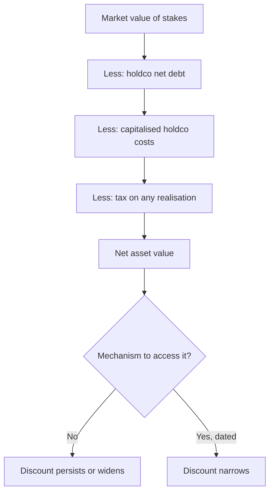

# Analysing Holding Companies

## The Problem / Why this matters
A listed holding company whose main assets are stakes in other listed companies trades at a discount to the market value of those stakes — often a very large one, and often for decades. This is one of the most persistently misanalysed situations in Indian markets: the arithmetic gap is obvious, the recommendation to buy is easy to write, and the discount frequently widens instead of closing.

## Core Idea
A holding company discount is **the market's price for the absence of a mechanism** to access the underlying value — so the analysis is about whether that mechanism exists or will, not about the size of the gap.

## Why it works this way
A shareholder in a holding company owns a claim on dividends the holdco receives and chooses to pass on, not on the stakes themselves. Without a mechanism to convert the stakes into value — a sale, a distribution, a merger, a liquidation — the underlying value is inaccessible, and the discount reflects that inaccessibility rather than a mispricing.

## Full technical content

### Computing NAV properly

Most published NAV calculations overstate it by omitting the deductions:
1. **Market value of listed stakes** at current prices.
2. **Estimated value of unlisted stakes**, conservatively, per the SOTP chapter — do not apply control valuations where control is not exercisable.
3. **Less holdco net debt.**
4. **Less capitalised holdco operating costs**, which are real and perpetual — the corporate centre costs money every year and summing stakes without deducting it overstates value, per the conglomerate chapter.
5. **Less tax that would be payable** on realisation of the stakes, which is often substantial and is routinely ignored.
6. **Less any cross-holding double-count**, where group companies hold each other.

**Steps 4 and 5 alone frequently account for a meaningful part of the observed "discount"**, which means the true discount is smaller than the headline calculation suggests.

### Why the discount persists

| Reason | Durability |
|---|---|
| **No mechanism to realise** | Permanent absent a change |
| **Holdco costs** | Permanent |
| **Tax on realisation** | Permanent |
| **Promoter uses the structure for control** | Permanent while the promoter wants control |
| **Poor capital allocation at the holdco** | Persistent |
| **Low liquidity in the holdco stock** | Persistent |
| **No dividend pass-through** | Changeable, and worth monitoring |

**The control point is decisive in most Indian cases.** The holding company exists to give the promoter control of the operating companies with less capital. Dismantling it would forfeit that control, so the promoter has no incentive to close the discount — and any thesis assuming they will needs to explain why.

### What actually narrows it

- **A dividend policy change** at the holdco, passing through received dividends — the most achievable and most overlooked.
- **A merger** of the holdco into the operating company, which eliminates the structure.
- **A sale of stakes** with proceeds distributed.
- **Succession or restructuring** in the promoter family, which frequently triggers simplification.
- **Regulatory or tax changes** affecting the structure's viability.
- **Buybacks by the holdco**, which capture the discount for continuing shareholders and are unusually value-accretive in this specific situation.

**That last point deserves emphasis:** a holding company buying back its own shares at a 60% discount to NAV is acquiring assets at 40 cents on the rupee, which is a far better use of capital than almost anything else available to it — so whether it does so is a direct test of whether management is working for minorities.

### The analytical position

- **Compute NAV properly**, with all deductions, and state the method.
- **State the discount** against the corrected NAV, not the gross one.
- **Compare the discount to its own history**, which is more informative than its absolute level — a discount at the wide end of a decade's range with no deterioration in the underlying is a more defensible entry than one at the narrow end.
- **Identify the mechanism** or state explicitly that there is none.
- **Track the dividend pass-through ratio**, which is the accessible cash and the part a minority actually receives.
- **Value on the dividend stream** as a cross-check, since that is what a holdco shareholder receives absent a structural change.

**The dividend-stream valuation is the honest one** in the absence of a mechanism, and it typically produces a value far below NAV — which explains the discount rather than presenting it as an anomaly.

### The trap, stated plainly

Recommending a holding company on its NAV discount alone, with no mechanism and no evidence of promoter intent, is the same error the asset-value, sum-of-the-parts and takeover-value chapters each identify from their own direction: **value that requires a change of control or a management decision to be realised is worth only the probability of that decision being made.**

## Common mistakes
- Computing NAV without deducting **holdco costs and realisation tax**.
- Presenting the **gross gap** as the discount.
- Recommending on the discount with **no mechanism**.
- Ignoring that the promoter uses the structure for **control** and has no incentive to dismantle it.
- Not comparing the discount to its **own history**.
- Overlooking **dividend pass-through** as the accessible value.
- Missing **holdco buybacks** as the clearest test of management intent.
- Applying control valuations to unlisted stakes where control is not exercisable.

## Interview angle
"A holding company trades at a 62% discount to the market value of its stakes. Is that an opportunity?" First correct the arithmetic, because the headline gap overstates it: deduct holdco net debt, capitalise the perpetual holdco operating costs, subtract the tax payable on any realisation of the stakes, and remove cross-holding double-counts — those alone account for a meaningful part of what looks like a discount. Then ask the question that decides it: is there a mechanism to access the underlying value? In most Indian cases the structure exists to give the promoter control with less capital, so dismantling it forfeits control and they have no incentive to close the gap, which is why these discounts persist for decades and often widen. Say what would change it — a dividend pass-through policy, a merger into the operating company, a stake sale with distribution, or a family succession that triggers simplification. And name the single clearest test of management intent: whether the holdco buys back its own shares, because at a 60% discount it is acquiring assets at 40 paise in the rupee, which beats almost any other use of its capital.
