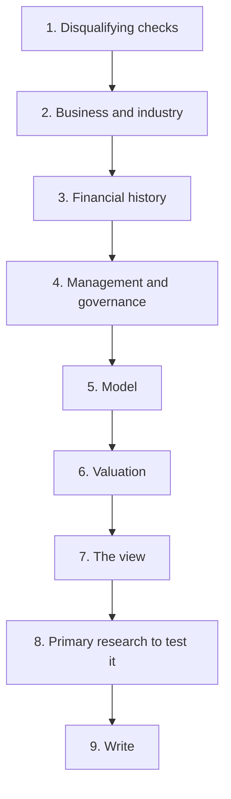

# The Complete Initiation — A Working Sequence

## The Problem / Why this matters
An initiation note is the largest single piece of work an analyst produces on a company and sets the reference point for everything that follows. Done in the wrong order it takes twice as long and misses things; done in a deliberate sequence it is efficient and complete. This chapter sets out that sequence, drawing the relevant checks from across the preceding chapters into one workflow.

## Core Idea
Initiate in a sequence that **eliminates disqualifying issues first, builds understanding before numbers, and produces the view before the write-up** — because each stage constrains the next.

## Why it works this way
Modelling before understanding the business produces a model with the wrong drivers. Valuing before establishing whether the company earns its cost of capital produces the wrong method. Writing before the view is formed produces a description. The order is not arbitrary.

## Full technical content

### Stage 1 — Disqualifying checks (half a day)

Per the checklist chapter, section A. Cash versus profit, auditor's report and KAMs, CARO items, promoter pledge, related-party flows, contingent liabilities, liquidity, share count trend. **If any fails materially, stop or reframe the exercise before investing further time.**

### Stage 2 — Business and industry (two to three days)

- Value chain, margin pool location, industry structure.
- The two or three variables that move earnings in this sector.
- Where the data is published; start the tracker.
- Competitive position, market share, and what protects returns.
- The binding constraint on growth.
- **Read three to five years of transcripts**, the highest-yield activity available.

### Stage 3 — Financial history (two days)

- Ten years of RoCE, decomposed into margin and turnover.
- ROIIC over rolling periods.
- Working capital days by component.
- Segment returns where multi-business.
- Other income decomposed; earnings quality assessed per that framework.
- Balance sheet: debt schedule, covenants, contingent items, equity-accounted entities.

### Stage 4 — Management and governance (one day)

- Capital allocation scorecard: past projects, acquisitions, distributions.
- Guidance credibility record.
- Promoter behaviour record.
- Board, remuneration, voting outcomes.
- Disclosure quality trend.

### Stage 5 — The model (two to three days)

- Built from operating drivers, not growth rates.
- Costs split fixed and variable.
- Balance sheet forecast that tests feasibility, per that chapter.
- Audited per the model audit chapter.

### Stage 6 — Valuation (one day)

- Method appropriate to the business type.
- At least two independent approaches, divergences diagnosed.
- Reverse-DCF to establish what the price implies.
- Bear case with the multiple moving.
- Risk-reward computed.

### Stage 7 — The view (half a day)

- **Is there a differentiated insight?** Write the sentence. If it cannot be written, the honest position is an in-line view on valuation, or no view.
- Falsification conditions.
- Catalyst and its date.
- Position size and the liquidity constraint.
- Who the marginal buyer is.

### Stage 8 — Primary research (variable)

**Deliberately placed after the view**, because the purpose is to test the specific claims the thesis rests on rather than to gather generally:
- Channel checks on the specific question the thesis depends on.
- Management meeting with the two or three questions the model cannot resolve.
- Site visit where feasible.
- **Seek disconfirming evidence specifically**, per the scuttlebutt chapter.

### Stage 9 — Write (one to two days)

- One-page summary first, per that chapter — if it cannot be written, the view is not resolved.
- Conclusion first throughout.
- Evidence attached to claims.
- Bear case and risk-reward explicit.
- Monitorables with dates.
- Model and methodology in appendices.

### The total

**Roughly two to three weeks for a proper initiation**, which is what the work requires and is frequently compressed. Where it must be compressed, the stages to protect are 1, 3 and 7 — the disqualifying checks, the financial history, and the formation of an actual view. **Those cannot be shortened without the output becoming a description.**

### After publication

- Set the monitorables and their dates.
- Diarise the quarterly review against the falsification conditions.
- Record the estimates for the calibration record.
- File the primary research notes with dates and sources.

## Common mistakes
- Modelling before understanding the **business**.
- Doing primary research **before** having a thesis to test.
- Valuing before establishing whether the business earns its **cost of capital**.
- Writing before the **view** is formed.
- Skipping the disqualifying checks and discovering a problem after weeks of work.
- Compressing the stages that cannot be compressed.
- Publishing without **falsification conditions** and monitorables.

## Interview angle
"Walk me through how you'd initiate coverage on a company." Give the sequence and explain why the order matters. Disqualifying checks first — cash against profit, the auditor's report, promoter pledging, related-party flows, contingent liabilities and liquidity — because they take half a day and discovering a problem after two weeks of modelling is wasted work. Then the business and industry before any numbers, since a model built without knowing which two or three variables drive earnings in the sector will have the wrong drivers. Then ten years of financial history, decomposing returns into margin and turnover, which determines what valuation method is even appropriate. Then management and governance, built as records rather than impressions. Only then the model, the valuation, and the view. Add the placement most people get backwards — primary research comes *after* forming the view, because its purpose is to test the specific claims the thesis rests on and to seek disconfirming evidence, not to gather generally. And write the one-page summary first, because if it cannot be written the view is not yet resolved.
