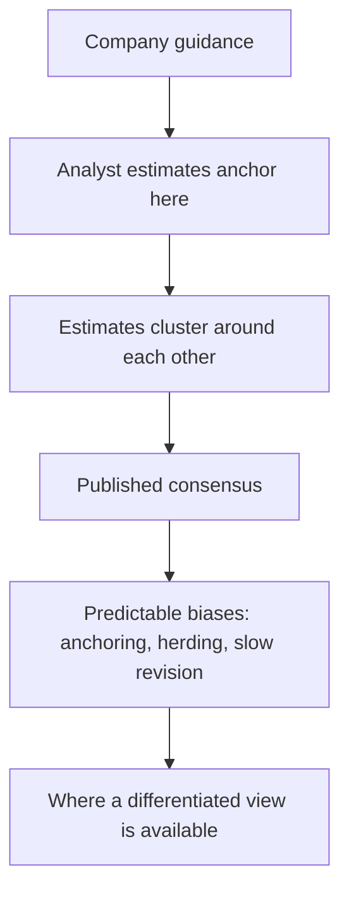

# The Analyst's Relationship With Consensus

## The Problem / Why this matters
Consensus estimates are the reference point against which every forecast is judged, and analysts relate to them badly in both directions — either clustering near them for safety, or disagreeing for the sake of appearing differentiated. Neither is analysis. Understanding what consensus is, how it forms and where it is reliably wrong is the foundation of a genuinely differentiated view.

## Core Idea
Consensus is a **weighted average of other analysts' models, formed under the same pressures you face** — so knowing why it sits where it does is more useful than knowing where it sits.

## Why it works this way
Consensus is not a market view; it is the mean of published estimates, most of which anchor on company guidance and on each other. That means it inherits specific, predictable biases — and those biases are where the opportunity to differ with evidence lies.

## Full technical content

### What consensus actually is

- **A mean or median** of published analyst estimates, of varying quality and vintage.
- **Anchored on guidance** where the company gives it, per that chapter.
- **Herded**, since being wrong alone is more damaging than being wrong together, per the ratings chapter.
- **Slow to revise**, since estimate changes are costly to publish and analysts revise in steps.
- **Stale in parts**, because not every contributor updates promptly.

**Check the dispersion, not just the mean.** A tight range means expectations are settled and only a large surprise moves the stock; a wide range means the market is genuinely uncertain and the print matters more.

### The predictable biases

| Bias | Where it appears |
|---|---|
| **Anchoring on guidance** | Wherever guidance is given, especially where it is conservative by policy |
| **Slow revision** | After a structural change, when the historical model no longer applies |
| **Extrapolation** | Late in a cycle, when peak or trough conditions are projected forward |
| **Under-modelling second-order effects** | Where the first-order impact is priced and consequences are not |
| **Neglect of the balance sheet** | Where the P&L looks fine and the funding does not work |
| **Ignoring mechanical items** | Concession expiry, capacity constraints, share count growth |

**The most reliable of these is slow revision after a structural change.** When a company's historical record stops describing it — post-demerger, post-acquisition, after a business mix shift — consensus models are built on the old shape and take quarters to adjust. This is where differentiated estimates are most often available and least contested.

### Establishing what consensus assumes

Before disagreeing:
1. **Get the estimate distribution**, not just the mean.
2. **Decompose it** — what revenue, margin and volume does the consensus EPS imply?
3. **Compare to guidance** to see how much is anchoring.
4. **Check the revision trend** — is consensus moving toward or away from your view?
5. **Read the most credible contrary note** properly, per the disagreement chapter.
6. **Run the reverse-DCF** — what does the *price* imply, which may differ from what the estimates imply.

**The gap between what consensus estimates imply and what the price implies is itself informative**: where the price embeds more optimism than the published estimates, the market is looking through consensus, and vice versa.

### Being differentiated properly

- **Differentiation must be evidenced**, not manufactured. A forecast that differs because of a specific identified factor is a view; one that differs because you rounded differently is noise.
- **Quantify the difference** and its source — "our FY28 EBITDA is 19% above consensus because we model the new capacity commissioning six months earlier and at a higher utilisation, based on the commissioning disclosure" is a thesis.
- **Be differentiated where it matters** — a large difference in a year nobody is valuing on is not useful.
- **Being in line is legitimate.** If your work agrees with consensus, say so and let the recommendation rest on valuation, per the one-page chapter.

### The revision cycle

- **Estimate revisions are serially correlated**, per the factor and sector chapters — sectors and stocks seeing upgrades tend to continue.
- **Anticipating a revision** is a tradeable view, and it is often more achievable than being right about the absolute level.
- **The catalyst for revision** is usually a results print or guidance change, which makes the timing partly predictable.
- **Publishing ahead of the revision** is where the value is; publishing after it is reporting.

### The honest caveats

- **Consensus is often right.** Most companies perform roughly in line with expectations, and a base rate of disagreement that is too high indicates a process problem rather than insight.
- **Being differentiated is not the objective** — being right is, and agreeing with consensus while the price is wrong is a perfectly good position.
- **Where consensus is a small number of contributors**, particularly syndicate research on a recent listing, it is not a market view at all, per that chapter.

## Common mistakes
- Clustering near consensus for **safety**.
- Disagreeing to appear **differentiated** without evidence.
- Using the **mean** without the dispersion.
- Not decomposing consensus into its **implied operating assumptions**.
- Confusing what **estimates** imply with what the **price** implies.
- Missing the **slow-revision** opportunity after a structural change.
- Treating consensus from a handful of syndicate analysts as a market view.

## Interview angle
"How do you use consensus estimates?" As a reference point to be understood rather than a benchmark to sit near or defy. Get the distribution rather than the mean, since a tight range means expectations are settled while a wide one means the print will move the stock. Decompose the consensus EPS into the revenue, margin and volume it implies, and compare that to guidance to see how much of it is simple anchoring. Then look for the biases that are predictable: consensus revises slowly after a structural change, so post-demerger companies, post-acquisition businesses and mix shifts are where the models are built on the old shape and stay wrong for quarters — that is where differentiated estimates are most available and least contested. Add the distinction between what estimates imply and what the price implies, since a reverse-DCF sometimes shows the market looking through consensus entirely. And be honest that consensus is usually roughly right, so a high base rate of disagreement signals a process problem rather than insight, and agreeing with consensus while arguing the price is wrong is a perfectly legitimate position.
