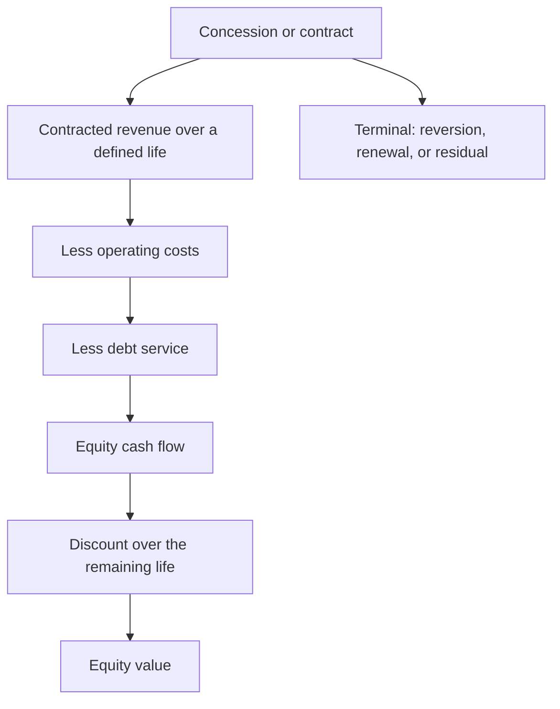

# Analysing Asset-Heavy Infrastructure Businesses

## The Problem / Why this matters
Roads, ports, transmission, renewable generation and similar assets have economics unlike operating companies: long-dated contracted or regulated cash flows, heavy upfront capital, high leverage, and value concentrated in a defined concession life rather than in perpetuity. Applying standard multiples to them produces meaningless answers, and the correct methods are specific and learnable.

## Core Idea
An infrastructure asset is a **finite stream of largely contracted cash flows financed with debt** — so it is valued by discounting that stream over the concession life, not by applying a multiple to current earnings.

## Why it works this way
The asset generates cash under a concession or contract that ends on a known date, after which it may revert to the grantor or require renewal. Value is therefore the present value of a bounded stream, and the equity's value is that stream net of the debt service that funded the asset — which makes the capital structure central rather than incidental.

## Full technical content

### Why multiples fail

- **P/E is distorted** by depreciation on a large asset base and by heavy interest, so reported earnings bear little relation to cash generation.
- **EV/EBITDA ignores the finite life** — two assets with identical EBITDA and concession lives of five and twenty-five years are worth very different amounts.
- **Book value** reflects historical cost and depreciation policy, not the value of the contracted stream.

**The appropriate method is a DCF over the remaining life**, with the terminal treatment stated explicitly.

### Building the valuation

1. **Revenue** from the contract or tariff mechanism — traffic and toll rates, cargo volumes and tariffs, regulated returns on an asset base, or a power purchase agreement's rate and volume.
2. **Escalation** as contracted, which is often inflation-linked and should be modelled as specified rather than assumed.
3. **Operating costs**, largely fixed, with periodic major maintenance modelled as lumpy rather than smoothed.
4. **Debt service** from the actual amortisation schedule, since most infrastructure debt amortises rather than bulleting.
5. **Tax**, including any concessional regime with its expiry, per the deferred tax chapter.
6. **Terminal treatment** — reversion to the grantor at zero, a residual value, or renewal at uncertain terms. **State which, because it can be a large part of the value.**
7. **Discount the equity cash flows at the cost of equity**, since the debt is modelled explicitly — this is an FCFE approach and mixing it with WACC is the error the FCF chapter warns about.

### The specific risks

| Risk | Assessment |
|---|---|
| **Volume risk** | Traffic, cargo or generation below forecast — the principal risk in non-annuity assets |
| **Counterparty risk** | Who pays, and are they creditworthy? A state distribution utility is a different counterparty from a private offtaker |
| **Regulatory or tariff risk** | Where returns are set by a regulator, per the policy chapter |
| **Construction risk** | For assets under development: cost overruns and delays, per the capex chapter |
| **Refinancing risk** | Long assets financed with shorter debt |
| **Concession terms** | Termination provisions, and what compensation is payable |
| **Force majeure and change-in-law** | Provisions that shift risk back to the grantor |

**Counterparty risk is frequently the binding one in India**, particularly where the offtaker is a state entity with a history of delayed payment — and receivable days from that counterparty are the direct evidence, per that chapter.

### The annuity versus volume distinction

The most important classification:
- **Annuity or availability-based assets** receive a fixed payment for being available, so volume risk sits with the grantor. These are bond-like and should be valued and levered accordingly.
- **Volume-based assets** — toll roads, ports, merchant power — bear demand risk, which is real and has produced substantial losses where traffic forecasts proved optimistic.
- **Hybrid structures** share the risk in defined proportions.

**Traffic and volume forecasts in bid documents have a poor historical record**, and a base-rate approach per that chapter argues for discounting them materially.

### Leverage

- **High leverage is normal and appropriate** where cash flows are contracted, since the debt is serviced by a predictable stream.
- **It is dangerous where volume risk exists**, because the fixed obligation meets a variable revenue.
- **Check the debt service coverage ratio** and its covenant, which is the operative constraint.
- **Refinancing** at each tenor is a recurring risk, and the rate environment at that point matters, per the interest rate chapter.

### The InvIT and trust structures

- **Infrastructure investment trusts** hold operating assets and distribute cash flows, with specific regulatory requirements on distribution and leverage.
- **Valued on distribution yield** against a required return, and on the underlying assets' remaining life.
- **The sponsor relationship** matters — asset acquisition from the sponsor raises related-party pricing questions, per that chapter.
- **Growth comes from acquisitions**, so the pipeline and the price paid determine whether unitholders benefit.

## Common mistakes
- Applying **P/E or EV/EBITDA** to a finite-life asset.
- Ignoring the **remaining concession life** in a valuation.
- Not stating the **terminal treatment** where it is material.
- Discounting equity cash flows at **WACC**.
- Accepting bid-document **traffic forecasts** without a haircut.
- Treating **annuity and volume-risk** assets as equivalent.
- Underweighting **counterparty credit risk** on state offtakers.
- Modelling debt as a rate on average balances rather than from the amortisation schedule.

## Interview angle
"How would you value a toll road concession?" Not on a multiple, because the asset generates cash under a concession that ends on a known date — so it is a DCF over the remaining life, with the terminal treatment stated explicitly, whether that is reversion to the grantor at zero, a residual value, or renewal at uncertain terms. Build revenue from traffic and the contracted toll escalation mechanism, model major maintenance as lumpy rather than smoothed, take debt service from the actual amortisation schedule since infrastructure debt amortises, and discount the equity cash flows at the cost of equity rather than at WACC, since the debt is modelled explicitly. Then handle the risks specifically: this is a volume-risk asset rather than an annuity, so demand risk sits with the equity, and bid-document traffic forecasts have a poor historical record which argues for a material haircut. Add the check that matters most in Indian infrastructure — counterparty credit, since a state offtaker with a record of delayed payment changes the risk entirely, and receivable days from that counterparty are the direct evidence.
