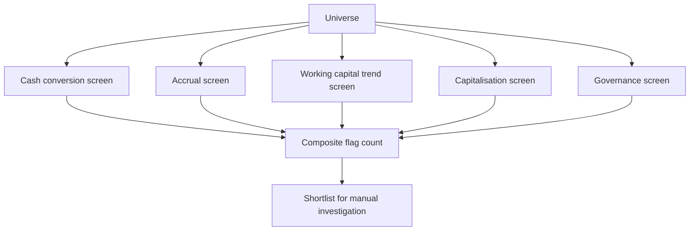

# Screening for Forensic Red Flags

## The Problem / Why this matters
Forensic problems are rare in any given company and costly when they occur, which makes systematic screening across a universe far more efficient than deep investigation of each name. The signals are computable from standard financial data, the screens can be run across hundreds of companies in minutes, and they have a genuinely useful hit rate — which is unusual among quantitative approaches.

## Core Idea
Run **systematic forensic screens across the universe** to generate a shortlist, then investigate manually — because the signals are computable and the base rate of problems in flagged names is materially higher than in the general population.

## Why it works this way
Accounting problems produce characteristic financial signatures: profit without cash, receivables growing faster than revenue, unusual accruals, capitalisation rising without activity. These are ratios computable from published data, and while each has false positives, several appearing together in one company is a strong signal.

## Full technical content

### The screens

| Screen | Computation | Flags |
|---|---|---|
| **Cash conversion** | Cumulative CFO ÷ cumulative PAT, 5 years | Below a threshold |
| **Accruals** | (PAT − CFO) ÷ average total assets | High accruals relative to peers |
| **Receivable growth** | Receivable growth ÷ revenue growth | Materially above 1 |
| **Inventory growth** | Inventory growth ÷ COGS growth | Materially above 1 |
| **Payable stretch** | Payable days trend | Sharp extension |
| **Capitalisation** | Capitalised costs ÷ cash outflow, or capex ÷ depreciation | Rising without capacity growth |
| **Other income share** | Other income ÷ PBT | High or rising |
| **Tax anomaly** | Taxes paid ÷ tax charge | Persistently low |
| **Auditor** | Change, resignation, qualification | Any occurrence |
| **Promoter pledge** | Pledge ÷ total equity, and trend | High and rising |
| **Related party** | RPT ÷ revenue or purchases, and trend | High and rising |
| **Contingent liabilities** | Contingent ÷ net worth | High |
| **Share count** | Growth over 5 years | Persistent dilution |
| **Disclosure** | Metrics discontinued year on year | Any occurrence |

**The composite count matters more than any single flag.** One flag is usually explicable; four or five appearing together in the same company is where the hit rate concentrates.

### Constructing the screen well

- **Sector-adjust the thresholds.** Working capital intensity varies enormously by business model, per that chapter, so a universal threshold produces sector-wide false positives.
- **Exclude financials** from most of these, since the framework does not apply — lenders need their own screens on provision coverage, stage migration and restructured assets.
- **Use multi-year measures**, since single-year figures are noisy.
- **Rank rather than filter**, so the output is a priority order rather than a binary list.
- **Include governance flags**, which are the ones with the highest severity even where the financial signals are clean.

### What the screen cannot do

- **It cannot establish that a problem exists.** It identifies where to look, per the screening chapter's general point — output is a shortlist, never a conclusion.
- **False positives are common** — rapid genuine growth produces several of the same signatures as aggressive accounting, which is why the manual step is essential.
- **It misses problems with no financial signature yet**, particularly where the issue is governance or a related-party structure rather than reported numbers.
- **Data quality limits it** — standardised database items may misclassify unusual items, per the data-integrity chapter, so flagged names must be checked against primary filings.

### The manual investigation

For each flagged name, in order:
1. **Read the auditor's report and KAMs**, per that chapter.
2. **Read the related-party note** in full.
3. **Check the shareholding pattern** for pledging and promoter changes.
4. **Read the cash flow statement** in full, per that chapter.
5. **Check the specific ratio** that flagged, against the primary filings.
6. **Look for a benign explanation** and test it — rapid growth, a business model change, an acquisition.
7. **Check the disclosure trend** for metrics discontinued.

### Using it in practice

- **Run it across the coverage universe** quarterly, which takes minutes once built.
- **Run it before initiating** on any new name, per the initiation sequence.
- **Run it across the sector** to see whether a flag is company-specific or a sector characteristic.
- **Track flags over time** — a company acquiring flags is more concerning than one that has always had one for a structural reason.

**The trend in flag count is more informative than the level**, because a structural characteristic is stable while a developing problem accumulates signals.

### The honest framing

- **Most flagged companies have benign explanations.** The screen's value is efficiency, not accusation.
- **State findings factually** — "cumulative operating cash flow was 41% of cumulative profit over five years, with receivables growing at twice the rate of revenue" is a finding; an allegation is not.
- **The purpose is avoiding losses**, which it does by directing attention rather than by producing conclusions.

## Common mistakes
- Treating a screen flag as a **conclusion**.
- Using **universal thresholds** across sectors with different working capital models.
- Applying the framework to **financial companies**.
- Using **single-year** measures.
- Not checking flagged names against **primary filings**.
- Ignoring **governance flags**, which carry the highest severity.
- Watching the flag **level** rather than the trend.
- Stating findings as allegations rather than as facts about the numbers.

## Interview angle
"How would you screen for accounting risk across a universe?" Build a composite of computable signals rather than relying on one: cumulative operating cash flow against cumulative profit over five years, an accruals ratio scaled by assets, receivable and inventory growth against revenue and COGS growth, capitalised costs against cash outflow, taxes paid against the tax charge, and governance items — auditor changes or qualifications, promoter pledging as a share of total equity, related-party transactions as a proportion of revenue, and any metric that stopped being disclosed. Say that the composite count matters more than any single flag, since one is usually explicable and four together is where the hit rate concentrates, and that the trend in flag count is more informative than the level because a structural characteristic is stable while a developing problem accumulates signals. Add the construction disciplines — sector-adjust thresholds because working capital intensity varies enormously by model, exclude financials since the framework does not apply, and rank rather than filter. And be clear on what it is: a shortlist that directs manual investigation, never a conclusion, because rapid genuine growth produces several of the same signatures as aggressive accounting.
