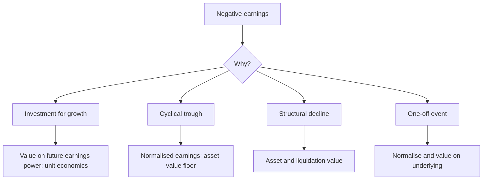

# Valuing Companies With Negative Earnings

## The Problem / Why this matters
A company with no profit cannot be valued on a P/E, which removes the tool most analysts reach for first. Loss-making companies span very different situations — early-stage growth, cyclical trough, structural decline, and turnaround — and each requires a different approach. Using the wrong one produces answers that are not merely imprecise but categorically wrong.

## Core Idea
Classify the **reason for the loss** before choosing a method, because early-stage investment, cyclical trough and structural decline are three different problems with three different correct approaches.

## Why it works this way
A loss caused by deliberate investment in growth is temporary by choice; one caused by a cyclical trough is temporary by circumstance; one caused by structural decline is permanent. The first is valued on future earnings power, the second on normalised earnings, and the third on assets — and misclassifying is the error that matters more than any modelling detail.

## Full technical content

### Case 1 — Investment for growth

Per the growth-company and subscription chapters:
- **Test whether the loss is discretionary**: what happens to cash flow at zero customer acquisition? If it turns positive, the loss is investment.
- **Value on unit economics** built upward — contribution per customer or unit, times the plausible number, less the fixed cost base at scale.
- **Model the path to profitability** with a stated timeline and the capital required to reach it, since that capital must be funded and may dilute.
- **Reverse-DCF the price** to establish what scale and margin it implies, and test that against the addressable market.
- **The risk**: the terminal margin assumption carries almost all the value, so state it and test its sensitivity, per that chapter.

### Case 2 — Cyclical trough

Per the cyclicals chapter:
- **Normalise earnings** to mid-cycle conditions using a full-cycle average of spreads or margins applied to current capacity.
- **Use asset-based measures** — price to book against the historical trough range, EV per unit of capacity against replacement cost.
- **The binding question is survival**, since a levered cyclical may not reach the recovery. Model the cash flow to the nearest debt maturity and check covenant compliance at trough EBITDA.
- **P/E is meaningless or negative here**, and rejecting a trough opportunity on that basis is the standard error.

### Case 3 — Structural decline

- **Value on assets** — replacement, liquidation or realisable value — since the earnings stream is not returning.
- **Deduct the cost of the decline**: closure costs, employee obligations, environmental remediation, per those chapters.
- **Check whether the assets are genuinely realisable** and whether management intends to realise them, per the hidden-value chapter — the same mechanism question.
- **The equity is a residual claim** on what remains after obligations, per the distress chapter.

### Case 4 — One-off event

- **Normalise** by removing the identified item and value on the underlying business.
- **Verify the item is genuinely one-off** — an "exceptional" charge that recurs is an operating cost, per the earnings quality chapter.
- **Check for consequences** — a large litigation settlement or impairment may signal something ongoing.

### The methods available without earnings

| Method | When appropriate |
|---|---|
| **EV/Sales** | Where the loss is investment and gross margin is stable and comparable |
| **EV/Gross profit** | Better than EV/Sales where gross margins differ across peers |
| **Price to book** | Cyclicals, financials, asset-heavy businesses |
| **EV per unit of capacity** | Commodity and manufacturing at a trough |
| **Replacement cost** | Asset-heavy; also sets the supply-response trigger |
| **DCF on future profitability** | Where the path is credible and the timeline stated |
| **Sum of parts** | Where a loss-making segment obscures a profitable one |

**EV/Gross profit is under-used** and is frequently the better multiple for early-stage companies, since it controls for the very different gross margins that make EV/Sales comparisons misleading.

### The segment case

Often overlooked: a company reporting a consolidated loss may contain a profitable core and a loss-making venture. **Segment disclosure allows valuing them separately**, and the sum can differ substantially from any consolidated measure — this is the conglomerate chapter's method applied to a loss-making company, and it frequently reveals that the market is valuing the whole at the loss-making part's worth.

### The disciplines

- **State the classification** and why, since it determines the method.
- **Model the funding requirement** to reach profitability, and the dilution it implies.
- **Present a range**, since loss-making companies carry wider uncertainty, per the low-visibility chapter.
- **Give an asset-based floor** where one exists, which anchors the downside independently.
- **Test the price** with a reverse-DCF, which is more defensible than forecasting forward in these situations.

## Common mistakes
- Choosing a method before **classifying the reason** for the loss.
- Treating a cyclical trough as **structural decline**, or the reverse — the most expensive error available.
- Using **EV/Sales** where peer gross margins differ materially.
- Valuing a growth company without modelling the **capital required** and its dilution.
- Ignoring **survival** in a levered cyclical trough.
- Missing a profitable segment inside a consolidated loss.
- Presenting a point estimate where the uncertainty is genuinely wide.

## Interview angle
"How do you value a company that is losing money?" Classify the loss first, because the method follows from it and misclassifying is worse than any modelling error. If the loss is deliberate investment in growth, test whether it is discretionary — what does cash flow look like at zero customer acquisition — then value on unit economics built upward and model the capital needed to reach profitability, since that capital dilutes. If it is a cyclical trough, normalise earnings to mid-cycle conditions and use price to book against the historical trough range and EV per unit of capacity against replacement cost, while treating survival as the binding question, since a levered cyclical may not reach the recovery. If it is structural decline, value on realisable assets net of closure and employee obligations. Add two practical points: EV to gross profit is usually a better multiple than EV to sales for early-stage companies because it controls for very different gross margins, and where a consolidated loss contains a profitable core, segment disclosure lets you value the parts separately — which often shows the market pricing the whole at the loss-making part's worth.
