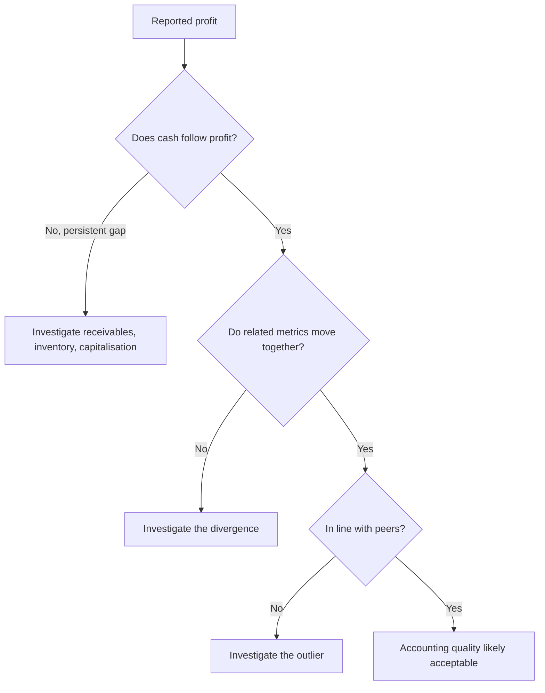

# Forensic Accounting and Accounting-Quality Red Flags

## The Problem / Why this matters
A model built on misstated financials produces a precise, confident, worthless valuation. The most damaging outcomes in equity research are not valuation errors of 15% — they are companies where the reported earnings were not real. Detecting deteriorating accounting quality *before* it becomes a headline is among the highest-value skills a senior analyst has, and "what red flags would you look for in a company's accounts?" is a standard senior-level interview question.

## Core Idea
Accounting quality problems almost always show up as a **divergence between reported profit and cash**, between **related figures that should move together**, or between **a company and its peers** on the same metric. You find them by systematically checking those relationships rather than reading the P&L alone.

## Why it works this way
Profit involves judgement — revenue recognition timing, provisioning, depreciation rates, capitalisation choices. Cash does not. Management can influence reported profit far more easily than it can conjure cash. Therefore any sustained, unexplained gap between profit and operating cash flow is the single most reliable place to start.

## Full technical content

### Category 1 — Cash flow versus profit

**The core test: cumulative CFO versus cumulative PAT over 3–5 years.** For a healthy, non-growing-working-capital business these should track reasonably closely. A company reporting consistent profit while operating cash flow lags persistently is the highest-priority red flag in this entire chapter.

**Cash conversion ratio** = CFO ÷ EBITDA. Persistently below ~60–70% without a structural explanation (a genuinely working-capital-intensive business model) warrants investigation.

Where the gap hides:
- **Receivables growing faster than revenue** — revenue may be recognised on sales that will not collect. Check **Days Sales Outstanding (DSO)** trend, and against peers.
- **Inventory growing faster than sales** — either demand is weakening or inventory is not being written down. Check **inventory days**.
- **Unusual "other current assets"** growth — a common parking place for items that should be expensed.

### Category 2 — Revenue recognition

- **Revenue recognised well ahead of cash** — especially in project/EPC businesses using percentage-of-completion, where the completion estimate itself is a management judgement.
- **Unbilled revenue** rising sharply as a share of revenue — work claimed as earned but not yet invoiced.
- **Channel stuffing** — primary sales (to distributors) outpacing secondary sales (to end consumers). Compare the company's reported growth to distributor inventory commentary and to retail-audit/industry data.
- **Quarter-end concentration** — a large share of quarterly revenue landing in the final days.
- **Related-party revenue** — sales to entities connected to the promoter. Always read the related-party transactions note in full.

### Category 3 — Expense and capitalisation choices

- **Capitalising costs that peers expense** — R&D, software development, or interest. Capitalisation moves cost off the P&L onto the balance sheet, flattering current profit and inflating assets. Compare the capitalisation policy to peers directly.
- **Depreciation rate lower than peers** or a sudden change in useful-life assumptions — a change in estimate that conveniently boosts profit.
- **Under-provisioning** — for doubtful debts, inventory obsolescence, or warranty. Check provision as a % of the relevant base, trended and versus peers.
- **Falling employee cost per employee** or A&P cut sharply while revenue grows — borrowing from the future.

### Category 4 — Balance sheet and structure

- **Rising debt alongside rising reported profit** — if the company is profitable, why is it borrowing more?
- **Contingent liabilities** large relative to net worth — read the note; disputed tax demands and guarantees given to group companies both matter.
- **Loans and advances to related parties / subsidiaries** — a classic route for funds to leave the listed entity.
- **Complex subsidiary structures** with material unconsolidated entities, or frequent restructuring of the group.
- **Goodwill that is never impaired** despite the acquired business underperforming.
- **Cash on the balance sheet alongside high-cost debt** — genuinely odd; ask why the cash is not repaying the debt. Sometimes the "cash" is not freely available.

### Category 5 — Governance and behavioural signals

These often precede the accounting problems becoming visible:
- **Auditor resignation mid-term**, or a change to a materially smaller audit firm. Read the stated reason in the resignation letter — a reason citing inability to obtain satisfactory explanations is severe.
- **Qualified audit opinion** or an emphasis-of-matter paragraph.
- **CFO churn** — repeated CFO exits are among the most reliable soft signals.
- **Resignation of independent directors**, especially with a stated reason.
- **Rising promoter pledge** — the promoter's own funding stress, which creates incentive pressure on reported results.
- **Frequent changes of accounting policy or restatements of prior periods.**
- **Aggressive, promotional investor communication** disproportionate to the business's actual scale.

### Ratio-based screening tools

**The Beneish M-Score** combines eight ratios (days-sales-in-receivables index, gross margin index, asset quality index, sales growth index, depreciation index, SG&A index, leverage index, and total accruals to total assets) into a single score designed to flag possible earnings manipulation. **The Altman Z-Score** screens for financial distress rather than manipulation. Both are *screens, not verdicts* — they generate a shortlist for investigation, and both produce false positives (fast-growing companies frequently trip the M-Score legitimately).

**The accruals ratio** — (Net income − CFO) ÷ average total assets — is a simpler, robust version of the same idea: high accruals mean profit is largely non-cash.

### How to use this in practice

Run the checks in order of information value: **cash versus profit first**, then working-capital trends, then policy comparison versus peers, then the governance signals. A single flag is a question, not a conclusion. A **cluster** of flags — rising receivables *and* falling PCR-equivalent provisioning *and* a CFO exit *and* a rising promoter pledge — is a pattern, and patterns are what you act on.

## Common mistakes
- Reading the P&L and ignoring the **cash flow statement** entirely.
- Treating a single red flag as proof of fraud, or dismissing a cluster because no single item is conclusive.
- Comparing a company's ratios only to its own history and not to **peers** — an industry-wide change is different from a company-specific one.
- Skipping the **notes to accounts**, which is where related-party transactions, contingent liabilities, and policy changes actually live.
- Assuming a Big-4 auditor guarantees quality.

## Interview angle
"What red flags would make you distrust a company's reported earnings?" Structure it: (1) profit not converting to cash — the cumulative CFO vs PAT test, and where the gap hides (receivables, inventory); (2) revenue-recognition aggressiveness — unbilled revenue, channel stuffing, related-party sales; (3) expense choices — capitalisation versus peers, under-provisioning, depreciation assumptions; (4) balance-sheet structure — related-party loans, contingent liabilities, debt rising alongside profit; (5) governance signals — auditor resignation, CFO churn, rising promoter pledge. Then close with the key judgement point: one flag is a question, a cluster is a pattern.
