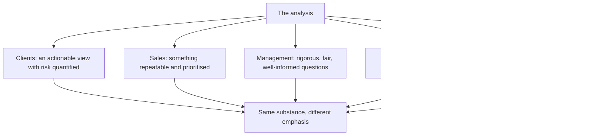

# Stakeholder Mapping in a Research Role

## The Problem / Why this matters
An analyst's work is consumed by several groups with different needs, different incentives and different views of what good research is — clients, sales, management teams, compliance, and the research management who decide compensation. Understanding what each needs, and where their interests diverge, is what allows an analyst to serve them all without compromising the analysis.

## Core Idea
Each stakeholder needs something different from the same work, and **the analysis must not change to suit any of them** — only the emphasis and the format may.

## Why it works this way
The underlying view is a claim about a company, and it is either supported by the evidence or it is not. Nothing about who is reading it changes that. What legitimately varies is which parts are foregrounded, how much detail is given, and in what format — and confusing that legitimate variation with changing the substance is where analysts get into difficulty.

## Full technical content

### Clients

The primary stakeholder, per the final-note chapter:
- **A view they can act on**, with risk quantified and conditions stated.
- **Responsiveness** during market hours.
- **Proactive contact when a call goes badly**, which is when they most need it.
- **Honesty about conviction level**, so they can size accordingly.
- **Differentiation** — restating consensus adds nothing to what they already have.

**Different client types need different emphasis**, per the shareholder-base chapter, but never a different view.

### The sales desk

- **Something repeatable** in fifteen seconds, per the morning meeting chapter.
- **Prioritisation** — which calls to push hard, which are marginal.
- **Availability** when they have a client on the line.
- **An explanation when a call fails**, since they face the client.
- **What they must not get**: an unpublished rating change, which is a compliance breach.

### Management teams

- **Rigorous, well-informed questions** rather than softball ones — good managements respect an analyst who has done the work.
- **Fair treatment** — a negative view expressed factually and without insinuation is defensible; the same view expressed loosely is not.
- **Accuracy** — misstating their numbers destroys the relationship faster than a negative rating.
- **What they may want and should not get**: a favourable view in exchange for access. **Access is a means to information, not a reward for a rating**, and an analyst who trades one for the other has stopped being useful to clients.

### Compliance

- **Verified numbers and traceable claims.**
- **Disclosure of conflicts** as required.
- **Adherence to restricted lists and quiet periods**, per those chapters.
- **Prompt escalation** of any inadvertent receipt of material non-public information.
- **Documentation** sufficient to demonstrate how a conclusion was reached — the mosaic defence.

**Compliance constrains conduct rather than conclusions**, and an analyst who understands the distinction finds the rules workable rather than obstructive.

### Research management

- **Differentiated output**, since that is what the franchise is judged on.
- **Timeliness**, particularly around results and events.
- **Distribution** — work that is read and acted on.
- **Client feedback and votes**, which is how the value is measured commercially.
- **Compliance record**, since a breach is costly to the firm.

### Where interests diverge

The tensions worth naming, per the ratings and incentives chapter:
- **A Sell rating** serves clients and costs corporate access.
- **A prompt downgrade** serves clients and displeases holders.
- **Depth** serves clients and reduces the volume of output.
- **Admitting uncertainty** serves clients and reads as indecisive internally.
- **Refusing to soften a view** serves clients and strains a management relationship.

**In each case the client's interest is the one to serve**, because the analyst's value is entirely derived from being useful to them — and the other relationships are instrumental to that rather than ends in themselves.

### The practical resolution

- **Separate substance from presentation.** Emphasis, length and format may vary; the view may not.
- **Be transparent about the constraint** where one applies — a restricted stock can be disclosed as restricted.
- **Document the basis** of conclusions, which protects against pressure from every direction.
- **Build the record** of publishing genuinely negative views, which makes the positive ones credible and makes the difficult conversations easier over time.

## Common mistakes
- Changing the **substance** of a view for an audience.
- Trading **access** for a favourable rating.
- Previewing an unpublished rating change to **sales or clients**.
- Treating compliance as obstructive rather than as constraining conduct only.
- Softening a view to preserve a **management relationship**.
- Optimising for **volume** of output rather than for being read.
- Going quiet with clients when a call is going badly.

## Interview angle
"How do you handle pressure from a company that disagrees with your view?" Separate substance from presentation: the emphasis and format may vary by audience, but the view does not, and a substantive view that changes with the listener is a serious problem that becomes visible quickly. Say that accuracy is the ground you defend — misstating a company's numbers damages the relationship far more than a negative rating does, so being factually precise and expressing the view without insinuation makes it defensible. Then name the underlying principle: corporate access is a means to information, not a reward for a rating, and an analyst who trades one for the other has stopped being useful to the clients whose interest is the reason the job exists. Add that the practical defence is a documented basis for the conclusion and a record of having published genuinely negative views before, which makes both the positive calls credible and the difficult conversations easier.
