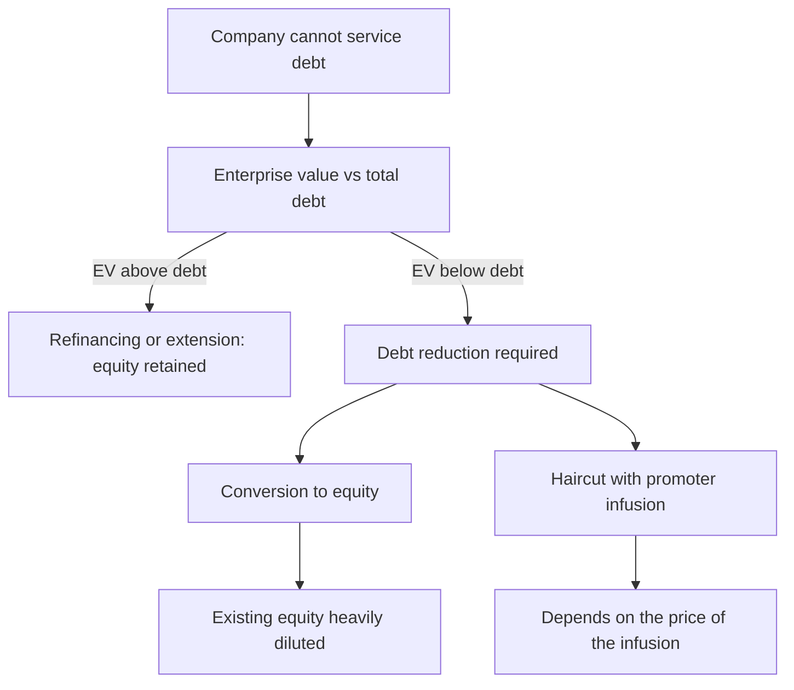

# Debt Restructuring and Recapitalisation

## The Problem / Why this matters
A company unable to service its debt on existing terms may restructure rather than enter insolvency — extending maturities, converting debt to equity, taking a haircut, or raising new capital. Each outcome distributes value very differently between lenders, promoters and minority shareholders, and the equity's outcome ranges from substantial dilution to complete extinguishment. Understanding the mechanics determines whether a distressed equity is an opportunity or a claim on nothing.

## Core Idea
In a restructuring, the equity's outcome depends on **how much value exists above the debt and how much new capital is required** — and where the enterprise is worth less than the debt, existing equity has no claim regardless of the process chosen.

## Why it works this way
Restructuring reallocates claims. Lenders can extend, convert or write down; each option changes who owns the recovered business. Where the enterprise value falls short of the debt, any restructuring that makes the business viable must transfer ownership to the creditors, and the existing equity's share of the outcome approaches zero.

## Full technical content

### The options and their consequences

| Option | Effect on existing equity |
|---|---|
| **Maturity extension** | Preserved; buys time without reducing the obligation |
| **Interest reduction** | Preserved; improves serviceability |
| **Conversion of debt to equity** | Heavily diluted, potentially to a nominal residual |
| **Haircut with promoter capital infusion** | Depends entirely on the infusion price |
| **Asset sale to repay debt** | Preserved but on a smaller business |
| **New equity from an external investor** | Diluted at the price agreed |
| **Insolvency resolution** | Usually extinguished, per that chapter |

**The conversion price is the whole question in a debt-to-equity conversion.** Converting at a price near the market price causes proportionate dilution; converting at a steep discount transfers most of the recovered value to the lenders and leaves existing holders with very little.

### The analysis

1. **Estimate enterprise value** on a restructured, viable basis — not on current distressed earnings.
2. **Total the debt**, including off-balance-sheet items and invoked guarantees, per the contingent liabilities chapter.
3. **Compare.** If EV is below debt, the equity has no economic value before any new capital arrives.
4. **Establish how much new capital** the business needs to be viable.
5. **Model the dilution** at plausible issuance prices.
6. **Compute the residual** for existing holders across scenarios.

**Step 6 is the one that surprises.** A successful restructuring can leave existing shareholders with a small fraction of a recovered business, so being right that the company survives is entirely compatible with losing most of the investment — the point the distress and turnaround chapters both make.

### Reading the disclosures

- **Board and lender approvals** disclosed to exchanges, with the terms.
- **The conversion price and ratio**, which determines everything.
- **Whether promoters are infusing capital**, and at what price — a promoter injecting at a fair price is a strong signal, per the promoter behaviour chapter; injecting at a steep discount to acquire more control is a different matter.
- **Whether the resolution is under a regulatory framework** with defined rules, or is a bilateral bank arrangement.
- **Conditions precedent** and the timeline, which determine completion risk.
- **Whether the lenders have taken security** over additional assets, which subordinates the equity further.

### The signals during the process

- **Rating actions**, per the credit chapter — the most timely public information on how creditors view the situation.
- **Whether the company continues to service interest** during negotiations.
- **Promoter pledge invocation**, which changes the shareholding and can accelerate the process.
- **Independent director or auditor resignations**, which are close to decisive negative signals.
- **Asset sales completing** at reasonable prices, which is the strongest positive.

### Valuing the equity through it

- **Scenario-weight explicitly**: successful restructuring with modest dilution, restructuring with heavy dilution, and insolvency with extinguishment.
- **The equity is an option**, per the distress chapter — positive value only if enterprise value exceeds claims at resolution.
- **Size for total loss.**
- **State the probability of extinguishment** in the note, which is the number a client most needs and which is routinely omitted.

### The rare favourable case

Restructurings occasionally work well for existing equity:
- **Where the business is fundamentally viable** and the problem is a maturity mismatch rather than solvency — extension alone fixes it.
- **Where an asset sale can repay enough debt** to restore viability without dilution.
- **Where the promoter infuses capital at a fair price**, absorbing the dilution themselves.
- **Where the enterprise value genuinely exceeds the debt** and the problem is liquidity, not solvency.

**Distinguishing a liquidity problem from a solvency problem is the whole judgement**, and it is answered by comparing enterprise value to total claims rather than by looking at the immediate cash position.

## Common mistakes
- Assuming survival means the **equity recovers**.
- Ignoring the **conversion price** in a debt-to-equity restructuring.
- Understating **total claims** by omitting guarantees and off-balance-sheet items.
- Valuing on **current distressed earnings** rather than restructured viability.
- Confusing a **liquidity** problem with a **solvency** one.
- Not modelling the **dilution** required to fund viability.
- Omitting the probability of extinguishment from the note.
- Reading a promoter infusion as positive without checking the **price**.

## Interview angle
"The company is restructuring its debt. What happens to the equity?" It depends on whether enterprise value exceeds total claims, so start there — value the business on a restructured, viable basis rather than on current distressed earnings, and total the debt including invoked guarantees and off-balance-sheet items, which are usually larger than reported borrowings. If enterprise value is below claims, the existing equity has no economic value before any new capital arrives, and any restructuring that makes the business viable must transfer ownership to creditors. Then model the dilution: in a debt-to-equity conversion the conversion price is the entire question, since converting at a steep discount leaves existing holders with a fraction of the recovered business — which means being right that the company survives is fully compatible with losing most of the investment. Add the distinction that decides the favourable cases: a liquidity problem, where the business is viable and the issue is a maturity mismatch, can be fixed by extension alone with the equity intact, while a solvency problem cannot — and the comparison of enterprise value to total claims is what separates them.
